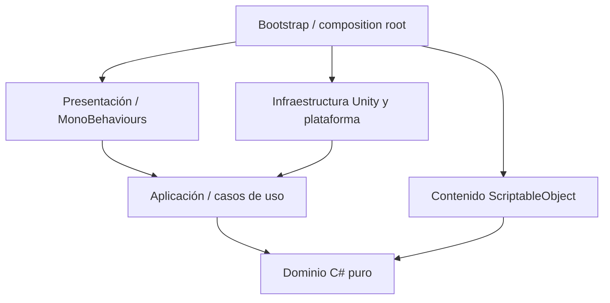

# Pequeño Explorador — Arquitectura, roadmap y cadena completa de prompts para Codex

Versión del documento: 1.0

Fecha de referencia de la investigación: 14 de agosto de 2026

Objetivo: construir desde una carpeta vacía una base comercial Unity para Android, preparada para iOS y para Closed Testing, sin publicar automáticamente.

> Este documento es una especificación de construcción, no código del juego. Los datos sobre versiones y políticas son una fotografía de la fecha indicada. La Fase 00 obliga a volver a verificarlos antes de fijar el toolchain.

## Cómo usar este documento

1. Crea o abre una carpeta completamente vacía.
2. Ejecuta los prompts en orden, uno por uno, desde el **PROMPT 00**.
3. No ejecutes el prompt posterior a un Gate si el Gate no termina en `PASS`.
4. Conserva la misma rama salvo que Codex documente una razón válida para usar una rama de trabajo.
5. Revisa el reporte y el hash de cada commit antes de continuar.
6. Las decisiones que requieren cuentas, credenciales, aceptación legal, precios definitivos o assets finales quedan como intervención humana explícita; Codex no debe fingir que las completó.

---

# A. Evaluación técnica

## A.1 Viabilidad

El producto es viable como juego móvil Unity offline-first. El loop campamento → expedición → descubrimiento → fotografía → aprendizaje → estrellas → álbum → progreso tiene buena coherencia, es fácil de explicar a padres y permite ampliar mundos sin cambiar el núcleo si el contenido se modela por datos.

El MVP también es viable sin backend. El progreso, las sesiones educativas, la configuración parental y los entitlements verificados por tienda pueden conservarse localmente. La ausencia de cuentas reduce costo, riesgo de privacidad y superficie operativa. El límite real no será la programación: serán la calidad y consistencia de arte, animación, narración, contenido educativo revisado y QA en dispositivos infantiles/reales.

## A.2 Puntos difíciles

1. **Edad 4–9 demasiado amplia para una sola UX.** Un niño de 4 años y uno de 9 difieren mucho en lectura, motricidad y autonomía. La solución propuesta usa dos niveles de apoyo configurables por el padre —más guía audiovisual y guía estándar— sin pedir fecha de nacimiento ni crear perfiles basados en edad.
2. **Movimiento 3D táctil.** Un joystick virtual permanente no es ideal para el extremo inferior del público. El MVP usará navegación contextual/tap-to-move con cámara asistida y puntos interactivos grandes. Un control directo alternativo solo se añadirá si pruebas con niños demuestran que aporta.
3. **Fotografía divertida y tolerante.** Se necesita asistencia de encuadre, validación por visibilidad/distancia/ángulo y feedback inmediato. No debe exigir precisión adulta ni usar la cámara real del dispositivo.
4. **Contenido educativo confiable.** Codex puede generar borradores, pero no debe declarar hechos como aprobados sin fuentes y revisión. Cada contenido tendrá estado `Draft`, `FactChecked` y `Approved`; solo `Approved` entra en una Release Candidate.
5. **Guardado robusto sin backend.** Debe diferenciar modelo de dominio, DTO persistente y migraciones; escribir de forma atómica; conservar backup; tolerar corrupción y actualizaciones. Las miniaturas de fotos del mundo virtual se almacenarán por separado y con límites.
6. **Compras sin servidor.** La validación local y la reconciliación con Google Play son suficientes para el MVP, pero no equivalen a validación remota antifraude. El juego debe conservar acceso offline a compras previamente verificadas y no revocarlo por un fallo temporal de red.
7. **Publicidad infantil.** Es la mayor fuente de riesgo normativo, UX y reputación. Google exige tratamiento infantil, formatos restringidos, ausencia de publicidad personalizada y versiones autocertificadas de SDK; una app exclusivamente infantil no debería solicitar `AD_ID`. Apple indica que las apps de Kids Category no deberían incluir publicidad o analítica de terceros. Por eso, la recomendación para la primera publicación es **sin anuncios**, con muestra gratuita y compras únicas. Se conserva una abstracción de anuncios y un Gate posterior puede autorizar un proveedor solo con evidencia vigente.
8. **Arte y audio.** La ingeniería puede llegar a Closed Testing con un kit coherente de placeholders, pero una publicación comercial premium requiere assets finales o, como mínimo, un paquete temporal aprobado explícitamente. Los Gates separan “técnicamente listo” de “arte/contenido aprobado”.
9. **Rendimiento 3D en 2 GB RAM.** Se requiere una escena Selva acotada, iluminación baked/mixed apropiada, materiales compartidos, pooling selectivo y presupuestos medidos. No se aplicarán optimizaciones indiscriminadas antes del perfilado.

## A.3 Cambios recomendados respecto al planteamiento inicial

- Fijar como toolchain candidato la última revisión parcheada de **Unity 6.3 LTS**, no “cualquier Unity 6”. A la fecha consultada está soportada hasta diciembre de 2027 y su documentación contempla API 36 y páginas de memoria de 16 KB. La Fase 00 debe volver a comprobarlo.
- Apuntar a Android API 36 desde el primer build técnico: Google Play lo exige para apps nuevas y actualizaciones desde el 31 de agosto de 2026.
- Usar **uGUI + TextMeshPro** para la UI runtime del MVP por madurez en juegos, world-space UI y animación; usar UI Toolkit/IMGUI solo en herramientas de Editor cuando aporte. No mantener dos stacks runtime.
- Usar tap-to-move/NavMesh, cámara semiautomática e interacción contextual en vez de joystick complejo como control primario.
- Mantener el lanzamiento inicial ad-free. `AdsService` existe para no acoplar el gameplay, pero `NoAdsService` será la implementación Release predeterminada hasta que un Gate normativo pruebe lo contrario.
- Sustituir “mantener pulsado + operación sencilla” como única puerta parental por un PIN creado por el padre, almacenado con derivación segura local, más una alternativa de recuperación documentada. Una cuenta matemática puede ser resuelta por parte del público de 9 años y no es una verificación robusta.
- No guardar capturas ilimitadas. Conservar como máximo la mejor miniatura reducida por descubrimiento y metadatos de intentos; el álbum sigue siendo visual sin crecer indefinidamente.
- No tratar ScriptableObjects como dominio. Serán authoring/data assets que se validan y convierten a modelos runtime; las reglas importantes permanecerán en C# puro testeable.
- No usar Firebase, Unity Analytics ni un SDK de crash remoto en el MVP. Empezar con `NullAnalyticsService`, diagnósticos locales acotados y Android Vitals de la distribución. Cualquier telemetría futura requiere una revisión infantil específica.
- Definir `Explorer Complete Edition` mediante un catálogo de entitlements versionado. “Todos los mundos” debe describir exactamente qué paquetes incluye; no prometer automáticamente expansiones futuras sin una decisión comercial humana.
- Como Campamento + Selva son gratuitos y el MVP no construye todavía otro mundo, preparar Billing no significa activar una venta. No debe ofrecerse `Explorer Complete` ni un pack de mundo hasta que el contenido prometido exista; Closed Testing puede validar el adapter con catálogo inactivo, mocks y license testers cuando haya un SKU legítimo.

## A.4 Evidencia vigente usada para estas recomendaciones

- [Unity 6 releases](https://unity.com/releases/unity-6): Unity 6.3 LTS tiene soporte anunciado hasta diciembre de 2027.
- [Unity 6.3 Android compatibility](https://docs.unity3d.com/6000.3/Documentation/Manual/android-requirements-and-compatibility.html): API 35/36, URP en Android y soporte de página de memoria de 16 KB.
- [Unity 6.3 Android dependency versions](https://docs.unity3d.com/6000.3/Documentation/Manual/android-supported-dependency-versions.html): SDK tools, NDK y JDK mantenidos por la versión de Editor.
- [Google Play target API requirements](https://support.google.com/googleplay/android-developer/answer/11926878?hl=en): API 36 desde el 31 de agosto de 2026 para nuevas apps y updates.
- [Google Play Families Policies](https://support.google.com/googleplay/android-developer/answer/9893335?hl=en): datos, identificadores, SDKs, formatos de anuncios y monetización infantil.
- [Google Play Billing deprecation](https://developer.android.com/google/play/billing/deprecation-faq): ciclos y fechas límite de Billing Library; la integración debe probar una versión vigente.
- [Apple App Review Guidelines](https://developer.apple.com/app-store/review/guidelines/): Kids Category, parental gates, analítica y anuncios de terceros.
- [OpenAI Codex best practices](https://learn.chatgpt.com/guides/best-practices) y [Codex ExecPlans](https://developers.openai.com/cookbook/articles/codex_exec_plans): contexto persistente, definición de terminado, `AGENTS.md` y planes vivos.

---

# B. Arquitectura recomendada

## B.1 Principios

- Juego offline-first; red opcional y nunca requerida para gameplay instalado.
- Arquitectura por funcionalidades con capas ligeras, no una Clean Architecture ceremonial.
- Dominio C# puro para reglas que merecen tests; Unity se mantiene en presentación, authoring e infraestructura.
- Composition root explícito; sin service locator global, sin singletons arbitrarios y sin framework DI externo inicialmente.
- Contenido data-driven, IDs estables y catálogos validados.
- Dependencias externas mínimas, exactas, documentadas y aprobadas para uso infantil.
- Release segura por defecto: sin analytics remoto, sin ads, sin permisos sensibles y sin secretos.

## B.2 Estructura lógica

```text
Assets/_Game/
├── Bootstrap/                 # composition root y arranque
├── Shared/
│   ├── Domain/                # IDs, resultados, reglas comunes; C# puro
│   ├── Application/           # puertos, casos de uso, coordinadores
│   ├── Infrastructure/        # Unity, filesystem, Addressables, plataforma
│   └── Presentation/          # componentes/UI compartidos
├── Features/
│   ├── Explorer/
│   ├── Interaction/
│   ├── Discovery/
│   ├── Photography/
│   ├── Album/
│   ├── Learning/
│   ├── Missions/
│   ├── Economy/
│   ├── Camp/
│   ├── Customization/
│   ├── Parents/
│   └── Monetization/
├── Worlds/
│   ├── Shared/
│   └── Jungle/
├── Content/
│   ├── Shared/
│   └── Jungle/
├── UI/
├── Audio/
├── VFX/
├── Editor/
└── Tests/
    ├── EditMode/
    └── PlayMode/
```

La organización física será feature-first, pero no se creará un asmdef por cada carpeta. El objetivo inicial es 8–12 assemblies con fronteras útiles:

| Assembly | Puede depender de | No puede depender de |
|---|---|---|
| `PequenoExplorador.Domain` | BCL | UnityEngine, UI, filesystem, SDKs |
| `PequenoExplorador.Application` | Domain | Presentation, adapters concretos |
| `PequenoExplorador.Content` | Domain, Unity authoring | Infrastructure concreta |
| `PequenoExplorador.Infrastructure` | Domain, Application, Unity/packages aprobados | Presentation |
| `PequenoExplorador.Presentation` | Domain, Application, Unity UI | adapters de tienda/anuncios concretos |
| `PequenoExplorador.Bootstrap` | Todas las anteriores | lógica de negocio nueva |
| `PequenoExplorador.Editor` | assemblies runtime necesarios | runtime release |
| Tests | assembly bajo prueba | dependencias no necesarias |

## B.3 Flujos y límites



- **Scenes:** `Bootstrap`, shell/UI persistente, `Camp`, `World_Jungle`; carga aditiva coordinada por una máquina de estados de aplicación.
- **Addressables:** grupos locales `SharedLocal` y `JungleLocal` en MVP; manifiestos y perfiles preparados para grupos remotos futuros, sin depender de un servidor.
- **Content:** ScriptableObjects de authoring → validación Editor → catálogos runtime por ID. Nada importante se busca por nombre de GameObject.
- **Save:** snapshot DTO con `schemaVersion`, migraciones explícitas, escritura temporal + reemplazo atómico + `.bak` + checksum. Las miniaturas se guardan fuera del JSON, una por descubrimiento y con tamaño máximo.
- **Input:** Input System; tap-to-move, tap contextual, drag/pinch únicamente donde se pruebe; acciones semánticas, no lectura directa de touch dispersa.
- **UI:** uGUI/TMP runtime con tokens, safe areas, targets grandes y navegación por audio/iconos.
- **Eventos:** eventos tipados y acotados por ciclo de vida. Se prefieren llamadas directas para flujos locales; no “event bus” global para todo.
- **Servicios:** interfaces `IClock`, `ISaveService`, `IAudioService`, `ILocalizationService`, `IAnalyticsService`, `IAdsService`, `IPurchaseService`, `IParentGateService`, `IContentCatalog`, `ISceneFlowService`.
- **Monetización:** catálogo de productos/entitlements separado de precios. Gameplay pregunta por capacidades (`CanAccessWorld`) y nunca por SKU o SDK.
- **Privacidad:** métricas parentales agregadas localmente por día/concepto; sin identidad, advertising ID, ubicación, cámara, micrófono, contactos o chat.

## B.4 Modelo de contenido

- IDs namespaced e inmutables: `world.jungle`, `discovery.jungle.toucan`, `mission.jungle.first_photo`.
- Definiciones referencian claves de localización y AssetReferences, no textos incrustados.
- Categorías y tags se representan por IDs/definiciones, no por un enum cerrado que obligue a recompilar el núcleo.
- `DiscoveryDefinition` incluye clasificación, rareza, hábitat/dieta/tags, recompensas, condiciones, referencias visuales/sonoras, facts y estado editorial.
- `LearningActivityDefinition` selecciona un tipo de actividad registrado y datos; la estrategia de ejecución vive en aplicación/presentación.
- `MissionDefinition` compone objetivos, condiciones y recompensas reutilizables.
- `WorldManifest` enumera catálogos, escenas, Addressables labels, gates y presupuesto de contenido.
- Todo hecho educativo registra fuente, fecha de revisión, revisor y estado. Un validador impide Release con borradores visibles.

## B.5 Presupuestos iniciales

Son hipótesis que deben medirse y ajustarse, no garantías:

- 60 FPS objetivo; modo 30 FPS estable en dispositivos que no sostengan 60.
- Sin allocations por frame en bucles estables cuando sea práctico.
- Working set objetivo aproximado menor de 400 MB en dispositivo de 2 GB; el Gate de performance fijará el valor probado.
- Carga fría objetivo menor de 8 s y transición de mundo menor de 5 s en el dispositivo mínimo real definido.
- Una sola Selva acotada en MVP; pooling solo para objetos repetitivos/efectos medidos.
- OpenGL ES 3 como compatibilidad base; Vulkan se conserva solo si la matriz real demuestra estabilidad.

---

# C. Roadmap completo

| Fase | Resultado principal |
|---:|---|
| 00 | Investigación vigente, repo y baseline desde carpeta vacía |
| 01 | Visión, GDD, diseño educativo y alcance verificable |
| 02 | Contrato operativo de Codex, AGENTS y ExecPlans |
| 03 | Proyecto Unity 6 LTS URP y Android vacío compilable |
| 04 | Assemblies, dependencias y arquitectura modular |
| 05 | Automatización local, tests y CI baseline |
| 06 | Bootstrap y puertos de servicios con mocks/nulls |
| 07 | **Gate A — fundación compilable** |
| 08 | Scene flow y Addressables locales |
| 09 | Guardado versionado, atómico y migrable |
| 10 | Configuración runtime y feature flags locales |
| 11 | Localización ES/EN sin textos hardcodeados |
| 12 | Arquitectura de audio y placeholders |
| 13 | Input táctil, safe areas y adaptación de dispositivo |
| 14 | Modelo data-driven, IDs, catálogos y validación |
| 15 | Framework extensible de mundos |
| 16 | Explorador, cámara de seguimiento y tap-to-move |
| 17 | Interacción contextual accesible |
| 18 | Discovery/progreso |
| 19 | Cámara fotográfica in-game |
| 20 | Álbum/enciclopedia |
| 21 | Estrellas y recompensas |
| 22 | Misiones data-driven |
| 23 | Motor educativo desacoplado |
| 24 | Primera actividad integrada: alimentación/hábitat |
| 25 | Campamento y mejoras visuales |
| 26 | Personalización inclusiva |
| 27 | Design system UI infantil premium |
| 28 | Tutorial audiovisual y onboarding |
| 29 | Ensamble del loop jugable mínimo |
| 30 | **Gate B — loop mínimo jugable** |
| 31 | Persistencia y resiliencia del Vertical Slice |
| 32 | **Gate C — Vertical Slice Selva** |
| 33 | Herramientas Editor y pipeline de contenido |
| 34 | Escalado de discoveries Selva |
| 35 | Escalado de misiones |
| 36 | Cinco o más tipos de actividades educativas |
| 37 | Selva: secretos, ambientación y polish |
| 38 | Progresión de campamento y cosméticos |
| 39 | Accesibilidad, localización y QA de layouts |
| 40 | Puerta parental y shell de padres |
| 41 | Dashboard parental, sesiones y límites amables |
| 42 | Auditoría de privacidad, permisos y SDKs |
| 43 | Integración completa del MVP y revisión factual |
| 44 | **Gate D — MVP funcional** |
| 45 | Catálogo de entitlements y monetización mock |
| 46 | Google Play Billing / Unity IAP real |
| 47 | Auditoría vigente de anuncios: go/no-go |
| 48 | NoAds Release o ads familiares aprobados |
| 49 | UX de compras, restore y comportamiento offline |
| 50 | **Gate E — monetización responsable** |
| 51 | Perfilado y optimización basada en evidencia |
| 52 | AAB Android, API/16 KB, versionado y signing seguro |
| 53 | QA, hardening, matriz de dispositivos y diagnósticos |
| 54 | Preparación iOS sin fork de código |
| 55 | Ficha de tienda, políticas y paquete Closed Testing |
| 56 | **Gate F — Release Candidate Android** |
| 57 | Handoff, baseline, backlog y plan post-Closed Testing |

---

# D. Dependencias entre fases

La ejecución recomendada es lineal. Las dependencias directas que importan son:

- 00 → todas las fases.
- 01 y 02 → 03; no se crea el proyecto antes de fijar visión y contrato.
- 03 → 04 → 05 → 06 → 07.
- Gate A `PASS` → 08–15.
- 08–15 → 16–29; contenido, escenas y servicios deben existir antes del loop.
- 18 → 19 y 20; 21 alimenta 18/22/25/26; 23 → 24.
- 16–28 → 29 → 30.
- Gate B `PASS` → 31 → 32.
- Gate C `PASS` → 33–43 → 44.
- 33 precede el escalado 34–38.
- 40 → 41; 42 audita 40/41 y cualquier SDK existente.
- Gate D `PASS` → 45–50.
- 45 → 46 y 49; 47 → 48; 46+48+49 → 50.
- Gate E `PASS` → 51–56.
- 51 precede 52/53; 42 y 50 preceden 55; 54 precede el Gate final para garantizar portabilidad.
- Gate F `PASS` → 57.

No se deben ejecutar fases de escalado de contenido antes del Gate C. No se debe integrar un SDK publicitario antes de que la Fase 47 produzca evidencia positiva explícita.

---

# E. Gates

| Gate | Fase | PASS exige | Si falla |
|---|---:|---|---|
| A — Fundación | 07 | proyecto abre, compila, tests base, arquitectura y dependencias válidas | corregir fundación; no iniciar gameplay |
| B — Loop mínimo | 30 | camp→selva→mover→interactuar→foto→descubrir→estrella→álbum→volver | corregir el flujo; no escalar contenido |
| C — Vertical Slice | 32 | flujo anterior pulido, persistente tras reinicio y medido en Android real | no crear los 40 discoveries |
| D — MVP | 44 | cantidades de contenido, 5+ actividades, padres, accesibilidad y save integrados | congelar features y resolver gaps |
| E — Monetización | 50 | compras parent-gated, restore/offline probado; ads solo con evidencia o NoAds | no producir RC monetizada |
| F — RC | 56 | AAB reproducible, API vigente, 16 KB, QA, políticas, contenido aprobado, git limpio | emitir lista bloqueante; no subir a producción |

Cada Gate crea `docs/audits/GATE_X_YYYY-MM-DD.md`. Puede corregir únicamente defectos pequeños y deterministas dentro de su alcance; si detecta un problema estructural, debe registrar `FAIL` y detenerse tras dejar el repositorio compilable.

---

# F. Cadena completa de prompts

## Convención del reporte de todas las fases

Aunque cada prompt lo repite para que pueda copiarse de forma independiente, el reporte final debe contener siempre:

1. Resultado.
2. Estado inicial.
3. Cambios.
4. Arquitectura.
5. Archivos creados/modificados.
6. Pruebas ejecutadas.
7. Resultado de pruebas.
8. Build.
9. Riesgos.
10. Deuda técnica.
11. Pendientes/bloqueos humanos.
12. Hash del commit.
13. Estado final de `git status`.
14. Próxima fase recomendada.

---

## PROMPT 00 — INVESTIGACIÓN VIGENTE, REPOSITORIO Y BASELINE DESDE CARPETA VACÍA

**INICIO DEL PROMPT**

### Rol

Actúa como Principal Game Engineer, Technical Director, Release Engineer y especialista en políticas de tiendas infantiles. Estás trabajando en **Pequeño Explorador: Aprende Jugando**, un juego Unity 2.5D/3D infantil, landscape, Android-first, iOS-ready, offline-first, sin backend en el MVP.

### Estado esperado

El punto inicial es literalmente una carpeta vacía. No existe proyecto Unity, repositorio, documentación ni configuración. Si encuentras archivos, detente a inventariarlos: no los borres y documenta la desviación.

### Preflight

Antes de tocar cualquier archivo, cumple este preflight obligatorio y registra sus resultados: (1) si `AGENTS.md` existe, léelo completo; desde la Fase 01 su ausencia es un bloqueo; (2) lee completos los documentos relevantes que enumera esta fase; (3) ejecuta `git status --short --branch` —en la Fase 00 puede confirmar que aún no existe repositorio—; (4) comprueba la rama con `git branch --show-current`; (5) identifica el último commit con `git log -1 --format=fuller`; (6) inspecciona la implementación, configuración, pruebas y diff existentes relacionados con el alcance; y (7) no asumas que una fase previa está correcta por su reporte: contrástala con archivos y comandos. Conserva cambios ajenos y detente si existe una colisión que no puedas aislar.

1. Confirma directorio actual y lista archivos visibles.
2. Comprueba si existe Git, rama y último commit; en una carpeta realmente vacía deben no existir.
3. Verifica acceso real a Unity Hub/Editor, Git, Git LFS, JDK/SDK/NDK y herramientas disponibles, pero no instales globalmente ni cambies el sistema sin necesidad.
4. Investiga en fuentes oficiales vigentes: última revisión parcheada de Unity 6 LTS apropiada; soporte API Android; JDK/SDK/NDK/Gradle que Unity incluye/soporta; target API de Google Play; 16 KB pages; requisitos AAB; Families; Billing; políticas Apple Kids relevantes. Registra URL, fecha y conclusión.
5. No inventes versiones. Diferencia “verificado”, “no disponible localmente” y “pendiente humano”.

### Objetivo

Crear el repositorio y una baseline documental de decisiones técnicas y regulatorias, sin crear aún el proyecto Unity ni gameplay.

### Alcance

Incluye Git, archivos raíz, estructura `docs/`, matriz de versiones/políticas, riesgos, roadmap y criterios de selección del Editor. Excluye escenas, C#, assets, paquetes Unity, SDK de anuncios, IAP y publicación.

### Requisitos funcionales

- Definir el producto, público 4–9, loop y MVP Selva en documentos, sin ampliar el alcance.
- Registrar la recomendación de experiencia ad-free inicial y dejar anuncios como decisión posterior condicionada.
- Separar decisiones técnicas de decisiones humanas/comerciales.

### Requisitos técnicos

- Inicializa Git en rama `main` si no hay repo.
- Crea `.gitignore` oficial/adaptado para Unity, `.gitattributes` con line endings y reglas preparadas para UnityYAMLMerge/Git LFS sin introducir binarios, `.editorconfig`, `README.md`, `AGENTS.md` inicial y `LICENSE_NOT_SELECTED.md`.
- No elijas una licencia del producto sin autorización.
- Crea `docs/` con el índice documental solicitado, `DECISIONS.md`, `CHANGELOG.md`, `VERSION_MATRIX.md`, `POLICY_SOURCE_REGISTER.md`, `RISK_REGISTER.md`, `ROADMAP.md`, `ART_ASSET_REQUIREMENTS.md` y `AUDIO_REQUIREMENTS.md`.
- No guardes secretos ni rutas personales.

### Arquitectura

Documenta la arquitectura candidata: Domain C# puro → Application → Infrastructure/Presentation/Content; composition root explícito; ScriptableObjects como authoring; uGUI/TMP runtime; Addressables local-first; mocks/nulls para analytics, ads e IAP. No la implementes todavía.

### Implementación

1. Crea todos los archivos raíz y documentos mínimos con contenido útil, no encabezados vacíos.
2. Registra una ADR provisional de selección de Unity. La elección por defecto es la última revisión compatible de Unity 6.3 LTS si las fuentes y el entorno lo confirman; si no, documenta la alternativa sin instalarla silenciosamente.
3. Crea una tabla `requisito → fuente → fecha → impacto → volver a verificar en fase`.
4. Define los Gates A–F y las 58 fases 00–57 en `docs/ROADMAP.md`.
5. Añade al README instrucciones de cómo continuar con la Fase 01.

### Testing

No hay tests de juego. Valida sintaxis Markdown, enlaces relativos, ausencia de archivos basura y patrones de `.gitignore`/`.gitattributes`. Si Git LFS está disponible, valida configuración sin descargar assets.

### Validaciones

- `git status` solo muestra archivos intencionales antes del commit.
- No existe `Assets/`, `ProjectSettings/` ni código de gameplay.
- Todas las afirmaciones temporales llevan fuente y fecha.
- Ninguna política se presenta como asesoría legal definitiva.

### Documentación

Actualiza el índice, decisiones, riesgos, roadmap y changelog. `AGENTS.md` debe ser conciso y señalar que evolucionará en Fase 02.

### Git

Revisa el diff completo. Haz un único commit limpio con mensaje `chore(repo): initialize Pequeno Explorador research baseline`. No hagas push ni conectes GitHub. Reporta hash completo.

### Criterios de aceptación

- Repo Git válido nacido de carpeta vacía.
- Baseline documental completa y coherente.
- Versiones/políticas verificadas o marcadas como pendientes, nunca inventadas.
- Cero gameplay y cero dependencias descargadas innecesariamente.
- `git status` limpio después del commit.

### Reporte final

Redacta un informe autocontenido con estos apartados numerados: 1. Resultado. 2. Estado inicial. 3. Cambios. 4. Arquitectura. 5. Archivos creados/modificados. 6. Pruebas ejecutadas. 7. Resultado de pruebas. 8. Build y artefactos —usa `NOT RUN` cuando corresponda—. 9. Riesgos. 10. Deuda técnica. 11. Pendientes y bloqueos humanos. 12. Hash completo del commit. 13. Estado final de `git status`. 14. Próxima fase recomendada. No ocultes fallos ni conviertas un bloqueo externo en PASS.

Entrega exactamente: 1) Resultado, 2) Estado inicial, 3) Cambios, 4) Arquitectura propuesta, 5) Archivos creados/modificados, 6) Validaciones ejecutadas, 7) Resultados, 8) Build —indica “no aplica”—, 9) Riesgos, 10) Deuda técnica, 11) Pendientes/bloqueos humanos, 12) hash del commit, 13) `git status` final, 14) próxima fase recomendada. No afirmes que el proyecto Unity existe.

**FIN DEL PROMPT**

---

## PROMPT 01 — VISIÓN, GDD, DISEÑO EDUCATIVO Y ALCANCE DEL MVP

**INICIO DEL PROMPT**

### Rol

Actúa como Game Director, Educational Game Designer, Child UX Designer y Product Architect. Trabaja incrementalmente sobre Pequeño Explorador; no programes gameplay.

### Estado esperado

Debe existir el commit de Fase 00 con Git, README, AGENTS y docs de investigación. No debe existir aún proyecto Unity.

### Preflight

Antes de tocar cualquier archivo, cumple este preflight obligatorio y registra sus resultados: (1) si `AGENTS.md` existe, léelo completo; desde la Fase 01 su ausencia es un bloqueo; (2) lee completos los documentos relevantes que enumera esta fase; (3) ejecuta `git status --short --branch` —en la Fase 00 puede confirmar que aún no existe repositorio—; (4) comprueba la rama con `git branch --show-current`; (5) identifica el último commit con `git log -1 --format=fuller`; (6) inspecciona la implementación, configuración, pruebas y diff existentes relacionados con el alcance; y (7) no asumas que una fase previa está correcta por su reporte: contrástala con archivos y comandos. Conserva cambios ajenos y detente si existe una colisión que no puedas aislar.

Lee completo `AGENTS.md`, `README.md`, `docs/ROADMAP.md`, `docs/VERSION_MATRIX.md`, `docs/POLICY_SOURCE_REGISTER.md`, `docs/RISK_REGISTER.md` y `docs/DECISIONS.md`. Comprueba `git status`, rama y último commit. Inspecciona todo lo existente; no asumas que Fase 00 es correcta. Si hay cambios ajenos, consérvalos y delimita tu trabajo.

### Objetivo

Convertir la idea en especificaciones de producto, gameplay y educación medibles, definiendo el MVP Selva y el Vertical Slice sin crear contenido masivo ni código.

### Alcance

Incluye visión, GDD, loops, pilares, público, progresión, alcance de Selva, campamento, fotografía, álbum, misiones, economía, actividades, tono, anti-patrones y criterios de contenido. Excluye implementación Unity, precios definitivos, SKUs, textos legales finales y assets finales.

### Requisitos funcionales

- Pilar: `acción → descubrimiento → aprendizaje → recompensa`.
- Definir loop de 30 segundos, 3 minutos y sesión de 15–30 minutos.
- Especificar Vertical Slice con un animal, una actividad, una misión, una mejora de campamento y persistencia.
- Especificar MVP: 20 animales, 10 plantas, 5 insectos, 5 objetos especiales, 10+ misiones, 5+ tipos de actividad, secretos, álbum, campamento, personalización, padres y monetización preparada.
- Definir dos modos de asistencia sin pedir edad/fecha de nacimiento: “Más guía” y “Guía estándar”.
- Definir feedback no punitivo, accesibilidad, descansos y ausencia de mecánicas compulsivas.
- Definir qué significa “divertido” y “educativo” con métricas observables cualitativas y playtests.

### Requisitos técnicos

- Toda cantidad debe distinguir entre Vertical Slice, MVP y post-MVP.
- Crear una matriz de funcionalidades Must/Should/Could/Won't.
- Crear taxonomía de conceptos educativos y edades orientativas sin perfilar al niño.
- Añadir proceso factual: fuente autorizada, revisión, aprobación y bloqueo de Release si no está aprobado.

### Arquitectura

Describe contratos de producto que luego serán data-driven: discovery, activity, mission, reward, world y camp upgrade. No fijes clases C# todavía; define responsabilidades y relaciones.

### Implementación

Completa o crea `00_PRODUCT_VISION.md`, `01_GDD.md`, `03_GAMEPLAY_LOOP.md`, `04_EDUCATIONAL_DESIGN.md`, `06_WORLD_DESIGN.md`, `07_DISCOVERY_SYSTEM.md`, `08_LEARNING_SYSTEM.md`, `09_MISSION_SYSTEM.md`, `14_UI_UX.md`, `15_ART_DIRECTION.md`, `16_AUDIO.md` y el canónico `docs/ROADMAP.md`. Añade `docs/PLAYTEST_PLAN.md`, `docs/CONTENT_SOURCES.md` y `docs/MVP_SCOPE.md`. Evita duplicaciones: enlaza fuentes de verdad.

### Testing

Realiza una revisión de consistencia documental: cada feature del MVP debe tener criterio de aceptación, dependencia y estado. Simula en papel tres sesiones: niño con poca lectura, niño lector y padre revisando progreso.

### Validaciones

- No hay contradicción entre GDD, MVP_SCOPE y ROADMAP.
- No se escala contenido antes del Vertical Slice.
- No hay recompensa por rachas, energía, gacha, loot boxes, FOMO o castigo.
- No hay afirmaciones educativas sin política de fuente/revisión.

### Documentación

Actualiza índice, decisiones, riesgos y changelog. Registra las decisiones de rango 4–9, modos de guía, tap-to-move candidato y lanzamiento ad-free recomendado.

### Git

Revisa diff y haz commit `docs(product): define educational game and MVP`. No hagas push. Deja el árbol limpio.

### Criterios de aceptación

- Un desarrollador puede entender exactamente qué construir y qué no.
- Vertical Slice y MVP tienen límites verificables.
- La propuesta sigue sintiéndose juego, no examen.
- Se documentan necesidades humanas de arte, audio y revisión factual.

### Reporte final

Redacta un informe autocontenido con estos apartados numerados: 1. Resultado. 2. Estado inicial. 3. Cambios. 4. Arquitectura. 5. Archivos creados/modificados. 6. Pruebas ejecutadas. 7. Resultado de pruebas. 8. Build y artefactos —usa `NOT RUN` cuando corresponda—. 9. Riesgos. 10. Deuda técnica. 11. Pendientes y bloqueos humanos. 12. Hash completo del commit. 13. Estado final de `git status`. 14. Próxima fase recomendada. No ocultes fallos ni conviertas un bloqueo externo en PASS.

Entrega 1) Resultado, 2) Estado inicial, 3) Cambios, 4) Arquitectura de producto, 5) Archivos, 6) Revisiones ejecutadas, 7) Resultados, 8) Build —no aplica—, 9) Riesgos, 10) Deuda, 11) Pendientes humanos, 12) hash, 13) `git status`, 14) siguiente fase.

**FIN DEL PROMPT**

---

## PROMPT 02 — CONTRATO OPERATIVO DE CODEX, AGENTS Y EXECPLANS

**INICIO DEL PROMPT**

### Rol

Actúa como Staff Software Architect y especialista en desarrollo de larga duración con Codex. Tu objetivo es convertir las reglas del proyecto en instrucciones ejecutables y mantenibles.

### Estado esperado

Fases 00 y 01 están commiteadas; todavía no hay proyecto Unity.

### Preflight

Antes de tocar cualquier archivo, cumple este preflight obligatorio y registra sus resultados: (1) si `AGENTS.md` existe, léelo completo; desde la Fase 01 su ausencia es un bloqueo; (2) lee completos los documentos relevantes que enumera esta fase; (3) ejecuta `git status --short --branch` —en la Fase 00 puede confirmar que aún no existe repositorio—; (4) comprueba la rama con `git branch --show-current`; (5) identifica el último commit con `git log -1 --format=fuller`; (6) inspecciona la implementación, configuración, pruebas y diff existentes relacionados con el alcance; y (7) no asumas que una fase previa está correcta por su reporte: contrástala con archivos y comandos. Conserva cambios ajenos y detente si existe una colisión que no puedas aislar.

Lee `AGENTS.md` y toda la documentación relevante, especialmente arquitectura, GDD, roadmap, decisiones y riesgos. Comprueba rama, `git status`, último commit y diff pendiente. Inspecciona si las normas existentes son accionables y no las aceptes sin crítica.

### Objetivo

Crear el contrato de trabajo que Codex deberá leer en todas las fases: arquitectura, límites, estilo, planes, validación, documentación, seguridad, Git y definición de terminado.

### Alcance

Incluye `AGENTS.md`, plantilla de ExecPlan, status vivo y reglas de review. Excluye código Unity, instalación de paquetes y gameplay.

### Requisitos funcionales

- `AGENTS.md` debe explicar producto, layout, dependencias permitidas, comandos conocidos, convenciones, pruebas, no-go rules, políticas infantiles, placeholders y DoD.
- Debe ordenar revisar estado existente antes de editar, trabajar incrementalmente, no destruir cambios ajenos y no publicar ni aceptar términos.
- Debe definir cuándo crear un ExecPlan y cómo mantenerlo vivo.
- Debe exigir evidencia para afirmar “compila”, “pasa”, “cumple” o “listo”.

### Requisitos técnicos

- Mantén `AGENTS.md` conciso; mueve detalle a `.agent/PLANS.md`, `docs/ENGINEERING_STANDARDS.md`, `docs/CODE_REVIEW_RULES.md`, `docs/VALIDATION_PLAYBOOK.md` y `docs/STATUS.md`.
- Define reglas C#: namespaces, nullable cuando sea compatible, serialización explícita, ciclo de vida Unity, async/cancellation, logs, tests y asmdefs.
- Define que Domain no referencia UnityEngine y que MonoBehaviours no contienen reglas complejas.
- Define política de dependencias: fuente oficial, licencia, versión exacta, mantenimiento, Android/iOS, 16 KB, datos recolectados y uso infantil.
- Define placeholders con prefijo/metadata y prohibición en Release salvo aprobación.

### Arquitectura

Documenta la dirección de dependencias y el composition root. Incluye reglas para eventos, ScriptableObjects, Addressables, save DTOs, servicios de plataforma y feature flags.

### Implementación

1. Reescribe `AGENTS.md` como índice práctico.
2. Crea `.agent/PLANS.md` con formato obligatorio de planes vivos: propósito, progreso, hallazgos, decisiones, resultados, comandos y recovery.
3. Crea `.agent/execplans/README.md`; no crees planes ficticios.
4. Crea `docs/STATUS.md` con fase actual, Gate actual, siguiente fase y bloqueos.
5. Añade checklist de review específico para privacidad infantil, permisos, SDKs, compras, ads, save y performance.
6. Añade una regla: si un comando no puede ejecutarse, reportar `NOT RUN` y motivo, no `PASS`.

### Testing

Valida enlaces, ausencia de contradicciones y que las instrucciones puedan seguirse desde una sesión nueva sin memoria de chat. Realiza una “prueba de reanudación”: describe desde los archivos cómo Codex sabría estado y siguiente acción.

### Validaciones

- `AGENTS.md` no supera un tamaño innecesario y enlaza detalle.
- No hay comandos inventados antes de existir Unity.
- Queda clara la jerarquía de fuentes de verdad.
- Definición de terminado incluye implementación, tests, build, docs, Git y reporte.

### Documentación

Actualiza decisiones, changelog, roadmap y status. Registra por qué se usa ExecPlan solo en features complejas/refactors y no para cada cambio trivial.

### Git

Commit `docs(agents): establish Codex execution contract`. No push. Árbol limpio y hash completo.

### Criterios de aceptación

- Una sesión nueva de Codex puede operar sin contexto del chat.
- Las reglas son verificables y no meros deseos.
- No se ha creado código ni instalado dependencias.

### Reporte final

Redacta un informe autocontenido con estos apartados numerados: 1. Resultado. 2. Estado inicial. 3. Cambios. 4. Arquitectura. 5. Archivos creados/modificados. 6. Pruebas ejecutadas. 7. Resultado de pruebas. 8. Build y artefactos —usa `NOT RUN` cuando corresponda—. 9. Riesgos. 10. Deuda técnica. 11. Pendientes y bloqueos humanos. 12. Hash completo del commit. 13. Estado final de `git status`. 14. Próxima fase recomendada. No ocultes fallos ni conviertas un bloqueo externo en PASS.

Entrega los 14 puntos estándar: Resultado; Estado inicial; Cambios; Arquitectura; Archivos; Pruebas; Resultados; Build no aplica; Riesgos; Deuda; Pendientes; hash; `git status`; próxima fase.

**FIN DEL PROMPT**

---

## PROMPT 03 — PROYECTO UNITY 6 LTS, URP Y ANDROID VACÍO COMPILABLE

**INICIO DEL PROMPT**

### Rol

Actúa como Unity Build Engineer y Mobile Game Architect.

### Estado esperado

Repositorio documental de Fases 00–02 limpio. No existe proyecto Unity.

### Preflight

Antes de tocar cualquier archivo, cumple este preflight obligatorio y registra sus resultados: (1) si `AGENTS.md` existe, léelo completo; desde la Fase 01 su ausencia es un bloqueo; (2) lee completos los documentos relevantes que enumera esta fase; (3) ejecuta `git status --short --branch` —en la Fase 00 puede confirmar que aún no existe repositorio—; (4) comprueba la rama con `git branch --show-current`; (5) identifica el último commit con `git log -1 --format=fuller`; (6) inspecciona la implementación, configuración, pruebas y diff existentes relacionados con el alcance; y (7) no asumas que una fase previa está correcta por su reporte: contrástala con archivos y comandos. Conserva cambios ajenos y detente si existe una colisión que no puedas aislar.

Lee `AGENTS.md`, `.agent/PLANS.md`, `docs/STATUS.md`, `VERSION_MATRIX`, arquitectura, decisiones y release Android. Comprueba `git status`, rama, último commit y herramientas instaladas. Revalida en fuentes oficiales la revisión exacta de Unity 6 LTS y sus módulos Android; usa la versión fijada en la ADR o actualízala con justificación. No uses otra versión silenciosamente.

### Objetivo

Crear un proyecto Unity URP mínimo, reproducible, landscape, Android-first e iOS-ready que abra sin errores y produzca un build Android de smoke cuando el entorno lo permita.

### Alcance

Incluye proyecto Unity, ProjectSettings, packages mínimos, escena Bootstrap vacía, URP, Android settings y build script mínimo. Excluye arquitectura de gameplay, save, Addressables, IAP, ads y arte.

### Requisitos funcionales

- Al abrir se muestra una escena de diagnóstico simple y claramente temporal con nombre del producto y versión de desarrollo.
- Landscape izquierda/derecha; safe area se implementará después.
- Sin permisos sensibles.

### Requisitos técnicos

- Usa plantilla URP compatible con la revisión exacta fijada.
- Instala solo paquetes Unity verificados necesarios ahora: Input System y Test Framework pueden fijarse aquí si son parte oficial de la baseline; Addressables/Localization se difieren si conviene.
- Fija versiones exactas en `Packages/manifest.json` y conserva lock.
- Configura IL2CPP para Android Release, ARM64 obligatorio y perfiles Debug/Development/Release documentados; para smoke puede usarse configuración más rápida si se identifica.
- Target API: valor vigente verificado, con API 36 como baseline de agosto de 2026. Min API: 26 provisional salvo evidencia documentada.
- Usa SDK/JDK/NDK provistos por Unity cuando sea posible; no personalices Gradle/manifest aún.
- Product name provisional y bundle ID placeholder estable, claramente documentado como decisión humana antes de Play Console.

### Arquitectura

Crea `Assets/_Game/Bootstrap`, `Shared`, `Features`, `Worlds`, `Content`, `UI`, `Audio`, `VFX`, `Editor`, `Tests` con `.gitkeep` solo donde sea necesario. No crees docenas de asmdefs todavía. La escena `Bootstrap` será el entry point futuro.

### Implementación

1. Crea el proyecto en la raíz correcta, sin anidar accidentalmente otro repo.
2. Elimina assets demo de la plantilla que no aporten.
3. Configura URP móvil conservador, color space y quality tiers provisionales.
4. Crea un método Editor/CLI para smoke build Android que falle con exit code correcto.
5. Registra versión exacta de Editor en `ProjectVersion.txt` y docs.
6. No generes ni versionas `Library`, `Temp`, `Logs`, builds ni secretos.

### Testing

Ejecuta import/headless compile, EditMode vacío/baseline y smoke de escena. Si Android Build Support está disponible, genera APK/AAB de desarrollo fuera de Git y registra tamaño/hash; si no, marca `NOT RUN` con bloqueo exacto.

### Validaciones

- Consola sin errores.
- Proyecto abre con la versión fijada.
- No hay paquetes innecesarios o preview.
- Manifest Android generado no solicita cámara, micrófono, ubicación, contactos o AD_ID.
- `git status` no incluye cachés/builds.

### Documentación

Actualiza README con apertura/build, arquitectura técnica, matrix, Android release, decisiones, changelog y status. Añade pasos reproducibles sin rutas personales.

### Git

Commit `chore(unity): create Unity 6 URP Android project`. No push. Hash y árbol limpio.

### Criterios de aceptación

- Proyecto Unity mínimo abre/compila.
- Smoke Android ejecutado o bloqueo de entorno honesto y reproducible.
- Configuración Android/iOS no está acoplada a una máquina.
- No hay gameplay ni SDKs comerciales.

### Reporte final

Redacta un informe autocontenido con estos apartados numerados: 1. Resultado. 2. Estado inicial. 3. Cambios. 4. Arquitectura. 5. Archivos creados/modificados. 6. Pruebas ejecutadas. 7. Resultado de pruebas. 8. Build y artefactos —usa `NOT RUN` cuando corresponda—. 9. Riesgos. 10. Deuda técnica. 11. Pendientes y bloqueos humanos. 12. Hash completo del commit. 13. Estado final de `git status`. 14. Próxima fase recomendada. No ocultes fallos ni conviertas un bloqueo externo en PASS.

Entrega los 14 puntos estándar e incluye versión exacta de Editor, paquetes, target/min API, backend/arquitecturas, build path temporal, tamaño/hash o `NOT RUN`.

**FIN DEL PROMPT**

---

## PROMPT 04 — ASSEMBLIES, DEPENDENCIAS Y ARQUITECTURA MODULAR

**INICIO DEL PROMPT**

### Rol

Actúa como Principal Unity Architect especializado en modularidad pragmática y testabilidad.

### Estado esperado

Proyecto Unity vacío de Fase 03, compilable y sin gameplay.

### Preflight

Antes de tocar cualquier archivo, cumple este preflight obligatorio y registra sus resultados: (1) si `AGENTS.md` existe, léelo completo; desde la Fase 01 su ausencia es un bloqueo; (2) lee completos los documentos relevantes que enumera esta fase; (3) ejecuta `git status --short --branch` —en la Fase 00 puede confirmar que aún no existe repositorio—; (4) comprueba la rama con `git branch --show-current`; (5) identifica el último commit con `git log -1 --format=fuller`; (6) inspecciona la implementación, configuración, pruebas y diff existentes relacionados con el alcance; y (7) no asumas que una fase previa está correcta por su reporte: contrástala con archivos y comandos. Conserva cambios ajenos y detente si existe una colisión que no puedas aislar.

Lee `AGENTS.md`, arquitectura, decisiones, status, manifest/lock, ProjectSettings y todos los scripts existentes. Comprueba rama, status y último commit. Abre/importa el proyecto y confirma errores actuales antes de cambiar.

### Objetivo

Implementar las fronteras de assemblies y skeleton físico que soportará el producto sin sobrefragmentar el proyecto.

### Alcance

Incluye asmdefs, namespaces, referencias, contratos mínimos vacíos y tests de fronteras. Excluye features, scene flow, save, UI y servicios concretos.

### Requisitos funcionales

- La app conserva el smoke visual temporal.
- No cambia comportamiento de usuario.

### Requisitos técnicos

- Crea assemblies: Domain, Application, Content, Infrastructure, Presentation, Bootstrap, Editor, Tests.EditMode y Tests.PlayMode; subdivide solo si hay justificación medida.
- Domain debe compilar sin UnityEngine.
- Application depende solo de Domain/BCL.
- Presentation no puede referenciar adapters de ads/IAP/filesystem.
- Bootstrap es único composition root autorizado a ensamblar concretos.
- Habilita convenciones de namespaces `PequenoExplorador.*`.
- Evita cyclic dependencies y `overrideReferences` salvo necesidad.

### Arquitectura

Implementa un pequeño conjunto de tipos de prueba/markers para demostrar dependencias, no APIs ficticias extensas. Añade un test Editor que inspeccione asmdefs o compile una regla equivalente para impedir referencias prohibidas.

### Implementación

1. Reorganiza skeleton de Fase 03 sin borrar assets válidos.
2. Crea asmdefs y tests.
3. Configura assembly de Editor para no entrar en player.
4. Documenta diagrama y tabla de dependencias.
5. Si Unity/Test Framework impide un test automático de frontera, crea validador Editor invocable por CLI y testea su lógica pura.

### Testing

Ejecuta compilación, EditMode de fronteras, PlayMode smoke y build Android smoke si ya estaba disponible. Provoca localmente una referencia inválida solo mediante fixture/test controlado; no dejes el proyecto roto.

### Validaciones

- Cero ciclos.
- Domain no referencia Unity.
- Editor/debug no entra en Release.
- No hay service locator o singleton global.

### Documentación

Actualiza `02_TECHNICAL_ARCHITECTURE.md`, engineering standards, validation playbook, decisions, changelog y status.

### Git

Commit `feat(core): establish modular assembly boundaries`. No push; árbol limpio.

### Criterios de aceptación

- Fronteras compilables y testeadas.
- 8–12 assemblies, salvo razón documentada.
- Smoke de Fase 03 sigue funcionando.

### Reporte final

Redacta un informe autocontenido con estos apartados numerados: 1. Resultado. 2. Estado inicial. 3. Cambios. 4. Arquitectura. 5. Archivos creados/modificados. 6. Pruebas ejecutadas. 7. Resultado de pruebas. 8. Build y artefactos —usa `NOT RUN` cuando corresponda—. 9. Riesgos. 10. Deuda técnica. 11. Pendientes y bloqueos humanos. 12. Hash completo del commit. 13. Estado final de `git status`. 14. Próxima fase recomendada. No ocultes fallos ni conviertas un bloqueo externo en PASS.

Entrega los 14 puntos estándar, incluyendo grafo real de assemblies, tests y hash.

**FIN DEL PROMPT**

---

## PROMPT 05 — AUTOMATIZACIÓN LOCAL, TESTS Y CI BASELINE

**INICIO DEL PROMPT**

### Rol

Actúa como Unity Test/Build Engineer y DevSecOps Engineer.

### Estado esperado

Fase 04 compilable con assemblies y tests base.

### Preflight

Antes de tocar cualquier archivo, cumple este preflight obligatorio y registra sus resultados: (1) si `AGENTS.md` existe, léelo completo; desde la Fase 01 su ausencia es un bloqueo; (2) lee completos los documentos relevantes que enumera esta fase; (3) ejecuta `git status --short --branch` —en la Fase 00 puede confirmar que aún no existe repositorio—; (4) comprueba la rama con `git branch --show-current`; (5) identifica el último commit con `git log -1 --format=fuller`; (6) inspecciona la implementación, configuración, pruebas y diff existentes relacionados con el alcance; y (7) no asumas que una fase previa está correcta por su reporte: contrástala con archivos y comandos. Conserva cambios ajenos y detente si existe una colisión que no puedas aislar.

Lee AGENTS, validation playbook, architecture, Android release, status, ProjectVersion, Packages y scripts Editor. Comprueba Git. Detecta sistema operativo y ruta de Unity sin fijar rutas personales en repo. Revisa licencias de cualquier GitHub Action antes de usarla.

### Objetivo

Crear comandos reproducibles para importar, compilar, ejecutar EditMode/PlayMode, validar contenido futuro y producir smoke builds, más CI segura y no engañosa.

### Alcance

Incluye scripts de build/test, salida JUnit, logs, workflows y documentación. Excluye signing real, publicación, secretos y servicios de terceros obligatorios.

### Requisitos funcionales

- Un desarrollador puede ejecutar una validación completa con un comando documentado.
- Un fallo produce exit code no cero y artefactos de diagnóstico.

### Requisitos técnicos

- Crea `BuildTools` Editor con métodos batchmode para compile/test/build.
- Crea wrappers en `scripts/` compatibles al menos con macOS/Linux; PowerShell opcional documentado.
- Outputs a `artifacts/` ignorado por Git.
- CI GitHub Actions: fija actions por commit SHA, permisos mínimos, sin `pull_request_target`, sin secretos en logs. Si Unity license/credenciales faltan, deja workflow manual/documentado y no declares que pasó en remoto.
- Si no existe remoto GitHub, crea `docs/GITHUB_SETUP.md` con creación/conexión, branch protection, required checks y gestión de secrets como pasos humanos; no crees el repo remoto ni hagas push sin autorización. Si ya existe, inspecciónalo de forma no destructiva.
- Añade validación Markdown/configuración y escaneo básico de secretos sin introducir dependencia invasiva.
- No uses rangos dinámicos de paquetes.

### Arquitectura

La lógica de build vive en Editor; scripts shell solo orquestan. Los perfiles Development/Release se configuran por datos o métodos claros, sin modificar assets manualmente en CI.

### Implementación

1. Crea comandos `validate`, `test-editmode`, `test-playmode`, `build-android-development` y un placeholder seguro de `build-android-release` que requiera signing externo.
2. Añade reportes de versión y manifest de build.
3. Crea workflow de checks que pueda habilitarse con secrets documentados; no inventes secrets.
4. Documenta ejecución local y recuperación de errores.

### Testing

Ejecuta todos los wrappers posibles localmente. Comprueba un caso de fallo controlado. Valida YAML y permisos del workflow. Ejecuta smoke build si el entorno lo permite.

### Validaciones

- Nada publica ni hace push.
- No hay claves/licencias en Git.
- Logs no contienen rutas/secretos innecesarios.
- Artefactos están ignorados.

### Documentación

Actualiza README, `18_TESTING.md`, `20_ANDROID_RELEASE.md`, validation playbook, AGENTS con comandos reales, changelog y status.

### Git

Commit `ci(unity): add reproducible validation pipeline`. No push. Árbol limpio.

### Criterios de aceptación

- Comando local reproducible y fallos visibles.
- CI honesta: ejecutada o claramente pendiente de licencia.
- Tests y build existentes siguen pasando.

### Reporte final

Redacta un informe autocontenido con estos apartados numerados: 1. Resultado. 2. Estado inicial. 3. Cambios. 4. Arquitectura. 5. Archivos creados/modificados. 6. Pruebas ejecutadas. 7. Resultado de pruebas. 8. Build y artefactos —usa `NOT RUN` cuando corresponda—. 9. Riesgos. 10. Deuda técnica. 11. Pendientes y bloqueos humanos. 12. Hash completo del commit. 13. Estado final de `git status`. 14. Próxima fase recomendada. No ocultes fallos ni conviertas un bloqueo externo en PASS.

Entrega los 14 puntos estándar y lista comandos exactos, qué se ejecutó, tiempos, outputs y cualquier `NOT RUN`.

**FIN DEL PROMPT**

---

## PROMPT 06 — BOOTSTRAP Y PUERTOS DE SERVICIOS CON NULLS/MOCKS

**INICIO DEL PROMPT**

### Rol

Actúa como Principal Game Engineer responsable del composition root y servicios transversales.

### Estado esperado

Proyecto modular con pipeline de validación de Fases 03–05.

### Preflight

Antes de tocar cualquier archivo, cumple este preflight obligatorio y registra sus resultados: (1) si `AGENTS.md` existe, léelo completo; desde la Fase 01 su ausencia es un bloqueo; (2) lee completos los documentos relevantes que enumera esta fase; (3) ejecuta `git status --short --branch` —en la Fase 00 puede confirmar que aún no existe repositorio—; (4) comprueba la rama con `git branch --show-current`; (5) identifica el último commit con `git log -1 --format=fuller`; (6) inspecciona la implementación, configuración, pruebas y diff existentes relacionados con el alcance; y (7) no asumas que una fase previa está correcta por su reporte: contrástala con archivos y comandos. Conserva cambios ajenos y detente si existe una colisión que no puedas aislar.

Lee AGENTS, architecture, standards, decisions, validation, status y código completo de Bootstrap/Shared. Comprueba Git y ejecuta compile/tests antes de editar. No asumas que los scripts batch funcionan: verifícalos.

### Objetivo

Implementar un arranque determinista y los puertos mínimos que permitirán construir features sin acoplarse a Unity, tienda, ads o analytics.

### Alcance

Incluye composition root, lifecycle, service registry tipado interno al bootstrap, clock, logger, event/message abstraction acotada, analytics null, ads mock/no-ads, purchase mock y configuración de entorno. Excluye SDKs reales, save completo, scene flow completo y gameplay.

### Requisitos funcionales

- La escena arranca una vez, muestra estado `Ready` y se apaga limpiamente.
- Development puede seleccionar mocks; Release solo implementaciones seguras aprobadas.
- Fallos de inicialización muestran un estado recuperable, no una pantalla negra.

### Requisitos técnicos

- Interfaces prefijadas con `I` solo cuando hay un boundary real.
- Bootstrap ordena inicialización/dispose y soporta cancellation.
- Sin `FindObjectOfType`, estáticos globales mutables o `DontDestroyOnLoad` dispersos.
- `IAnalyticsService` inicia como Null; `IAdsService` Release como NoAds y Development como Mock; `IPurchaseService` Development como Mock y Release como Unavailable hasta integración.
- `IClock` y random seed inyectables para tests.
- Logs estructurados mínimos y sin datos infantiles.

### Arquitectura

Application define puertos; Infrastructure contiene concretos; Bootstrap compone; Presentation solo consume casos de uso/fachadas. El bus de mensajes, si se usa, no reemplaza llamadas directas y limpia suscripciones por lifecycle.

### Implementación

1. Implementa lifecycle `InitializeAsync/Shutdown` o equivalente compatible y documentado.
2. Crea un `AppContext` inmutable o fachada explícita, no un service locator accesible desde todo el juego.
3. Añade overlay de diagnóstico solo Development.
4. Configura scripting symbols para dev/release sin incluir debug menu en Release.
5. Añade fixtures de servicios para tests.

### Testing

EditMode: orden, idempotencia, fallo, cancellation, dispose, clock y mock services. PlayMode: un solo bootstrap, reload y ausencia de duplicados. Build smoke Android.

### Validaciones

- Release no expone simuladores/debug.
- Gameplay futuro no conocerá SDKs.
- Ningún evento deja listeners tras shutdown.

### Documentación

Actualiza arquitectura, decisions, testing, status, changelog y AGENTS con reglas de servicios.

### Git

Commit `feat(core): add explicit application bootstrap and service ports`. No push; limpio.

### Criterios de aceptación

- Bootstrap determinista, testeado y sin globals arbitrarios.
- Null/Mock services permiten continuar offline y sin cuentas.
- Pipeline completo pasa.

### Reporte final

Redacta un informe autocontenido con estos apartados numerados: 1. Resultado. 2. Estado inicial. 3. Cambios. 4. Arquitectura. 5. Archivos creados/modificados. 6. Pruebas ejecutadas. 7. Resultado de pruebas. 8. Build y artefactos —usa `NOT RUN` cuando corresponda—. 9. Riesgos. 10. Deuda técnica. 11. Pendientes y bloqueos humanos. 12. Hash completo del commit. 13. Estado final de `git status`. 14. Próxima fase recomendada. No ocultes fallos ni conviertas un bloqueo externo en PASS.

Entrega los 14 puntos estándar, incluye orden de inicialización, servicios por perfil, pruebas y build.

**FIN DEL PROMPT**

---

## PROMPT 07 — GATE A: AUDITORÍA DE FUNDACIÓN COMPILABLE

**INICIO DEL PROMPT**

### Rol

Actúa como auditor independiente de arquitectura Unity, build, testing y seguridad infantil. No eres el implementador original.

### Estado esperado

Fases 00–06 commiteadas. El objetivo es decidir `PASS` o `FAIL`; no avanzar a gameplay.

### Preflight

Antes de tocar cualquier archivo, cumple este preflight obligatorio y registra sus resultados: (1) si `AGENTS.md` existe, léelo completo; desde la Fase 01 su ausencia es un bloqueo; (2) lee completos los documentos relevantes que enumera esta fase; (3) ejecuta `git status --short --branch` —en la Fase 00 puede confirmar que aún no existe repositorio—; (4) comprueba la rama con `git branch --show-current`; (5) identifica el último commit con `git log -1 --format=fuller`; (6) inspecciona la implementación, configuración, pruebas y diff existentes relacionados con el alcance; y (7) no asumas que una fase previa está correcta por su reporte: contrástala con archivos y comandos. Conserva cambios ajenos y detente si existe una colisión que no puedas aislar.

Lee AGENTS, todos los docs de arquitectura/versiones/políticas/testing/status, ProjectSettings, Packages, asmdefs, bootstrap, scripts CI y tests. Comprueba Git, rama e historial. Ejecuta baseline antes de editar. Inspecciona cambios y no confíes en reportes anteriores.

### Objetivo

Probar que la fundación abre, compila, respeta fronteras, ejecuta tests y puede producir smoke Android con configuración vigente.

### Alcance

Auditoría y correcciones pequeñas/deterministas. Excluye nuevas features, refactors amplios, contenido, save y monetización.

### Requisitos funcionales

- Arranque único y estado Ready.
- Fallo controlado visible.
- Perfil Release sin mocks inseguros/debug.

### Requisitos técnicos

Audita versión exacta, lock de paquetes, licencias, ciclos asmdef, Domain puro, servicios, lifecycle, permisos Android, API objetivo, ARM64, IL2CPP Release, 16 KB readiness inicial, Git ignore, secrets y reproducibilidad.

### Arquitectura

Compara implementación real con dirección de dependencias documentada. Cualquier desviación no justificada es hallazgo.

### Implementación

1. Ejecuta compile, EditMode, PlayMode, validadores y Android smoke.
2. Revisa build manifest y Android manifest final.
3. Crea `docs/audits/GATE_A_<fecha>.md` con evidencia, severidad, comandos y resultado.
4. Corrige solo issues pequeños que no oculten deuda. Si hay issue estructural o build no verificable por fallo del proyecto, marca `FAIL`.
5. Actualiza status a `Gate A PASS` o `Gate A FAIL`. No declares PASS si Android build era ejecutable en el entorno y falló. Si falta toolchain externo, usa `CONDITIONAL` solo si el código/Editor están validados y detalla la acción humana; no lo llames PASS completo.

### Testing

Suite completa y repetición del smoke dos veces para detectar dependencia de estado. Verifica repo limpio entre runs.

### Validaciones

- Cero errores de consola.
- Cero paquetes preview/dinámicos no aprobados.
- Cero permisos sensibles inesperados.
- Todos los documentos reflejan realidad.

### Documentación

Audit, decisions si hubo cambio, risk register, changelog y status.

### Git

Commit del reporte/correcciones: `test(gate-a): audit compilable foundation`. No push. Si Gate falla, el commit sigue siendo válido y debe dejar el repo tan compilable como sea posible.

### Criterios de aceptación

Solo `PASS` si fundación, tests y build verificables cumplen. Un `FAIL` bien documentado es un resultado correcto y obliga a corregir antes del Prompt 08.

### Reporte final

Redacta un informe autocontenido con estos apartados numerados: 1. Resultado. 2. Estado inicial. 3. Cambios. 4. Arquitectura. 5. Archivos creados/modificados. 6. Pruebas ejecutadas. 7. Resultado de pruebas. 8. Build y artefactos —usa `NOT RUN` cuando corresponda—. 9. Riesgos. 10. Deuda técnica. 11. Pendientes y bloqueos humanos. 12. Hash completo del commit. 13. Estado final de `git status`. 14. Próxima fase recomendada. No ocultes fallos ni conviertas un bloqueo externo en PASS.

Empieza con `GATE A: PASS`, `FAIL` o `CONDITIONAL`. Después entrega los 14 puntos estándar, matriz de hallazgos y evidencia.

**FIN DEL PROMPT**

---
## PROMPT 08 — SCENE FLOW Y ADDRESSABLES LOCALES

**INICIO DEL PROMPT**

### Rol

Actúa como Unity Runtime Architect especializado en scene lifecycle, carga asíncrona y Addressables.

### Estado esperado

Gate A en `PASS`; proyecto base compilable, bootstrap y pipeline funcionales. Si `docs/STATUS.md` no indica PASS, detente y reporta que primero debe resolverse Gate A.

### Preflight

Antes de tocar cualquier archivo, cumple este preflight obligatorio y registra sus resultados: (1) si `AGENTS.md` existe, léelo completo; desde la Fase 01 su ausencia es un bloqueo; (2) lee completos los documentos relevantes que enumera esta fase; (3) ejecuta `git status --short --branch` —en la Fase 00 puede confirmar que aún no existe repositorio—; (4) comprueba la rama con `git branch --show-current`; (5) identifica el último commit con `git log -1 --format=fuller`; (6) inspecciona la implementación, configuración, pruebas y diff existentes relacionados con el alcance; y (7) no asumas que una fase previa está correcta por su reporte: contrástala con archivos y comandos. Conserva cambios ajenos y detente si existe una colisión que no puedas aislar.

Lee AGENTS, architecture, decisions, Gate A, status, Packages y todo Bootstrap/Infrastructure. Comprueba Git, rama, último commit y ejecuta tests/compile. Revalida versión compatible y estable de Addressables para el Editor fijado; registra licencia/versión y no uses `latest` ni preview.

### Objetivo

Implementar navegación de alto nivel y carga/descarga segura de escenas y contenido local, preparada para mundos descargables futuros sin configurar servidor.

### Alcance

Incluye estados Boot, Camp y Expedition; carga aditiva; pantalla de transición; Addressables locales; ownership de handles; cancelación y errores. Excluye gameplay de campamento/selva, remote catalogs y descarga real.

### Requisitos funcionales

- Desde Boot se entra a una escena Camp placeholder.
- Un botón Development permite entrar/salir de Jungle placeholder.
- Las transiciones muestran progreso comprensible, impiden doble activación y recuperan un error.
- Volver a Camp libera recursos del mundo sin destruir servicios persistentes.

### Requisitos técnicos

- `ISceneFlowService` y máquina de estados explícita; una transición a la vez.
- Addressables con perfiles `LocalDevelopment` y `LocalRelease`, grupos `SharedLocal`/`JungleLocal` y labels documentados.
- Libera cada handle exactamente una vez; cancellation y timeouts no dejan escenas huérfanas.
- Prohíbe referencias directas desde Shared hacia Jungle.
- No habilites remote catalogs, CDN o URL ficticia.

### Arquitectura

Application define navegación; Infrastructure adapta Addressables/SceneManager; Presentation muestra transición; Bootstrap compone. Los mundos se describirán luego por manifiestos y no por switches centrales.

### Implementación

Instala/fija Addressables, crea escenas placeholder, state machine, loading presenter, adapter y validador de grupos. Añade un modo de fallo simulado Development. Mantén assets temporales claramente etiquetados.

### Testing

EditMode: máquina de estados, exclusión mutua, error/cancel. PlayMode: Boot→Camp→Jungle→Camp repetido al menos tres veces, sin objetos duplicados/handles vivos. Build Addressables local y Android smoke.

### Validaciones

Sin leaks observables; escenas correctas; catálogo local incluido; modo offline funciona; ningún remote endpoint; consola limpia.

### Documentación

Actualiza arquitectura, world design, content pipeline, testing, decisions, changelog y status.

### Git

Commit `feat(core): add additive scene flow and local addressables`. No push; limpio.

### Criterios de aceptación

Flujo placeholder reproducible, offline y resiliente; handles/lifecycle probados; build pasa.

### Reporte final

Redacta un informe autocontenido con estos apartados numerados: 1. Resultado. 2. Estado inicial. 3. Cambios. 4. Arquitectura. 5. Archivos creados/modificados. 6. Pruebas ejecutadas. 7. Resultado de pruebas. 8. Build y artefactos —usa `NOT RUN` cuando corresponda—. 9. Riesgos. 10. Deuda técnica. 11. Pendientes y bloqueos humanos. 12. Hash completo del commit. 13. Estado final de `git status`. 14. Próxima fase recomendada. No ocultes fallos ni conviertas un bloqueo externo en PASS.

Entrega los 14 puntos estándar e incluye versión Addressables, escenas, grupos, pruebas de repetición, memoria/leaks observados y hash.

**FIN DEL PROMPT**

---

## PROMPT 09 — SISTEMA DE GUARDADO VERSIONADO, ATÓMICO Y MIGRABLE

**INICIO DEL PROMPT**

### Rol

Actúa como Senior Game Persistence Engineer y diseñador de migraciones offline.

### Estado esperado

Gate A PASS y Fase 08 limpia. Existe bootstrap/scene flow, pero no progreso real.

### Preflight

Antes de tocar cualquier archivo, cumple este preflight obligatorio y registra sus resultados: (1) si `AGENTS.md` existe, léelo completo; desde la Fase 01 su ausencia es un bloqueo; (2) lee completos los documentos relevantes que enumera esta fase; (3) ejecuta `git status --short --branch` —en la Fase 00 puede confirmar que aún no existe repositorio—; (4) comprueba la rama con `git branch --show-current`; (5) identifica el último commit con `git log -1 --format=fuller`; (6) inspecciona la implementación, configuración, pruebas y diff existentes relacionados con el alcance; y (7) no asumas que una fase previa está correcta por su reporte: contrástala con archivos y comandos. Conserva cambios ajenos y detente si existe una colisión que no puedas aislar.

Lee AGENTS, `10_SAVE_SYSTEM.md`, arquitectura, riesgos, decisiones, status y servicios existentes. Comprueba Git y ejecuta baseline. Evalúa serializadores soportados por Unity/IL2CPP; elige uno con versión exacta y documenta por qué. No cambies paquete por conveniencia sin ADR.

### Objetivo

Crear persistencia local robusta y testeable para todo progreso futuro, con esquema explícito, migraciones, backup y recuperación.

### Alcance

Incluye modelo raíz inicial, DTOs, repositorio, filesystem abstracto, checksum, atomicidad, backup, autosave y herramientas reset. Excluye cloud, cuentas, sincronización, cifrado pretendidamente seguro y datos de features aún inexistentes.

### Requisitos funcionales

- Primera ejecución crea progreso por defecto.
- Guardar/cerrar/abrir restaura estado.
- Archivo truncado/corrupto recupera backup y avisa de forma no alarmante.
- Una versión antigua migra paso a paso; una versión futura desconocida no se sobrescribe.

### Requisitos técnicos

- `schemaVersion` monotónico; DTO separado de Domain; migraciones puras `n→n+1`.
- Escritura `temp → flush → replace`, backup anterior y checksum; rutas en persistentDataPath mediante adapter.
- No serializar GameObjects, AssetReferences ni diccionarios/polimorfismo sin contrato explícito.
- `ISaveService`, `IFileStore`, `ISaveMigration`; fake in-memory para tests.
- Coalescing/debounce y guardados en checkpoints; manejar pause/quit sin bloquear indefinidamente.
- No llamar “cifrado” a ofuscación. No hay datos sensibles que justifiquen cifrado en MVP.

### Arquitectura

Application trabaja con `PlayerProgress`; Infrastructure mapea a `SaveEnvelope/DTO`; Presentation no lee archivos. Entitlements de tienda tendrán reconciliación aparte y nunca confiarán solo en una bandera editable.

### Implementación

Crea esquema v1 mínimo: app version, estrellas de prueba, world/discovery/mission placeholders vacíos, settings y metadatos técnicos no identificables. Implementa save/load/recovery/migration, autosave coordinator y menú Editor para reset/inspect en Development.

### Testing

EditMode exhaustivo: round-trip, determinismo, atomic failure en cada etapa, checksum, backup, corrupto, migraciones, future version, cancellation, múltiples requests. PlayMode: persistir entre recarga de escena y reinicio simulado. Android smoke escribe/lee en dispositivo si está disponible.

### Validaciones

No pérdida silenciosa; backup no se reemplaza por corrupto; paths portables; logs sin contenido innecesario; Release sin editor/debug.

### Documentación

Completa save system, architecture, testing, privacy, decisions, changelog y status; incluye procedimiento manual de recuperación.

### Git

Commit `feat(save): add versioned atomic local persistence`. No push; limpio.

### Criterios de aceptación

Todas las pruebas de fallo/migración pasan, build funciona y ninguna feature conoce formato JSON/archivo.

### Reporte final

Redacta un informe autocontenido con estos apartados numerados: 1. Resultado. 2. Estado inicial. 3. Cambios. 4. Arquitectura. 5. Archivos creados/modificados. 6. Pruebas ejecutadas. 7. Resultado de pruebas. 8. Build y artefactos —usa `NOT RUN` cuando corresponda—. 9. Riesgos. 10. Deuda técnica. 11. Pendientes y bloqueos humanos. 12. Hash completo del commit. 13. Estado final de `git status`. 14. Próxima fase recomendada. No ocultes fallos ni conviertas un bloqueo externo en PASS.

Entrega los 14 puntos estándar, versión de esquema, serializador, matriz de casos, ubicación lógica de archivos y hash.

**FIN DEL PROMPT**

---

## PROMPT 10 — CONFIGURACIÓN RUNTIME Y FEATURE FLAGS LOCALES

**INICIO DEL PROMPT**

### Rol

Actúa como Game Configuration Architect.

### Estado esperado

Guardado v1 y scene flow funcionales; repo limpio.

### Preflight

Antes de tocar cualquier archivo, cumple este preflight obligatorio y registra sus resultados: (1) si `AGENTS.md` existe, léelo completo; desde la Fase 01 su ausencia es un bloqueo; (2) lee completos los documentos relevantes que enumera esta fase; (3) ejecuta `git status --short --branch` —en la Fase 00 puede confirmar que aún no existe repositorio—; (4) comprueba la rama con `git branch --show-current`; (5) identifica el último commit con `git log -1 --format=fuller`; (6) inspecciona la implementación, configuración, pruebas y diff existentes relacionados con el alcance; y (7) no asumas que una fase previa está correcta por su reporte: contrástala con archivos y comandos. Conserva cambios ajenos y detente si existe una colisión que no puedas aislar.

Lee AGENTS, config/architecture/save/decisions/status; inspecciona Bootstrap y Content. Comprueba Git y baseline. Inventaría valores hardcodeados existentes antes de moverlos.

### Objetivo

Crear configuración tipada y validada para perfiles, presupuestos, features y contenido, sin remote config ni lógica comercial oculta.

### Alcance

Incluye `AppConfig`, `BuildProfile`, feature flags locales, defaults y validación. Excluye tuning detallado de features inexistentes, descarga remota y secrets.

### Requisitos funcionales

- Development/Release seleccionan configuración explícita.
- Flags pueden activar UI de diagnóstico/mocks solo en Development.
- Config inválida bloquea build con error accionable.

### Requisitos técnicos

- ScriptableObjects de authoring, interfaces readonly/runtime y mapeo validado.
- Separar build-time, content-time y preferencias del padre.
- IDs estables; no usar strings dispersos.
- Release no puede activar cheats, mock purchase, mock ads o bypass parental.
- Nada se obtiene de una red.

### Arquitectura

Content posee assets; Bootstrap los carga/valida; Application consume interfaces. Save solo guarda preferencias mutables, no copia toda la configuración.

### Implementación

Crea perfiles, loader, validator Editor/CLI y override temporal para tests. Migra hardcodes reales que ya existan, no inventes docenas de knobs.

### Testing

EditMode: defaults, invalid configs, flags prohibidos Release, mapping. PlayMode: perfiles correctos. Build validation para Development y Release unsigned.

### Validaciones

No secretos; no flags inseguras Release; configuración referenciada sin duplicados; build reproducible.

### Documentación

Actualiza architecture/config, testing, decisions, changelog, status y AGENTS.

### Git

Commit `feat(config): add validated runtime build profiles`. No push; limpio.

### Criterios de aceptación

Config mínima, tipada, testeada y sin remote dependency; perfiles seguros.

### Reporte final

Redacta un informe autocontenido con estos apartados numerados: 1. Resultado. 2. Estado inicial. 3. Cambios. 4. Arquitectura. 5. Archivos creados/modificados. 6. Pruebas ejecutadas. 7. Resultado de pruebas. 8. Build y artefactos —usa `NOT RUN` cuando corresponda—. 9. Riesgos. 10. Deuda técnica. 11. Pendientes y bloqueos humanos. 12. Hash completo del commit. 13. Estado final de `git status`. 14. Próxima fase recomendada. No ocultes fallos ni conviertas un bloqueo externo en PASS.

Entrega los 14 puntos estándar y tabla de perfiles/flags.

**FIN DEL PROMPT**

---

## PROMPT 11 — LOCALIZACIÓN ESPAÑOL/INGLÉS SIN TEXTOS HARDCODEADOS

**INICIO DEL PROMPT**

### Rol

Actúa como Unity Localization Engineer y Child UX Writer.

### Estado esperado

Config, save, scenes y bootstrap funcionales. UI aún es mínima.

### Preflight

Antes de tocar cualquier archivo, cumple este preflight obligatorio y registra sus resultados: (1) si `AGENTS.md` existe, léelo completo; desde la Fase 01 su ausencia es un bloqueo; (2) lee completos los documentos relevantes que enumera esta fase; (3) ejecuta `git status --short --branch` —en la Fase 00 puede confirmar que aún no existe repositorio—; (4) comprueba la rama con `git branch --show-current`; (5) identifica el último commit con `git log -1 --format=fuller`; (6) inspecciona la implementación, configuración, pruebas y diff existentes relacionados con el alcance; y (7) no asumas que una fase previa está correcta por su reporte: contrástala con archivos y comandos. Conserva cambios ajenos y detente si existe una colisión que no puedas aislar.

Lee AGENTS, localization, UI/UX, audio, content model, decisions, status y todos los textos runtime. Comprueba Git/baseline. Verifica paquete Unity Localization compatible/estable y licencia; fija versión exacta.

### Objetivo

Establecer localización ES/EN para textos, nombres y futuras voces/assets, con español inicial completo y fallback seguro.

### Alcance

Incluye locales, tablas, claves, selector parental futuro, pseudo-localización y servicio. Excluye traducción final de todo el MVP y narraciones humanas.

### Requisitos funcionales

- Todos los textos visibles actuales salen de tablas.
- Español predeterminado; inglés tiene baseline útil, no cadenas vacías.
- Cambio de locale persiste y actualiza UI sin reinicio cuando sea viable.
- Si falta una clave, se muestra fallback controlado en Development y texto seguro en Release.

### Requisitos técnicos

- Claves namespaced y estables; no usar el texto español como key.
- `ILocalizationService`; Presentation usa referencias/keys, Domain no contiene texto localizado.
- Preparar asset tables para audio/ilustraciones localizables.
- Formateo de plurales/variables y números mediante APIs del paquete, no concatenación.
- Pseudo-locale para expansión y caracteres.

### Arquitectura

El contenido referencia `LocalizedKey`; el servicio resuelve; voice cue y subtitle comparten clave conceptual sin acoplar archivos.

### Implementación

Instala/configura paquete, crea tablas shared/ui/content baseline, locale selector Development y migración de strings actuales. Añade validator de claves faltantes/duplicadas y export/import documentado.

### Testing

EditMode: resolución, fallback, variables/plurales, persistencia. PlayMode: cambio ES/EN y pseudo en resoluciones objetivo. Build Android smoke en español e inglés.

### Validaciones

Cero texto visible hardcodeado salvo diagnósticos Development; fonts cubren caracteres; layouts no rompen en pseudo.

### Documentación

Actualiza localization, UI, audio, content pipeline, decisions, changelog y status.

### Git

Commit `feat(localization): establish Spanish English content pipeline`. No push; limpio.

### Criterios de aceptación

Baseline ES/EN funcional, validadores pasan, UI actual responde y no se duplican fuentes de verdad.

### Reporte final

Redacta un informe autocontenido con estos apartados numerados: 1. Resultado. 2. Estado inicial. 3. Cambios. 4. Arquitectura. 5. Archivos creados/modificados. 6. Pruebas ejecutadas. 7. Resultado de pruebas. 8. Build y artefactos —usa `NOT RUN` cuando corresponda—. 9. Riesgos. 10. Deuda técnica. 11. Pendientes y bloqueos humanos. 12. Hash completo del commit. 13. Estado final de `git status`. 14. Próxima fase recomendada. No ocultes fallos ni conviertas un bloqueo externo en PASS.

Entrega los 14 puntos estándar, versión del paquete, tablas/claves y resultados pseudo-locale.

**FIN DEL PROMPT**

---

## PROMPT 12 — ARQUITECTURA DE AUDIO, NARRACIÓN Y PLACEHOLDERS

**INICIO DEL PROMPT**

### Rol

Actúa como Game Audio Systems Engineer con experiencia en UX infantil.

### Estado esperado

Localización ES/EN, config y servicios base funcionales; no hay audio final.

### Preflight

Antes de tocar cualquier archivo, cumple este preflight obligatorio y registra sus resultados: (1) si `AGENTS.md` existe, léelo completo; desde la Fase 01 su ausencia es un bloqueo; (2) lee completos los documentos relevantes que enumera esta fase; (3) ejecuta `git status --short --branch` —en la Fase 00 puede confirmar que aún no existe repositorio—; (4) comprueba la rama con `git branch --show-current`; (5) identifica el último commit con `git log -1 --format=fuller`; (6) inspecciona la implementación, configuración, pruebas y diff existentes relacionados con el alcance; y (7) no asumas que una fase previa está correcta por su reporte: contrástala con archivos y comandos. Conserva cambios ajenos y detente si existe una colisión que no puedas aislar.

Lee AGENTS, audio requirements/design, localization, accessibility, architecture y status. Comprueba Git/baseline. Inventaría clips de plantilla y elimina solo los no usados con certeza.

### Objetivo

Implementar reproducción categorizada de música, ambiente, SFX, feedback, nombre/instrucción/narración y subtítulos, con placeholders inequívocos.

### Alcance

Incluye mixer, buses, cues, prioridades, ducking, settings y voice queue. Excluye grabaciones humanas y catálogo completo de animales.

### Requisitos funcionales

- Volúmenes independientes: master, música, ambiente, efectos y voz.
- Voz prioritaria puede reducir música/ambiente; instrucciones no se solapan caóticamente.
- Subtítulos opcionales y replay de instrucción.
- Sin audio faltante que bloquee gameplay; placeholder suave y etiquetado.

### Requisitos técnicos

- `IAudioService` y `AudioCueDefinition` localizable/addressable-ready.
- Pool de AudioSources solo si justificado; límites de concurrencia y prioridad.
- No usar Resources.Load disperso.
- Persistir ajustes en save; respetar focus/pause/app lifecycle.
- Placeholders generados/licenciados internamente, sin descargar audio dudoso.

### Arquitectura

Application emite intención semántica; Infrastructure reproduce; Content define cues; Presentation solicita narración/replay. No hay referencias a archivos desde Domain.

### Implementación

Crea mixer, servicio, voice queue, subtitle event/model, cues baseline y panel Development. Actualiza `AUDIO_REQUIREMENTS.md` con ID, duración, idioma, emoción, formato y estado de cada asset requerido.

### Testing

EditMode: prioridad, cooldown, settings, missing cue. PlayMode: cambio de escena, pause/resume, ducking, replay, idioma y ausencia de objetos duplicados. Android smoke con audio.

### Validaciones

No clipping evidente; no loops huérfanos; placeholders identificables en tooling pero no con mensajes técnicos para el niño; release validator registra pendientes.

### Documentación

Actualiza audio, localization, accessibility, testing, asset requirements, changelog y status.

### Git

Commit `feat(audio): add localized child friendly audio framework`. No push; limpio.

### Criterios de aceptación

Audio desacoplado, configurable, testeado y no bloquea por assets finales faltantes.

### Reporte final

Redacta un informe autocontenido con estos apartados numerados: 1. Resultado. 2. Estado inicial. 3. Cambios. 4. Arquitectura. 5. Archivos creados/modificados. 6. Pruebas ejecutadas. 7. Resultado de pruebas. 8. Build y artefactos —usa `NOT RUN` cuando corresponda—. 9. Riesgos. 10. Deuda técnica. 11. Pendientes y bloqueos humanos. 12. Hash completo del commit. 13. Estado final de `git status`. 14. Próxima fase recomendada. No ocultes fallos ni conviertas un bloqueo externo en PASS.

Entrega los 14 puntos estándar y matriz de buses/cues/placeholders.

**FIN DEL PROMPT**

---

## PROMPT 13 — INPUT TÁCTIL, SAFE AREAS Y ADAPTACIÓN DE DISPOSITIVO

**INICIO DEL PROMPT**

### Rol

Actúa como Mobile Input Engineer, Accessibility Engineer y UX infantil.

### Estado esperado

Servicios, scenes, config, save, localization y audio compilables. Input System fijado o disponible.

### Preflight

Antes de tocar cualquier archivo, cumple este preflight obligatorio y registra sus resultados: (1) si `AGENTS.md` existe, léelo completo; desde la Fase 01 su ausencia es un bloqueo; (2) lee completos los documentos relevantes que enumera esta fase; (3) ejecuta `git status --short --branch` —en la Fase 00 puede confirmar que aún no existe repositorio—; (4) comprueba la rama con `git branch --show-current`; (5) identifica el último commit con `git log -1 --format=fuller`; (6) inspecciona la implementación, configuración, pruebas y diff existentes relacionados con el alcance; y (7) no asumas que una fase previa está correcta por su reporte: contrástala con archivos y comandos. Conserva cambios ajenos y detente si existe una colisión que no puedas aislar.

Lee AGENTS, UI/UX, accessibility, architecture, gameplay loop, decisions y status. Comprueba Git/baseline y versión Input System. Inspecciona toda lectura actual de teclado/touch.

### Objetivo

Crear acciones semánticas y componentes reutilizables para touch, UI, exploración, fotografía y padres, adaptados a teléfonos/tablets landscape.

### Alcance

Incluye action maps, gesture recognition mínimo, safe area, aspect ratio harness y feedback táctil abstracto. Excluye movimiento final, UI final y haptics invasivos.

### Requisitos funcionales

- Tap, press/hold, drag y pinch solo donde corresponda.
- Targets táctiles grandes y separación suficiente; evitar multitouch accidental.
- Back del sistema abre salida/pausa apropiada, nunca pierde progreso.
- Landscape left/right y rotación segura; 4:3, 16:9, 20:9 y tablets.

### Requisitos técnicos

- Action maps `UI`, `Explorer`, `Photography`, `Parents`, `Debug`; habilitación por estado.
- `IInputService`/fachadas semánticas; componentes no consultan `Touchscreen.current` dispersamente.
- Tap-to-move será primario; no joystick permanente.
- SafeArea layout service sin duplicar offsets.
- Haptics mediante interfaz no-op en plataformas no soportadas y desactivable.

### Arquitectura

Input adapter → intents de Application/Presentation. Los tests usan input simulado; no dependen de dedos reales.

### Implementación

Crea asset de acciones, adapters, gesture thresholds configurables, safe area component, device/aspect preview harness y overlay Development de toques. Mantén compatibilidad mouse para Editor sin diseñar UX de desktop.

### Testing

EditMode: clasificación de gestos, thresholds, cancelación, rotación. PlayMode con InputTestFixture: mapas, doble tap accidental, safe area y back. Device Simulator es visual; al menos un dispositivo Android real se marca requerido antes de Gate C.

### Validaciones

Sin APIs legacy Input; sin botones fuera de safe area; debug fuera de Release; allocations estables en gestos.

### Documentación

Actualiza UI/UX, architecture, accessibility, testing, decisions, changelog y status.

### Git

Commit `feat(input): add accessible touch and device adaptation`. No push; limpio.

### Criterios de aceptación

Acciones semánticas, testables y adaptables; smoke en varios ratios; build Android pasa.

### Reporte final

Redacta un informe autocontenido con estos apartados numerados: 1. Resultado. 2. Estado inicial. 3. Cambios. 4. Arquitectura. 5. Archivos creados/modificados. 6. Pruebas ejecutadas. 7. Resultado de pruebas. 8. Build y artefactos —usa `NOT RUN` cuando corresponda—. 9. Riesgos. 10. Deuda técnica. 11. Pendientes y bloqueos humanos. 12. Hash completo del commit. 13. Estado final de `git status`. 14. Próxima fase recomendada. No ocultes fallos ni conviertas un bloqueo externo en PASS.

Entrega los 14 puntos estándar, action maps, ratios probados y limitaciones de hardware.

**FIN DEL PROMPT**

---

## PROMPT 14 — MODELO DATA-DRIVEN, IDS, CATÁLOGOS Y VALIDACIÓN

**INICIO DEL PROMPT**

### Rol

Actúa como Game Data Architect y Tools Engineer.

### Estado esperado

Fundación, Addressables, save, config, localization, audio e input funcionales. No hay discoveries finales.

### Preflight

Antes de tocar cualquier archivo, cumple este preflight obligatorio y registra sus resultados: (1) si `AGENTS.md` existe, léelo completo; desde la Fase 01 su ausencia es un bloqueo; (2) lee completos los documentos relevantes que enumera esta fase; (3) ejecuta `git status --short --branch` —en la Fase 00 puede confirmar que aún no existe repositorio—; (4) comprueba la rama con `git branch --show-current`; (5) identifica el último commit con `git log -1 --format=fuller`; (6) inspecciona la implementación, configuración, pruebas y diff existentes relacionados con el alcance; y (7) no asumas que una fase previa está correcta por su reporte: contrástala con archivos y comandos. Conserva cambios ajenos y detente si existe una colisión que no puedas aislar.

Lee AGENTS, content model, educational design, discovery/learning/mission docs, localization, asset requirements, architecture y status. Comprueba Git/baseline. Revisa las decisiones de ScriptableObjects vs Domain.

### Objetivo

Implementar los tipos de authoring, IDs estables, catálogos runtime y validadores que permitirán agregar cientos de contenidos sin cambiar sistemas centrales.

### Alcance

Incluye identificadores, tags/categorías, definitions base, editorial metadata, source records, catálogo e inspección. Excluye reglas completas de discovery/mission/learning y contenido masivo.

### Requisitos funcionales

- Crear y resolver un discovery placeholder por ID.
- Detectar ID duplicado, referencia faltante, localización/audio/asset inexistente y fact no aprobado.
- Release solo acepta contenido marcado `Approved`; Development puede visualizar Draft con watermark.

### Requisitos técnicos

- Typed string IDs namespaced; no enums cerrados para categorías/mundos/tags extensibles.
- `DiscoveryDefinition`, `CategoryDefinition`, `TagDefinition`, `EducationalFactDefinition`, `ContentSourceRecord` y interfaces mínimas para world/mission/activity/reward.
- ScriptableObjects se mapean a modelos readonly runtime; no contienen reglas mutables.
- IDs no cambian al renombrar asset; generador explícito y registro de aliases/migración si se retira un ID.
- Catálogo indexado O(1), sin búsquedas repetidas por AssetDatabase en runtime.

### Arquitectura

Content authoring → validator/compiler → runtime catalog → Application. Domain conoce valores/IDs, no Unity assets.

### Implementación

Crea assets de ejemplo mínimos, inspector/help boxes, generador de IDs sin sobrescribir existentes, validator CLI y reporte JSON/Markdown. Integra el validator al build pipeline.

### Testing

EditMode: igualdad/parseo de IDs, duplicados, references, estados editoriales, mapping y determinismo de catálogo. Test controlado que pruebe que Release falla con Draft. Android smoke con catálogo local.

### Validaciones

Sin GUIDs expuestos como lógica de negocio; sin texto hardcodeado; catálogo no depende de orden de assets; validator da rutas/soluciones accionables.

### Documentación

Actualiza content model/pipeline, educational design, art/audio requirements, decisions, testing, changelog y status.

### Git

Commit `feat(content): add validated data driven content model`. No push; limpio.

### Criterios de aceptación

Un nuevo discovery placeholder se agrega por datos/assets y aparece en catálogo sin modificar sistemas centrales.

### Reporte final

Redacta un informe autocontenido con estos apartados numerados: 1. Resultado. 2. Estado inicial. 3. Cambios. 4. Arquitectura. 5. Archivos creados/modificados. 6. Pruebas ejecutadas. 7. Resultado de pruebas. 8. Build y artefactos —usa `NOT RUN` cuando corresponda—. 9. Riesgos. 10. Deuda técnica. 11. Pendientes y bloqueos humanos. 12. Hash completo del commit. 13. Estado final de `git status`. 14. Próxima fase recomendada. No ocultes fallos ni conviertas un bloqueo externo en PASS.

Entrega los 14 puntos estándar, esquema de IDs/definitions, errores probados y hash.

**FIN DEL PROMPT**

---

## PROMPT 15 — FRAMEWORK EXTENSIBLE DE MUNDOS

**INICIO DEL PROMPT**

### Rol

Actúa como World Systems Architect y Addressables Engineer.

### Estado esperado

Scene flow/Addressables y catálogo data-driven funcionales; Gate A PASS.

### Preflight

Antes de tocar cualquier archivo, cumple este preflight obligatorio y registra sus resultados: (1) si `AGENTS.md` existe, léelo completo; desde la Fase 01 su ausencia es un bloqueo; (2) lee completos los documentos relevantes que enumera esta fase; (3) ejecuta `git status --short --branch` —en la Fase 00 puede confirmar que aún no existe repositorio—; (4) comprueba la rama con `git branch --show-current`; (5) identifica el último commit con `git log -1 --format=fuller`; (6) inspecciona la implementación, configuración, pruebas y diff existentes relacionados con el alcance; y (7) no asumas que una fase previa está correcta por su reporte: contrástala con archivos y comandos. Conserva cambios ajenos y detente si existe una colisión que no puedas aislar.

Lee AGENTS, world design, content pipeline, architecture, scene flow, config y status. Comprueba Git/baseline. Inspecciona grupos/labels reales y escenas placeholder.

### Objetivo

Crear un contrato de mundo extensible para Selva y futuros Dinosaurios/Océano/Espacio/Polar/Desierto sin switches en el núcleo.

### Alcance

Incluye `WorldDefinition/Manifest`, disponibilidad, carga, spawn, checkpoints, presupuesto, labels y Jungle stub. Excluye contenido, progreso pagado y descarga remota.

### Requisitos funcionales

- Camp lista Jungle desde catálogo de mundos.
- Entrar carga manifest, escena y contenido; salir libera todo y vuelve al camp.
- Mundo bloqueado o faltante muestra respuesta amigable y no rompe save.

### Requisitos técnicos

- ID `world.jungle`; manifiesto con scene AssetReference, labels, spawn, catálogos, music/ambience cues y requisitos.
- `IWorldCatalog`, `IWorldSession`, `WorldLoadUseCase`.
- Estado de disponibilidad separado de entitlement comercial.
- Preparar manifest version/content version y tamaño estimado; no implementar download.
- Shared no referencia Jungle.

### Arquitectura

World framework en Shared; cada mundo aporta manifest, scene y content assembly/assets sin modificar coordinador.

### Implementación

Crea manifest schema, loader, Jungle stub, selection placeholder y validator. Añade una fixture de segundo mundo falso solo en tests para probar extensibilidad.

### Testing

EditMode: catalog, duplicate IDs, unavailable/missing, fake second world. PlayMode: entrar/salir Jungle repetidamente y error simulado. Addressables/build smoke.

### Validaciones

Agregar fake world no modifica core; offline completo; handles liberados; save tolera mundo retirado.

### Documentación

Actualiza world design, content pipeline, architecture, testing, decisions, changelog y status.

### Git

Commit `feat(worlds): add extensible world manifest framework`. No push; limpio.

### Criterios de aceptación

Jungle se descubre/carga por datos y una fixture demuestra expansión sin cambios centrales.

### Reporte final

Redacta un informe autocontenido con estos apartados numerados: 1. Resultado. 2. Estado inicial. 3. Cambios. 4. Arquitectura. 5. Archivos creados/modificados. 6. Pruebas ejecutadas. 7. Resultado de pruebas. 8. Build y artefactos —usa `NOT RUN` cuando corresponda—. 9. Riesgos. 10. Deuda técnica. 11. Pendientes y bloqueos humanos. 12. Hash completo del commit. 13. Estado final de `git status`. 14. Próxima fase recomendada. No ocultes fallos ni conviertas un bloqueo externo en PASS.

Entrega los 14 puntos estándar, flujo de carga y evidencia de extensibilidad.

**FIN DEL PROMPT**

---

## PROMPT 16 — EXPLORADOR, CÁMARA DE SEGUIMIENTO Y TAP-TO-MOVE

**INICIO DEL PROMPT**

### Rol

Actúa como Character Controller Engineer y Child Interaction Designer.

### Estado esperado

Jungle stub cargable, Input System y world framework funcionales.

### Preflight

Antes de tocar cualquier archivo, cumple este preflight obligatorio y registra sus resultados: (1) si `AGENTS.md` existe, léelo completo; desde la Fase 01 su ausencia es un bloqueo; (2) lee completos los documentos relevantes que enumera esta fase; (3) ejecuta `git status --short --branch` —en la Fase 00 puede confirmar que aún no existe repositorio—; (4) comprueba la rama con `git branch --show-current`; (5) identifica el último commit con `git log -1 --format=fuller`; (6) inspecciona la implementación, configuración, pruebas y diff existentes relacionados con el alcance; y (7) no asumas que una fase previa está correcta por su reporte: contrástala con archivos y comandos. Conserva cambios ajenos y detente si existe una colisión que no puedas aislar.

Lee AGENTS, GDD, input/UI, world design, art direction, accessibility, architecture y status. Comprueba Git/baseline. Verifica NavMesh oficial compatible antes de agregar paquete; no uses controller third-party.

### Objetivo

Implementar explorador placeholder estilizado, tap-to-move accesible, cámara de seguimiento asistida y locomoción estable en Selva stub.

### Alcance

Incluye movimiento, pathfinding, spawn, camera rig, animaciones placeholder y límites. Excluye personalización, interacción de objetos, combate y joystick.

### Requisitos funcionales

- Tap en suelo válido mueve al explorador con indicador claro.
- Tap inválido no castiga y da feedback discreto.
- Cámara sigue automáticamente; el niño no necesita controlar dos sticks.
- Movimiento se detiene al pausar, abrir UI o entrar a fotografía.

### Requisitos técnicos

- Controller determinista razonable, NavMesh/path adapter y cancelación de destino.
- Velocidad/aceleración/radio configurables; sin lógica importante en Update monolítico.
- Cámara con damping, bounds y reducción de movimiento.
- Placeholder creado con primitives/materiales propios, marcado en requirements.
- No usar root motion si complica el placeholder; documentar decisión.

### Arquitectura

Application recibe `MoveTo`; Infrastructure/Presentation adaptan raycast/NavMesh/animation. El estado de locomoción se expone a interacción/fotografía sin acoplarlas.

### Implementación

Crea prefab, rig, walkable area, destination marker, camera y animación simple. Añade keyboard/mouse solo como adaptación Editor de las mismas actions.

### Testing

EditMode: comandos/cancelación/estados. PlayMode: paths válidos/inválidos, spam de taps, pause, scene unload, reduce motion. Prueba touch en dispositivo real si está disponible; registra FPS básico.

### Validaciones

Sin caídas del NavMesh, jitter grave, allocations crecientes o input durante UI; cámara no muestra fuera del mundo.

### Documentación

Actualiza gameplay, input, world, art requirements, accessibility, testing, changelog y status.

### Git

Commit `feat(explorer): add child friendly tap to move controller`. No push; limpio.

### Criterios de aceptación

Niño puede desplazarse con taps simples; cámara y estados son extensibles; build Android pasa.

### Reporte final

Redacta un informe autocontenido con estos apartados numerados: 1. Resultado. 2. Estado inicial. 3. Cambios. 4. Arquitectura. 5. Archivos creados/modificados. 6. Pruebas ejecutadas. 7. Resultado de pruebas. 8. Build y artefactos —usa `NOT RUN` cuando corresponda—. 9. Riesgos. 10. Deuda técnica. 11. Pendientes y bloqueos humanos. 12. Hash completo del commit. 13. Estado final de `git status`. 14. Próxima fase recomendada. No ocultes fallos ni conviertas un bloqueo externo en PASS.

Entrega los 14 puntos estándar, controles, parámetros, device test y placeholder pendiente.

**FIN DEL PROMPT**

---

## PROMPT 17 — INTERACCIÓN CONTEXTUAL ACCESIBLE

**INICIO DEL PROMPT**

### Rol

Actúa como Gameplay Interaction Engineer y UX infantil.

### Estado esperado

Explorador tap-to-move funcional dentro de Jungle stub.

### Preflight

Antes de tocar cualquier archivo, cumple este preflight obligatorio y registra sus resultados: (1) si `AGENTS.md` existe, léelo completo; desde la Fase 01 su ausencia es un bloqueo; (2) lee completos los documentos relevantes que enumera esta fase; (3) ejecuta `git status --short --branch` —en la Fase 00 puede confirmar que aún no existe repositorio—; (4) comprueba la rama con `git branch --show-current`; (5) identifica el último commit con `git log -1 --format=fuller`; (6) inspecciona la implementación, configuración, pruebas y diff existentes relacionados con el alcance; y (7) no asumas que una fase previa está correcta por su reporte: contrástala con archivos y comandos. Conserva cambios ajenos y detente si existe una colisión que no puedas aislar.

Lee AGENTS, interaction/gameplay/UI/accessibility docs, Explorer y Input. Comprueba Git/baseline y perfila el loop actual.

### Objetivo

Crear un sistema genérico de focus, acercamiento e interacción contextual para animales, plantas, objetos y lugares.

### Alcance

Incluye interactables, affordances, proximidad, auto-approach, prompt y resultados. Excluye discovery, foto y actividades finales.

### Requisitos funcionales

- Tap en interactable lo enfoca y, si está lejos, mueve al punto de interacción.
- Al llegar aparece una acción grande/iconográfica; puede cancelarse.
- Objeto no disponible explica con icono/voz breve, no error técnico.
- Un solo focus activo y prioridad predecible en targets superpuestos.

### Requisitos técnicos

- `IInteractable`, `InteractionDefinition/Context/Result`, detector y coordinator.
- Interacción no depende de categoría animal.
- Puntos/volúmenes configurables y validables; no `GetComponent` masivo por frame.
- Cooldown/idempotencia y cancellation por unload/pause.
- Feedback visual/audio mediante interfaces existentes.

### Arquitectura

Presentation detecta candidatos; Application coordina; feature concreta implementa acción. Discovery y Learning se conectarán después mediante use cases, no eventos globales mágicos.

### Implementación

Crea tres fixtures: animal, planta y objeto genérico; indicator/prompt placeholder localizado; validator de colliders/puntos.

### Testing

EditMode: prioridad, rango, cancelación, idempotencia. PlayMode: acercamiento, spam, target destruido, scene unload, UI open y tres categorías. Android touch smoke.

### Validaciones

Sin hardcode animal; target grande; prompt safe-area; no interacción doble; consola limpia.

### Documentación

Actualiza gameplay, content model, UI/UX, accessibility, testing, changelog y status.

### Git

Commit `feat(interaction): add contextual world interaction system`. No push; limpio.

### Criterios de aceptación

Los tres fixtures usan el mismo núcleo sin modificarlo; flujo táctil claro y probado.

### Reporte final

Redacta un informe autocontenido con estos apartados numerados: 1. Resultado. 2. Estado inicial. 3. Cambios. 4. Arquitectura. 5. Archivos creados/modificados. 6. Pruebas ejecutadas. 7. Resultado de pruebas. 8. Build y artefactos —usa `NOT RUN` cuando corresponda—. 9. Riesgos. 10. Deuda técnica. 11. Pendientes y bloqueos humanos. 12. Hash completo del commit. 13. Estado final de `git status`. 14. Próxima fase recomendada. No ocultes fallos ni conviertas un bloqueo externo en PASS.

Entrega los 14 puntos estándar y matriz de escenarios.

**FIN DEL PROMPT**

---

## PROMPT 18 — DISCOVERY Y PROGRESO

**INICIO DEL PROMPT**

### Rol

Actúa como Game Systems Engineer de colección/progresión.

### Estado esperado

Catálogos data-driven, save e interacción funcionales; Jungle contiene fixtures.

### Preflight

Antes de tocar cualquier archivo, cumple este preflight obligatorio y registra sus resultados: (1) si `AGENTS.md` existe, léelo completo; desde la Fase 01 su ausencia es un bloqueo; (2) lee completos los documentos relevantes que enumera esta fase; (3) ejecuta `git status --short --branch` —en la Fase 00 puede confirmar que aún no existe repositorio—; (4) comprueba la rama con `git branch --show-current`; (5) identifica el último commit con `git log -1 --format=fuller`; (6) inspecciona la implementación, configuración, pruebas y diff existentes relacionados con el alcance; y (7) no asumas que una fase previa está correcta por su reporte: contrástala con archivos y comandos. Conserva cambios ajenos y detente si existe una colisión que no puedas aislar.

Lee AGENTS, discovery/content/save/economy docs, definitions y interaction code. Comprueba Git/baseline. Confirma schema save actual y plan de migración.

### Objetivo

Implementar registro de descubrimientos nuevo/repetido, condiciones, progreso y señalización para recompensa/álbum sin duplicaciones.

### Alcance

Incluye Domain/Application de discovery, estado persistente, use cases y feedback básico. Excluye cámara real, álbum final y economía completa.

### Requisitos funcionales

- Primer descubrimiento registra fecha local agregada/opcional, count y estado nuevo.
- Repeticiones incrementan estadísticas pero no vuelven a otorgar recompensa única.
- Contenido Draft no aparece en Release.
- Progreso por mundo/categoría se calcula de catálogos aprobados, no números hardcodeados.

### Requisitos técnicos

- `DiscoveryProgress`, `DiscoverUseCase`, repository sobre PlayerProgress y outcomes explícitos.
- Idempotency key por interacción/captura para evitar doble grant.
- Migración save v1→v2 o la siguiente versión necesaria; nunca editar snapshot en sitio sin migración.
- Dominio puro y clock inyectado; datos temporales minimizados.

### Arquitectura

Discovery emite resultado de aplicación consumible por Economy/Album/UI; no conoce estrellas, UI o Audio concretos.

### Implementación

Conecta fixture animal a un descubrimiento directo Development, crea feedback localizado temporal y contador en debug. Añade queries por world/category.

### Testing

EditMode: first/repeat/idempotency/missing/unapproved/removed content/progress/migration. PlayMode: interactuar, guardar, recargar y repetir. Build smoke.

### Validaciones

Recompensa futura solo una vez; save backward-compatible; catálogo manda denominadores; no datos personales.

### Documentación

Actualiza discovery, save, content model, testing, decisions, changelog y status.

### Git

Commit `feat(discovery): add persistent discovery progression`. No push; limpio.

### Criterios de aceptación

Discovery nuevo/repetido es correcto, persistente e independiente de presentación/economía.

### Reporte final

Redacta un informe autocontenido con estos apartados numerados: 1. Resultado. 2. Estado inicial. 3. Cambios. 4. Arquitectura. 5. Archivos creados/modificados. 6. Pruebas ejecutadas. 7. Resultado de pruebas. 8. Build y artefactos —usa `NOT RUN` cuando corresponda—. 9. Riesgos. 10. Deuda técnica. 11. Pendientes y bloqueos humanos. 12. Hash completo del commit. 13. Estado final de `git status`. 14. Próxima fase recomendada. No ocultes fallos ni conviertas un bloqueo externo en PASS.

Entrega los 14 puntos estándar, schema/migration y casos de idempotencia.

**FIN DEL PROMPT**

---

## PROMPT 19 — CÁMARA FOTOGRÁFICA IN-GAME

**INICIO DEL PROMPT**

### Rol

Actúa como Gameplay Camera Engineer, Rendering Engineer y UX infantil.

### Estado esperado

Explorer/interactions/discovery/save/audio/input funcionales. Un animal fixture aprobado existe.

### Preflight

Antes de tocar cualquier archivo, cumple este preflight obligatorio y registra sus resultados: (1) si `AGENTS.md` existe, léelo completo; desde la Fase 01 su ausencia es un bloqueo; (2) lee completos los documentos relevantes que enumera esta fase; (3) ejecuta `git status --short --branch` —en la Fase 00 puede confirmar que aún no existe repositorio—; (4) comprueba la rama con `git branch --show-current`; (5) identifica el último commit con `git log -1 --format=fuller`; (6) inspecciona la implementación, configuración, pruebas y diff existentes relacionados con el alcance; y (7) no asumas que una fase previa está correcta por su reporte: contrástala con archivos y comandos. Conserva cambios ajenos y detente si existe una colisión que no puedas aislar.

Lee AGENTS, camera/discovery/UI/accessibility/performance/save docs y código. Comprueba Git/baseline. Perfila memoria actual y confirma que no se solicita cámara del dispositivo.

### Objetivo

Implementar el modo cámara del explorador: encuadre asistido, validación tolerante, shutter, feedback, captura virtual y disparo de discovery.

### Alcance

Incluye camera mode, target evaluator, UI placeholder, RenderTexture/thumbnail acotado y flujo nuevo/repetido. Excluye cámara física, compartir, galería del dispositivo y arte final.

### Requisitos funcionales

- Entrar a cámara pausa locomoción y guía al target.
- Un indicador simple muestra “acércate/centra/listo” con icono, color y audio opcional.
- Validación combina viewport coverage, distancia, línea de visión y orientación con umbrales generosos.
- Foto válida: flash no agresivo, sonido, tarjeta y discovery; inválida: pista positiva, sin castigo.
- Conservar como máximo la mejor miniatura reducida por discovery; si falla almacenamiento, conservar progreso y usar imagen canónica.

### Requisitos técnicos

- `IPhotographable`, `PhotoTarget`, `PhotoEvaluation`, `CapturePhotoUseCase`.
- No usar `ScreenCapture` a resolución completa indiscriminadamente; RenderTexture temporal, tamaño/format configurable, liberación garantizada.
- File store separado del save JSON; manifest/filename por ID seguro, límites y cleanup.
- Reduce motion desactiva flash intenso/camera shake.
- Idempotency enlaza capture y discovery/reward.

### Arquitectura

Evaluator puro donde sea posible; rendering adapter crea thumbnail; Application orquesta; save conserva metadatos y referencia, no bytes.

### Implementación

Crea viewfinder accesible, assist reticle, target bounds authoring/validator, captura thumbnail y tarjeta temporal localizada. Añade simulación de fallo de storage Development.

### Testing

EditMode: evaluaciones límite, occlusion, scoring, best-photo policy, filenames, idempotencia. PlayMode: válido/inválido, spam shutter, pause/unload, storage failure, reduce motion. Perfil de allocations/memoria y Android device smoke.

### Validaciones

Manifest sin permiso CAMERA; no leak de RenderTexture; progreso sobrevive aunque miniatura falle; archivos acotados.

### Documentación

Actualiza discovery/camera, save, privacy, UI, performance, art/audio requirements, testing, changelog y status.

### Git

Commit `feat(photography): add assisted in game discovery camera`. No push; limpio.

### Criterios de aceptación

Foto virtual accesible y tolerante completa discovery sin cámara real; memoria/storage probados.

### Reporte final

Redacta un informe autocontenido con estos apartados numerados: 1. Resultado. 2. Estado inicial. 3. Cambios. 4. Arquitectura. 5. Archivos creados/modificados. 6. Pruebas ejecutadas. 7. Resultado de pruebas. 8. Build y artefactos —usa `NOT RUN` cuando corresponda—. 9. Riesgos. 10. Deuda técnica. 11. Pendientes y bloqueos humanos. 12. Hash completo del commit. 13. Estado final de `git status`. 14. Próxima fase recomendada. No ocultes fallos ni conviertas un bloqueo externo en PASS.

Entrega los 14 puntos estándar, thresholds, tamaño thumbnail, permisos y profiling.

**FIN DEL PROMPT**

---

## PROMPT 20 — ÁLBUM Y ENCICLOPEDIA INFANTIL

**INICIO DEL PROMPT**

### Rol

Actúa como Collection UI Engineer y diseñador de enciclopedia infantil.

### Estado esperado

Discovery y fotografía persistentes con una entrada fixture.

### Preflight

Antes de tocar cualquier archivo, cumple este preflight obligatorio y registra sus resultados: (1) si `AGENTS.md` existe, léelo completo; desde la Fase 01 su ausencia es un bloqueo; (2) lee completos los documentos relevantes que enumera esta fase; (3) ejecuta `git status --short --branch` —en la Fase 00 puede confirmar que aún no existe repositorio—; (4) comprueba la rama con `git branch --show-current`; (5) identifica el último commit con `git log -1 --format=fuller`; (6) inspecciona la implementación, configuración, pruebas y diff existentes relacionados con el alcance; y (7) no asumas que una fase previa está correcta por su reporte: contrástala con archivos y comandos. Conserva cambios ajenos y detente si existe una colisión que no puedas aislar.

Lee AGENTS, album/discovery/content/localization/audio/accessibility/UI docs y código. Comprueba Git/baseline. Revisa estados editoriales y miniaturas.

### Objetivo

Implementar álbum visual por mundo/categoría y ficha de discovery con datos infantiles, sonido, foto y progreso.

### Alcance

Incluye queries/modelos, grid/lista, locked/discovered, detail, replay audio y ratios. Excluye diseño visual final y 40 entradas reales.

### Requisitos funcionales

- Selva muestra contadores por categoría basados en catálogo Approved.
- Entradas no descubiertas usan silueta/pista no reveladora; descubiertas muestran icono/miniatura/nombre.
- Detalle: nombre, imagen, hábitat, alimentación, tamaño aproximado, curiosidad, sonido y mejor foto cuando exista.
- Navegación con poco texto, botones grandes, back claro y voz/replay.
- Un nuevo discovery aparece sin reiniciar el juego.

### Requisitos técnicos

- `AlbumQueryService`/view models; UI no recorre AssetDatabase ni save crudo.
- Scroll eficiente/recycling razonable; cargas async cancelables de thumbnails/addressables.
- Datos faltantes degradan de forma segura.
- Solo facts Approved en Release; lenguaje desde localización.

### Arquitectura

Read models se construyen de ContentCatalog + DiscoveryProgress + PhotoStore. Presentación no muta progreso.

### Implementación

Crea pantallas uGUI/TMP baseline coherentes, filtros simples, detalle, loading/empty/error states, audio replay y navegación Camp↔Album. Añade fixtures de locked/discovered/missing photo.

### Testing

EditMode: contadores/filtros/removed content/missing assets. PlayMode: navegación, actualización en vivo, async cancellation, ES/EN/pseudo, safe areas y fuente grande. Android smoke.

### Validaciones

No revela Draft; no bloqueo por miniatura; ratios/layouts correctos; no allocations/loads repetidos graves.

### Documentación

Actualiza album/discovery, UI/UX, localization, accessibility, testing, art/audio requirements, changelog y status.

### Git

Commit `feat(album): add visual explorer encyclopedia`. No push; limpio.

### Criterios de aceptación

Álbum refleja catálogo/progreso real, funciona offline y presenta una experiencia infantil legible.

### Reporte final

Redacta un informe autocontenido con estos apartados numerados: 1. Resultado. 2. Estado inicial. 3. Cambios. 4. Arquitectura. 5. Archivos creados/modificados. 6. Pruebas ejecutadas. 7. Resultado de pruebas. 8. Build y artefactos —usa `NOT RUN` cuando corresponda—. 9. Riesgos. 10. Deuda técnica. 11. Pendientes y bloqueos humanos. 12. Hash completo del commit. 13. Estado final de `git status`. 14. Próxima fase recomendada. No ocultes fallos ni conviertas un bloqueo externo en PASS.

Entrega los 14 puntos estándar, pantallas/estados, ratios/idiomas probados y hash.

**FIN DEL PROMPT**

---

## PROMPT 21 — ESTRELLAS Y RECOMPENSAS

**INICIO DEL PROMPT**

### Rol

Actúa como Game Economy Engineer para un producto infantil no manipulativo.

### Estado esperado

Discovery, fotografía, álbum y save funcionales; aún no hay economía real.

### Preflight

Antes de tocar cualquier archivo, cumple este preflight obligatorio y registra sus resultados: (1) si `AGENTS.md` existe, léelo completo; desde la Fase 01 su ausencia es un bloqueo; (2) lee completos los documentos relevantes que enumera esta fase; (3) ejecuta `git status --short --branch` —en la Fase 00 puede confirmar que aún no existe repositorio—; (4) comprueba la rama con `git branch --show-current`; (5) identifica el último commit con `git log -1 --format=fuller`; (6) inspecciona la implementación, configuración, pruebas y diff existentes relacionados con el alcance; y (7) no asumas que una fase previa está correcta por su reporte: contrástala con archivos y comandos. Conserva cambios ajenos y detente si existe una colisión que no puedas aislar.

Lee AGENTS, economy/rewards, educational design, monetization, save, discovery y anti-patterns. Comprueba Git/baseline y schema actual. Revisa que no exista una moneda improvisada previa.

### Objetivo

Implementar una única moneda ganable —Estrellas de Explorador— y recompensas data-driven, idempotentes y transparentes.

### Alcance

Incluye wallet, grants, spend, reward definitions, ledger técnico acotado y UI baseline. Excluye dinero premium, tienda real, precios finales, rachas, temporizadores y recompensas aleatorias pagadas.

### Requisitos funcionales

- Discovery/misión/actividad/colección pueden otorgar estrellas una sola vez según su regla.
- Saldo nunca negativo; gasto falla con resultado amable y sin pérdida.
- Padre/niño entiende que estrellas son virtuales y no dinero real.
- No existe compra de estrellas con dinero.

### Requisitos técnicos

- Value object entero no negativo; `GrantRewardUseCase`, `SpendStarsUseCase`, idempotency key y `RewardDefinition`.
- Ledger limitado para diagnóstico/migración, sin registrar conducta personal granular indefinidamente.
- Operación atómica con save; crash/retry no duplica.
- Economy no conoce UI/IAP/ads.

### Arquitectura

Features producen `RewardIntent`; Economy valida/aplica; Presentation muestra resultado. Entitlements comerciales permanecen separados.

### Implementación

Conecta recompensa de discovery fixture; crea display localizado y animación placeholder reducible. Añade debug grant solo Development y build validator que lo excluya.

### Testing

EditMode: grant/spend, insuficiente, overflow, idempotencia, retry/crash simulado, migración. PlayMode: discovery→estrellas→reload; reduce motion. Build smoke.

### Validaciones

Una sola moneda; no saldo negativo/duplicado; ninguna compra real; debug fuera de Release.

### Documentación

Actualiza economy, save, discovery, UI, testing, decisions, changelog y status.

### Git

Commit `feat(economy): add simple explorer stars rewards`. No push; limpio.

### Criterios de aceptación

Economía simple, segura, persistente y no compulsiva; pruebas de idempotencia pasan.

### Reporte final

Redacta un informe autocontenido con estos apartados numerados: 1. Resultado. 2. Estado inicial. 3. Cambios. 4. Arquitectura. 5. Archivos creados/modificados. 6. Pruebas ejecutadas. 7. Resultado de pruebas. 8. Build y artefactos —usa `NOT RUN` cuando corresponda—. 9. Riesgos. 10. Deuda técnica. 11. Pendientes y bloqueos humanos. 12. Hash completo del commit. 13. Estado final de `git status`. 14. Próxima fase recomendada. No ocultes fallos ni conviertas un bloqueo externo en PASS.

Entrega los 14 puntos estándar y tabla de fuentes/usos permitidos.

**FIN DEL PROMPT**

---

## PROMPT 22 — MISIONES DATA-DRIVEN

**INICIO DEL PROMPT**

### Rol

Actúa como Quest/Mission Systems Engineer.

### Estado esperado

Discovery, economía, save, world e interacción funcionales.

### Preflight

Antes de tocar cualquier archivo, cumple este preflight obligatorio y registra sus resultados: (1) si `AGENTS.md` existe, léelo completo; desde la Fase 01 su ausencia es un bloqueo; (2) lee completos los documentos relevantes que enumera esta fase; (3) ejecuta `git status --short --branch` —en la Fase 00 puede confirmar que aún no existe repositorio—; (4) comprueba la rama con `git branch --show-current`; (5) identifica el último commit con `git log -1 --format=fuller`; (6) inspecciona la implementación, configuración, pruebas y diff existentes relacionados con el alcance; y (7) no asumas que una fase previa está correcta por su reporte: contrástala con archivos y comandos. Conserva cambios ajenos y detente si existe una colisión que no puedas aislar.

Lee AGENTS, mission system, content model, economy, save, educational design y status. Comprueba Git/baseline. Revisa events/messages existentes y evita crear un segundo sistema paralelo.

### Objetivo

Implementar misiones extensibles de exploración, fotografía, discovery, observación, educación, ayuda y puzzles.

### Alcance

Incluye definitions, objectives, progress, prerequisites, completion y auto-reward. Excluye 10+ misiones finales y daily quests.

### Requisitos funcionales

- Fixture: “Fotografía el descubrimiento de prueba”.
- Progreso visible con iconos/poco texto; completion positivo y automático.
- Misiones no expiran, no castigan y no usan FOMO.
- Un evento previo a activar una misión no cuenta salvo definición explícita.

### Requisitos técnicos

- `MissionDefinition`, objectives por type ID/strategy, prerequisites, rewards y localized keys.
- Runtime registry de evaluadores; agregar tipo nuevo no modifica gran switch central.
- Gameplay facts tipados con lifecycle/scope; idempotencia y save migration.
- Auto-claim por defecto para evitar flujo comercial/manipulativo.

### Arquitectura

Mission Application consume hechos semánticos de features y produce outcomes/reward intents. Content authoring define objetivos; Domain evalúa reglas puras.

### Implementación

Crea al menos tres objective strategies en fixtures (discover count, photograph specific, interact tag), panel simple y validators de referencias/ciclos/prerrequisitos imposibles.

### Testing

EditMode: cada strategy, pre-events, duplicate facts, prerequisites, completion/reward idempotente, migration, removed content. PlayMode: misión fixture completa por foto y persiste. Build smoke.

### Validaciones

Sin timers diarios; sin manual claim obligatorio; sin switch central por misión; reward una vez.

### Documentación

Actualiza mission, content pipeline, economy, save, testing, decisions, changelog y status.

### Git

Commit `feat(missions): add data driven mission framework`. No push; limpio.

### Criterios de aceptación

Tres tipos de objetivo usan el mismo sistema, validan datos y persisten correctamente.

### Reporte final

Redacta un informe autocontenido con estos apartados numerados: 1. Resultado. 2. Estado inicial. 3. Cambios. 4. Arquitectura. 5. Archivos creados/modificados. 6. Pruebas ejecutadas. 7. Resultado de pruebas. 8. Build y artefactos —usa `NOT RUN` cuando corresponda—. 9. Riesgos. 10. Deuda técnica. 11. Pendientes y bloqueos humanos. 12. Hash completo del commit. 13. Estado final de `git status`. 14. Próxima fase recomendada. No ocultes fallos ni conviertas un bloqueo externo en PASS.

Entrega los 14 puntos estándar, strategies y escenarios probados.

**FIN DEL PROMPT**

---

## PROMPT 23 — MOTOR EDUCATIVO DESACOPLADO

**INICIO DEL PROMPT**

### Rol

Actúa como Educational Game Systems Architect y Learning Experience Engineer.

### Estado esperado

Content, missions, economy, save, localization/audio y interactions funcionales.

### Preflight

Antes de tocar cualquier archivo, cumple este preflight obligatorio y registra sus resultados: (1) si `AGENTS.md` existe, léelo completo; desde la Fase 01 su ausencia es un bloqueo; (2) lee completos los documentos relevantes que enumera esta fase; (3) ejecuta `git status --short --branch` —en la Fase 00 puede confirmar que aún no existe repositorio—; (4) comprueba la rama con `git branch --show-current`; (5) identifica el último commit con `git log -1 --format=fuller`; (6) inspecciona la implementación, configuración, pruebas y diff existentes relacionados con el alcance; y (7) no asumas que una fase previa está correcta por su reporte: contrástala con archivos y comandos. Conserva cambios ajenos y detente si existe una colisión que no puedas aislar.

Lee AGENTS, educational design, learning system, content sources, privacy, missions, save y UI. Comprueba Git/baseline. Identifica dónde se mezcló aprendizaje con presentation y corrige solo dentro del alcance.

### Objetivo

Crear un motor de actividades que modele inicio, intentos, pistas, éxito y cierre sin acoplar reglas educativas a una pantalla concreta.

### Alcance

Incluye contracts, session state, activity type registry, attempts/hints/outcomes, conceptos vistos y agregación local. Excluye minijuegos visuales salvo fixtures, adaptación algorítmica y analytics remoto.

### Requisitos funcionales

- Respuesta equivocada produce `TryAgain/Hint`, nunca “fallaste”.
- No hay vidas, puntuación negativa ni límite de intentos punitivo.
- Éxito registra concepto visto/completado y recompensa una sola vez.
- El niño puede salir y retomar o reiniciar sin castigo según definición.

### Requisitos técnicos

- `LearningActivityDefinition`, `LearningSession`, `ActivityOutcome`, `HintPolicy`, `ILearningActivityStrategy`.
- Type IDs extensibles y registry/factory explícito, sin reflection frágil.
- Domain no contiene localized strings/audio/UI.
- Estadística local agregada por concepto/día; sin guardar cada tap indefinidamente.
- Save migration y clock inyectado.

### Arquitectura

Definition+strategy ejecutan reglas; presenter específico muestra opciones/drag/puzzle. Learning produce facts para Missions y reward intents para Economy.

### Implementación

Crea estrategia fixture abstracta de selección única con feedback no punitivo, presenter temporal y concept catalog. Integra hints, replay audio y estado editorial/factual.

### Testing

EditMode: correct/incorrect/hints/retry/exit/resume/idempotency/aggregation/migration. PlayMode: fixture completo con touch, audio y localización. Build smoke.

### Validaciones

No texto humillante; no raw event log; no analytics; estrategia no conoce GameObjects; Draft bloqueado Release.

### Documentación

Actualiza learning, educational design, missions, economy, privacy, save, testing, changelog y status.

### Git

Commit `feat(learning): add non punitive learning activity engine`. No push; limpio.

### Criterios de aceptación

Motor puro/testeable, feedback amable y estadísticas mínimas; fixture completo.

### Reporte final

Redacta un informe autocontenido con estos apartados numerados: 1. Resultado. 2. Estado inicial. 3. Cambios. 4. Arquitectura. 5. Archivos creados/modificados. 6. Pruebas ejecutadas. 7. Resultado de pruebas. 8. Build y artefactos —usa `NOT RUN` cuando corresponda—. 9. Riesgos. 10. Deuda técnica. 11. Pendientes y bloqueos humanos. 12. Hash completo del commit. 13. Estado final de `git status`. 14. Próxima fase recomendada. No ocultes fallos ni conviertas un bloqueo externo en PASS.

Entrega los 14 puntos estándar y state machine/resultados.

**FIN DEL PROMPT**

---

## PROMPT 24 — PRIMERA ACTIVIDAD INTEGRADA: ALIMENTACIÓN Y HÁBITAT

**INICIO DEL PROMPT**

### Rol

Actúa como Gameplay/Educational Activity Engineer y Content Fact Checker.

### Estado esperado

Learning engine, interaction, discovery, economy, localization y audio funcionales.

### Preflight

Antes de tocar cualquier archivo, cumple este preflight obligatorio y registra sus resultados: (1) si `AGENTS.md` existe, léelo completo; desde la Fase 01 su ausencia es un bloqueo; (2) lee completos los documentos relevantes que enumera esta fase; (3) ejecuta `git status --short --branch` —en la Fase 00 puede confirmar que aún no existe repositorio—; (4) comprueba la rama con `git branch --show-current`; (5) identifica el último commit con `git log -1 --format=fuller`; (6) inspecciona la implementación, configuración, pruebas y diff existentes relacionados con el alcance; y (7) no asumas que una fase previa está correcta por su reporte: contrástala con archivos y comandos. Conserva cambios ajenos y detente si existe una colisión que no puedas aislar.

Lee AGENTS, educational design, content sources, learning, discovery y art/audio requirements. Comprueba Git/baseline. Selecciona un animal Selva apropiado solo después de verificar facts en fuentes educativas/científicas confiables; registra fuentes y estado. Si no puedes investigar, usa fixture `Draft` y no lo presentes como aprobado.

### Objetivo

Implementar una actividad jugable de alimentación/hábitat integrada en una interacción con animal, demostrando acción→aprendizaje→recompensa.

### Alcance

Incluye selección visual de opciones, animación placeholder, feedback/pista/fact y outcome. Excluye múltiples animales, arte final y otros tipos de actividad.

### Requisitos funcionales

- El niño elige entre tres opciones visuales grandes.
- Correcta: el animal responde positivamente y se narra un fact breve.
- Incorrecta: reacción neutral, pista y nuevo intento; sin quitar estrellas.
- Puede reproducir instrucción/fact y salir.
- Completion puede alimentar misión/reward una sola vez.

### Requisitos técnicos

- Configuración totalmente data-driven: options, correct tags, hint levels, animation/audio cues, concept IDs y localized keys.
- Strategy reutilizable con otros animales sin código nuevo.
- Fixtures visuales simples creados con assets propios/placeholders.
- No inferir dieta por nombre; datos aprobados mandan.

### Arquitectura

Presenter específico usa Learning engine; animal adapter reproduce reacción; rules permanecen puras.

### Implementación

Crea definition, presenter, option cards/drag-or-tap —elige la interacción más simple y documenta—, reacciones, source record y validadores. Integra un flujo desde interactable y una mission fact.

### Testing

EditMode: configuración, todas las opciones, hints, source/editorial gate. PlayMode: correcto/incorrecto/retry/replay/exit, ES/EN, reduce motion, safe area. Android real si posible.

### Validaciones

Fact con fuente/estado; no examen textual; target táctil grande; no castigo; reusable sin modificar strategy.

### Documentación

Actualiza learning, educational design, content sources, mission, art/audio requirements, testing, changelog y status.

### Git

Commit `feat(learning): add integrated feeding habitat activity`. No push; limpio.

### Criterios de aceptación

Actividad divertida, amable, data-driven y conectada al loop; contenido aprobado o bloqueo explícito.

### Reporte final

Redacta un informe autocontenido con estos apartados numerados: 1. Resultado. 2. Estado inicial. 3. Cambios. 4. Arquitectura. 5. Archivos creados/modificados. 6. Pruebas ejecutadas. 7. Resultado de pruebas. 8. Build y artefactos —usa `NOT RUN` cuando corresponda—. 9. Riesgos. 10. Deuda técnica. 11. Pendientes y bloqueos humanos. 12. Hash completo del commit. 13. Estado final de `git status`. 14. Próxima fase recomendada. No ocultes fallos ni conviertas un bloqueo externo en PASS.

Entrega los 14 puntos estándar, fact/fuentes/estado y flujo probado.

**FIN DEL PROMPT**

---

## PROMPT 25 — CAMPAMENTO Y MEJORAS VISUALES

**INICIO DEL PROMPT**

### Rol

Actúa como Hub/Progression Systems Engineer y Level Designer.

### Estado esperado

Camp placeholder, world selection, stars, missions, album y save funcionales.

### Preflight

Antes de tocar cualquier archivo, cumple este preflight obligatorio y registra sus resultados: (1) si `AGENTS.md` existe, léelo completo; desde la Fase 01 su ausencia es un bloqueo; (2) lee completos los documentos relevantes que enumera esta fase; (3) ejecuta `git status --short --branch` —en la Fase 00 puede confirmar que aún no existe repositorio—; (4) comprueba la rama con `git branch --show-current`; (5) identifica el último commit con `git log -1 --format=fuller`; (6) inspecciona la implementación, configuración, pruebas y diff existentes relacionados con el alcance; y (7) no asumas que una fase previa está correcta por su reporte: contrástala con archivos y comandos. Conserva cambios ajenos y detente si existe una colisión que no puedas aislar.

Lee AGENTS, camp/world/economy/UI/art docs y código. Comprueba Git/baseline. Inventaría responsabilidades actuales de Camp para no duplicar navegación.

### Objetivo

Convertir Camp en hub funcional y progreso visual data-driven con primera mejora comprable mediante estrellas.

### Alcance

Incluye anchors/estaciones, upgrades, unlock conditions, preview/confirmación y persistencia. Excluye arte final, todos los edificios y compras reales.

### Requisitos funcionales

- Camp ofrece mapa/expedición, álbum, tienda de personalización placeholder y zona futura de padres separada.
- Una mejora visual —por ejemplo mesa→rincón de exploración— muestra costo en estrellas, preview y confirmación sencilla.
- Mejora persiste y no afecta contenido educativo esencial.
- Si no hay estrellas, sugerencia amable; no enlace a compra real.

### Requisitos técnicos

- `CampUpgradeDefinition`, states, prerequisites, star cost, visual variants/addressable references.
- Transacción atómica spend+unlock; idempotencia y save migration.
- Anchors data-driven; no switch por edificio.
- Parent area queda fuera de navegación infantil accidental.

### Arquitectura

Camp Application orquesta Economy y progreso; Presentation activa variantes; Content define upgrades.

### Implementación

Crea layout placeholder coherente, estaciones grandes, primera mejora, preview y validator de ciclos/referencias. Actualiza art requirements con niveles de campamento.

### Testing

EditMode: prerequisites, suficiente/insuficiente, atomicidad, duplicate purchase, migration. PlayMode: navegación, compra, reload, world roundtrip, ratios. Build smoke.

### Validaciones

No paywall del aprendizaje; no compra accidental; spend/unlock consistente; placeholders etiquetados.

### Documentación

Actualiza GDD/camp, economy, save, UI, art requirements, testing, changelog y status.

### Git

Commit `feat(camp): add progressive explorer hub`. No push; limpio.

### Criterios de aceptación

Camp representa progreso, conecta sistemas y primera mejora es atómica/persistente.

### Reporte final

Redacta un informe autocontenido con estos apartados numerados: 1. Resultado. 2. Estado inicial. 3. Cambios. 4. Arquitectura. 5. Archivos creados/modificados. 6. Pruebas ejecutadas. 7. Resultado de pruebas. 8. Build y artefactos —usa `NOT RUN` cuando corresponda—. 9. Riesgos. 10. Deuda técnica. 11. Pendientes y bloqueos humanos. 12. Hash completo del commit. 13. Estado final de `git status`. 14. Próxima fase recomendada. No ocultes fallos ni conviertas un bloqueo externo en PASS.

Entrega los 14 puntos estándar y mapa de estaciones/upgrades.

**FIN DEL PROMPT**

---

## PROMPT 26 — PERSONALIZACIÓN INCLUSIVA

**INICIO DEL PROMPT**

### Rol

Actúa como Avatar Customization Engineer y diseñador inclusivo.

### Estado esperado

Explorer placeholder, stars, camp y save funcionales.

### Preflight

Antes de tocar cualquier archivo, cumple este preflight obligatorio y registra sus resultados: (1) si `AGENTS.md` existe, léelo completo; desde la Fase 01 su ausencia es un bloqueo; (2) lee completos los documentos relevantes que enumera esta fase; (3) ejecuta `git status --short --branch` —en la Fase 00 puede confirmar que aún no existe repositorio—; (4) comprueba la rama con `git branch --show-current`; (5) identifica el último commit con `git log -1 --format=fuller`; (6) inspecciona la implementación, configuración, pruebas y diff existentes relacionados con el alcance; y (7) no asumas que una fase previa está correcta por su reporte: contrástala con archivos y comandos. Conserva cambios ajenos y detente si existe una colisión que no puedas aislar.

Lee AGENTS, explorer/customization, art direction, economy, accessibility, content model y status. Comprueba Git/baseline. Revisa estructura del prefab y no la rehagas sin necesidad.

### Objetivo

Implementar personalización por slots sin selección de género: tono de piel, cabello, camiseta, pantalón, zapatos, sombrero, mochila, cámara/binoculares.

### Alcance

Incluye definitions, catalog, unlock/equip, preview, persistencia y placeholders representativos. Excluye modelos finales y monetización real.

### Requisitos funcionales

- Opciones iniciales gratuitas y diversidad visible.
- Cosméticos adicionales se desbloquean con estrellas/progreso; nada educativo se bloquea.
- Preview antes de equipar/comprar; selección persiste en Camp/Jungle.
- Sin etiquetas “niño/niña”.

### Requisitos técnicos

- `CustomizationSlotDefinition`, `CosmeticDefinition`, unlock conditions, cost, visual reference y compatibility tags.
- Transaction spend+unlock separada de equip; default/fallback si asset se retira.
- Material/property blocks o variantes eficientes; evitar material instances masivos.
- Validar combinaciones, clipping básico y IDs.

### Arquitectura

Application administra ownership/equipped; Presentation ensambla; Content define. No acoplar a IAP.

### Implementación

Crea catálogo mínimo por slots con colores/primitives, UI preview baseline y validator. Añade debug unlock all solo Development.

### Testing

EditMode: unlock/equip/default/removed/incompatible/idempotency/migration. PlayMode: preview, purchase with stars, reload, scenes, ratios y colores. Performance de materials.

### Validaciones

Inclusiva, sin género forzado; no unlocks pagos; debug fuera Release; fallback seguro.

### Documentación

Actualiza customization, art requirements, economy, save, accessibility, testing, changelog y status.

### Git

Commit `feat(customization): add inclusive explorer cosmetics`. No push; limpio.

### Criterios de aceptación

Personalización data-driven, persistente y eficiente con varias combinaciones placeholder.

### Reporte final

Redacta un informe autocontenido con estos apartados numerados: 1. Resultado. 2. Estado inicial. 3. Cambios. 4. Arquitectura. 5. Archivos creados/modificados. 6. Pruebas ejecutadas. 7. Resultado de pruebas. 8. Build y artefactos —usa `NOT RUN` cuando corresponda—. 9. Riesgos. 10. Deuda técnica. 11. Pendientes y bloqueos humanos. 12. Hash completo del commit. 13. Estado final de `git status`. 14. Próxima fase recomendada. No ocultes fallos ni conviertas un bloqueo externo en PASS.

Entrega los 14 puntos estándar, slots/opciones y pendientes de arte.

**FIN DEL PROMPT**

---

## PROMPT 27 — DESIGN SYSTEM UI INFANTIL PREMIUM

**INICIO DEL PROMPT**

### Rol

Actúa como Lead Game UI Engineer, Child UX Designer y Accessibility Designer.

### Estado esperado

Varias pantallas baseline funcionales pero no necesariamente consistentes.

### Preflight

Antes de tocar cualquier archivo, cumple este preflight obligatorio y registra sus resultados: (1) si `AGENTS.md` existe, léelo completo; desde la Fase 01 su ausencia es un bloqueo; (2) lee completos los documentos relevantes que enumera esta fase; (3) ejecuta `git status --short --branch` —en la Fase 00 puede confirmar que aún no existe repositorio—; (4) comprueba la rama con `git branch --show-current`; (5) identifica el último commit con `git log -1 --format=fuller`; (6) inspecciona la implementación, configuración, pruebas y diff existentes relacionados con el alcance; y (7) no asumas que una fase previa está correcta por su reporte: contrástala con archivos y comandos. Conserva cambios ajenos y detente si existe una colisión que no puedas aislar.

Lee AGENTS, UI/UX, art direction, accessibility, localization, audio y todas las pantallas/prefabs actuales. Comprueba Git/baseline. Captura/inventaría layouts a ratios objetivo antes de refactorizar.

### Objetivo

Crear un sistema visual moderno, coherente, táctil y accesible; migrar UI crítica sin cambiar reglas.

### Alcance

Incluye tokens, components, typography, color, motion, states, dialogs/cards/buttons/HUD y safe area. Excluye arte ilustrado final y rediseño de gameplay.

### Requisitos funcionales

- Botones grandes, estados claros, icono+texto/voz, poco texto.
- Estados loading/empty/error/offline/locked/success consistentes.
- Feedback alegre sin sobreestimulación.
- Ajustes de texto/subtítulos/reduce motion se respetan.

### Requisitos técnicos

- uGUI+TMP runtime; tokens centralizados para color, spacing, radii, typography, shadows, motion y target sizes.
- Canvas scaling y safe-area robustos; target infantil recomendado ≥64 unidades lógicas cuando layout lo permita, nunca menor al mínimo accesible documentado.
- Component prefabs y presenters; no estilos duplicados por escena.
- Animaciones cancelables y modo reduce motion.
- Contraste medido y no depender solo de color.

### Arquitectura

DesignSystem assembly/presentation no conoce Domain. Features consumen componentes y view models.

### Implementación

Crea palette/toques inspirados en juguetes redondeados premium —sin copiar IP—, component gallery y migra Boot/loading, Camp nav, camera HUD, discovery card, album, activity, mission y customization. Placeholders deben verse coherentes.

### Testing

PlayMode visual/interaction en 4:3, 16:9, 20:9, tablets, ES/EN/pseudo, escala grande y reduce motion. Tests básicos de targets/safe area/keys. Capturas a artifacts para revisión.

### Validaciones

No texto cortado/overlap crítico; contraste/targets; navegación back; sin UI de 2015 o assets aleatorios; lógica intacta.

### Documentación

Completa UI/UX/design tokens, art direction, accessibility, localization, testing, changelog y status.

### Git

Commit `feat(ui): establish premium child friendly design system`. No push; limpio.

### Criterios de aceptación

Galería y pantallas críticas consistentes, accesibles y adaptativas; tests/build pasan.

### Reporte final

Redacta un informe autocontenido con estos apartados numerados: 1. Resultado. 2. Estado inicial. 3. Cambios. 4. Arquitectura. 5. Archivos creados/modificados. 6. Pruebas ejecutadas. 7. Resultado de pruebas. 8. Build y artefactos —usa `NOT RUN` cuando corresponda—. 9. Riesgos. 10. Deuda técnica. 11. Pendientes y bloqueos humanos. 12. Hash completo del commit. 13. Estado final de `git status`. 14. Próxima fase recomendada. No ocultes fallos ni conviertas un bloqueo externo en PASS.

Entrega los 14 puntos estándar, tokens/componentes, capturas generadas y gaps de arte.

**FIN DEL PROMPT**

---

## PROMPT 28 — TUTORIAL AUDIOVISUAL Y ONBOARDING

**INICIO DEL PROMPT**

### Rol

Actúa como FTUE Designer y Gameplay Tutorial Engineer para edades 4–9.

### Estado esperado

Loop systems y design system funcionales; aún no hay tutorial completo.

### Preflight

Antes de tocar cualquier archivo, cumple este preflight obligatorio y registra sus resultados: (1) si `AGENTS.md` existe, léelo completo; desde la Fase 01 su ausencia es un bloqueo; (2) lee completos los documentos relevantes que enumera esta fase; (3) ejecuta `git status --short --branch` —en la Fase 00 puede confirmar que aún no existe repositorio—; (4) comprueba la rama con `git branch --show-current`; (5) identifica el último commit con `git log -1 --format=fuller`; (6) inspecciona la implementación, configuración, pruebas y diff existentes relacionados con el alcance; y (7) no asumas que una fase previa está correcta por su reporte: contrástala con archivos y comandos. Conserva cambios ajenos y detente si existe una colisión que no puedas aislar.

Lee AGENTS, GDD/FTUE, gameplay loop, audio/localization, accessibility, save y UI. Comprueba Git/baseline. Recorre el flujo sin conocimiento previo y lista fricciones.

### Objetivo

Implementar tutorial contextual que enseñe tocar para moverse, interactuar, fotografiar, entender discovery/estrellas/álbum y volver al campamento.

### Alcance

Incluye step definitions, triggers, spotlight/gesture animation, voz placeholder, skip/replay y persistencia. Excluye tutorial de padres/monetización.

### Requisitos funcionales

- Enseñar mediante acción, una instrucción por vez.
- No bloquear indefinidamente; recovery y replay.
- Skip accesible sin patrón oscuro; tutorial rejugable desde ajustes.
- Estado persiste pero se invalida/migra si cambia versión del tutorial.

### Requisitos técnicos

- Data-driven `TutorialDefinition/Step`, triggers por intents/outcomes semánticos, no polling de objetos por nombre.
- Input gating permite solo lo necesario sin atrapar back/pause.
- Voz/subtítulo/localized keys; reduce motion.
- Analytics remoto no requerido; métricas locales de finalización solo si aportan al padre/QA y están minimizadas.

### Arquitectura

Tutorial coordinator en Application/Presentation observa contratos de features; no introduce ramas dentro de cada feature salvo hooks explícitos.

### Implementación

Crea tutorial Vertical Slice, visual hands/arrows placeholder, timeout/help, skip/replay y debug reset Development.

### Testing

EditMode: step transitions, duplicate events, resume/version/skip. PlayMode: complete, wrong actions, app pause, reload mid-step, ES/EN, no-reading mode y ratios. Android touch real si posible.

### Validaciones

No soft locks; no más de una instrucción; debug fuera Release; save migrable.

### Documentación

Actualiza GDD/gameplay/UI/audio/localization/save/testing, changelog y status.

### Git

Commit `feat(tutorial): add audiovisual first expedition onboarding`. No push; limpio.

### Criterios de aceptación

Un usuario nuevo completa el loop básico sin texto largo ni intervención adulta; pruebas de recovery pasan.

### Reporte final

Redacta un informe autocontenido con estos apartados numerados: 1. Resultado. 2. Estado inicial. 3. Cambios. 4. Arquitectura. 5. Archivos creados/modificados. 6. Pruebas ejecutadas. 7. Resultado de pruebas. 8. Build y artefactos —usa `NOT RUN` cuando corresponda—. 9. Riesgos. 10. Deuda técnica. 11. Pendientes y bloqueos humanos. 12. Hash completo del commit. 13. Estado final de `git status`. 14. Próxima fase recomendada. No ocultes fallos ni conviertas un bloqueo externo en PASS.

Entrega los 14 puntos estándar, pasos/tiempos, pruebas y pendientes de narración.

**FIN DEL PROMPT**

---

## PROMPT 29 — ENSAMBLE DEL LOOP JUGABLE MÍNIMO

**INICIO DEL PROMPT**

### Rol

Actúa como Technical Game Director y Integration Engineer.

### Estado esperado

Fases 08–28 compilables: sistemas aislados existen; Gate B aún no evaluado.

### Preflight

Antes de tocar cualquier archivo, cumple este preflight obligatorio y registra sus resultados: (1) si `AGENTS.md` existe, léelo completo; desde la Fase 01 su ausencia es un bloqueo; (2) lee completos los documentos relevantes que enumera esta fase; (3) ejecuta `git status --short --branch` —en la Fase 00 puede confirmar que aún no existe repositorio—; (4) comprueba la rama con `git branch --show-current`; (5) identifica el último commit con `git log -1 --format=fuller`; (6) inspecciona la implementación, configuración, pruebas y diff existentes relacionados con el alcance; y (7) no asumas que una fase previa está correcta por su reporte: contrástala con archivos y comandos. Conserva cambios ajenos y detente si existe una colisión que no puedas aislar.

Lee AGENTS, roadmap, GDD, Vertical Slice spec, status y código/documentos de todos los sistemas. Comprueba Git/baseline. Ejecuta suite completa y registra fallos preexistentes. Crea ExecPlan porque esta integración cruza múltiples features.

### Objetivo

Ensamblar un flujo continuo: Camp → Selva → moverse → encontrar animal → interactuar/actividad → fotografiar → discovery/fact → estrellas → misión → álbum → primera mejora → volver → guardar.

### Alcance

Incluye integración, navegación, checkpoints, feedback y fixture coherente. Excluye escala de contenido, SDKs, padres y arte final.

### Requisitos funcionales

- Un único animal/fact/actividad/misión Approved o claramente bloqueado si falta revisión.
- Primera sesión guiada y sesión posterior sin tutorial obligatorio.
- Todas las recompensas una vez; repetición sigue siendo divertida pero no explota economía.
- Offline desde inicio a fin.

### Requisitos técnicos

- Usar contratos existentes; no crear atajos entre UI y save.
- Resolver race conditions de scene transitions/autosave/capture/reward.
- Checkpoints después de discovery, mission/reward, camp upgrade y return.
- Error states recuperables y cancellation.
- No expandir contenido para ocultar defectos.

### Arquitectura

Documenta sequence real y ownership de estado. Refactoriza solo duplicaciones/brechas necesarias con migraciones cuidadosas.

### Implementación

Mantén ExecPlan vivo; conecta fixtures, sustituye debug buttons por flow normal, conserva debug solo en Development, añade smoke journey automatizado y build marker/version.

### Testing

Suite completa; PlayMode journey end-to-end; tres repeticiones; pause/resume; offline; invalid save recovery; ES/EN; ratios; Android device si disponible. Registra tiempos y FPS/memoria baseline sin optimizar aún.

### Validaciones

No soft locks, doble rewards, escenas/handles huérfanos, permisos o red requerida; docs reflejan realidad.

### Documentación

Actualiza ExecPlan, gameplay loop, architecture, status, testing, risks, decisions y changelog.

### Git

Commit `feat(vertical-slice): assemble minimum exploration loop`. No push; limpio.

### Criterios de aceptación

Journey completo observable de principio a fin; build Android jugable; solo un contenido antes de Gate B.

### Reporte final

Redacta un informe autocontenido con estos apartados numerados: 1. Resultado. 2. Estado inicial. 3. Cambios. 4. Arquitectura. 5. Archivos creados/modificados. 6. Pruebas ejecutadas. 7. Resultado de pruebas. 8. Build y artefactos —usa `NOT RUN` cuando corresponda—. 9. Riesgos. 10. Deuda técnica. 11. Pendientes y bloqueos humanos. 12. Hash completo del commit. 13. Estado final de `git status`. 14. Próxima fase recomendada. No ocultes fallos ni conviertas un bloqueo externo en PASS.

Entrega los 14 puntos estándar, sequence, journey evidence, métricas baseline y hash.

**FIN DEL PROMPT**

---

## PROMPT 30 — GATE B: AUDITORÍA DEL LOOP MÍNIMO JUGABLE

**INICIO DEL PROMPT**

### Rol

Actúa como auditor independiente de gameplay, integración, UX infantil y calidad técnica.

### Estado esperado

Fase 29 commiteada; no debe existir contenido masivo ni padres/monetización real.

### Preflight

Antes de tocar cualquier archivo, cumple este preflight obligatorio y registra sus resultados: (1) si `AGENTS.md` existe, léelo completo; desde la Fase 01 su ausencia es un bloqueo; (2) lee completos los documentos relevantes que enumera esta fase; (3) ejecuta `git status --short --branch` —en la Fase 00 puede confirmar que aún no existe repositorio—; (4) comprueba la rama con `git branch --show-current`; (5) identifica el último commit con `git log -1 --format=fuller`; (6) inspecciona la implementación, configuración, pruebas y diff existentes relacionados con el alcance; y (7) no asumas que una fase previa está correcta por su reporte: contrástala con archivos y comandos. Conserva cambios ajenos y detente si existe una colisión que no puedas aislar.

Lee AGENTS, Gate A, GDD, Vertical Slice, ExecPlan, status, tests y diff/historial. Comprueba Git. Ejecuta journey sin usar debug shortcuts y no confíes en reportes.

### Objetivo

Decidir si el loop mínimo es genuinamente jugable, entendible, offline y técnicamente integrado.

### Alcance

Auditoría; fixes pequeños deterministas. Excluye contenido nuevo, polish amplio y arquitectura nueva.

### Requisitos funcionales

Prueba Camp→Jungle→move→interact/activity→photo→learn→stars→mission→album→upgrade→Camp. Evalúa primera y segunda sesión, feedback incorrecto/correcto, back/pause y no lector.

### Requisitos técnicos

Audita idempotencia, save checkpoints, scene/addressable lifecycle, async cancellation, errors, localization, audio, input, safe area, debug exclusion y permisos.

### Arquitectura

Revisa que integración use casos de uso/puertos y no atajos. Hallazgos estructurales causan FAIL.

### Implementación

Crea `docs/audits/GATE_B_<fecha>.md`, evidencia/capturas/logs y matriz PASS/FAIL. Corrige solo defectos pequeños; actualiza status. No escales contenido.

### Testing

Suite completa, journey automatizado, cinco runs manuales/automatizados, offline, corrupt save, ES/EN, ratios y al menos un Android real si disponible. Sin dispositivo real puede ser `CONDITIONAL`, no PASS pleno para UX touch.

### Validaciones

No duplicación de estrellas/misión; no soft lock; un niño puede inferir próxima acción; fact aprobado; build limpio.

### Documentación

Audit, risks, status, decisions/changelog si hubo fix.

### Git

Commit `test(gate-b): audit minimum playable loop`. No push; limpio.

### Criterios de aceptación

Solo PASS si loop entero funciona sin debug y sin red, se entiende con poco texto y es repetible. Si FAIL, no ejecutar Prompt 31 hasta corregir.

### Reporte final

Redacta un informe autocontenido con estos apartados numerados: 1. Resultado. 2. Estado inicial. 3. Cambios. 4. Arquitectura. 5. Archivos creados/modificados. 6. Pruebas ejecutadas. 7. Resultado de pruebas. 8. Build y artefactos —usa `NOT RUN` cuando corresponda—. 9. Riesgos. 10. Deuda técnica. 11. Pendientes y bloqueos humanos. 12. Hash completo del commit. 13. Estado final de `git status`. 14. Próxima fase recomendada. No ocultes fallos ni conviertas un bloqueo externo en PASS.

Empieza `GATE B: PASS/FAIL/CONDITIONAL`; entrega los 14 puntos estándar y hallazgos por severidad.

**FIN DEL PROMPT**

---

## PROMPT 31 — PERSISTENCIA Y RESILIENCIA DEL VERTICAL SLICE

**INICIO DEL PROMPT**

### Rol

Actúa como Senior Reliability Engineer para juegos offline Unity.

### Estado esperado

Gate B PASS. Loop mínimo funciona; aún no se escala contenido.

### Preflight

Antes de tocar cualquier archivo, cumple este preflight obligatorio y registra sus resultados: (1) si `AGENTS.md` existe, léelo completo; desde la Fase 01 su ausencia es un bloqueo; (2) lee completos los documentos relevantes que enumera esta fase; (3) ejecuta `git status --short --branch` —en la Fase 00 puede confirmar que aún no existe repositorio—; (4) comprueba la rama con `git branch --show-current`; (5) identifica el último commit con `git log -1 --format=fuller`; (6) inspecciona la implementación, configuración, pruebas y diff existentes relacionados con el alcance; y (7) no asumas que una fase previa está correcta por su reporte: contrástala con archivos y comandos. Conserva cambios ajenos y detente si existe una colisión que no puedas aislar.

Lee AGENTS, Gate B audit, save/scene/vertical slice/testing/risk/status. Comprueba Git/baseline. Reproduce los defectos residuales antes de modificar. Usa ExecPlan si los cambios cruzan save/scene/gameplay.

### Objetivo

Endurecer el Vertical Slice para cerrar/reabrir, interrumpir, pausar, perder escritura o encontrar contenido faltante sin perder progreso válido.

### Alcance

Incluye checkpoint/resume, rollback, failure injection, lifecycle Android, recovery UI y smoke automatizado. Excluye contenido y optimización grande.

### Requisitos funcionales

- Cerrar tras cada checkpoint y abrir continúa coherentemente.
- Interrupción durante foto/reward/scene load no duplica ni corrompe.
- Falta miniatura/audio/asset no bloquea progreso.
- Backup recovery informa al adulto solo cuando corresponde; niño ve continuidad amable.

### Requisitos técnicos

- Transaction boundaries explícitos; idempotency end-to-end.
- Android pause/focus/low-memory hooks manejados sin guardar en loop infinito.
- Failure injection Development para I/O, Addressables y service timeout.
- Versioned resume state solo si es seguro; si no, retomar en último camp/checkpoint.

### Arquitectura

Documenta consistencia y orden: activity/photo→discovery→reward/mission→save. Evita distributed transaction ficticia; usa operations idempotentes y snapshot atómico.

### Implementación

Añade test matrix, failure harness, recovery presentation y cualquier migración requerida. Mantén proyecto compilable a cada paso.

### Testing

Suite completa; kill/relaunch simulado en cada punto; 20 ciclos save/load; corrupt/temp/bak; missing addressable; low memory callback; device Android real con background/force-stop cuando sea posible.

### Validaciones

Cero duplicate grants; backup correcto; no deadlocks; recovery no requiere red; artifacts/logs acotados.

### Documentación

Actualiza save, architecture, testing, vertical slice, risks, ExecPlan, changelog y status.

### Git

Commit `fix(vertical-slice): harden persistence and recovery`. No push; limpio.

### Criterios de aceptación

Vertical Slice sobrevive matriz de interrupciones y reinicio; cualquier limitación de device queda explícita.

### Reporte final

Redacta un informe autocontenido con estos apartados numerados: 1. Resultado. 2. Estado inicial. 3. Cambios. 4. Arquitectura. 5. Archivos creados/modificados. 6. Pruebas ejecutadas. 7. Resultado de pruebas. 8. Build y artefactos —usa `NOT RUN` cuando corresponda—. 9. Riesgos. 10. Deuda técnica. 11. Pendientes y bloqueos humanos. 12. Hash completo del commit. 13. Estado final de `git status`. 14. Próxima fase recomendada. No ocultes fallos ni conviertas un bloqueo externo en PASS.

Entrega los 14 puntos estándar y matriz de failure injection/resultados.

**FIN DEL PROMPT**

---

## PROMPT 32 — GATE C: AUDITORÍA DEL VERTICAL SLICE SELVA

**INICIO DEL PROMPT**

### Rol

Actúa como Release Gate Owner, Technical Game Director, QA Lead y Educational UX reviewer.

### Estado esperado

Gate B PASS y Fase 31 completa. Un solo slice pulido; contenido masivo aún no creado.

### Preflight

Antes de tocar cualquier archivo, cumple este preflight obligatorio y registra sus resultados: (1) si `AGENTS.md` existe, léelo completo; desde la Fase 01 su ausencia es un bloqueo; (2) lee completos los documentos relevantes que enumera esta fase; (3) ejecuta `git status --short --branch` —en la Fase 00 puede confirmar que aún no existe repositorio—; (4) comprueba la rama con `git branch --show-current`; (5) identifica el último commit con `git log -1 --format=fuller`; (6) inspecciona la implementación, configuración, pruebas y diff existentes relacionados con el alcance; y (7) no asumas que una fase previa está correcta por su reporte: contrástala con archivos y comandos. Conserva cambios ajenos y detente si existe una colisión que no puedas aislar.

Lee AGENTS, todos los audits, Vertical Slice spec, GDD, educational sources, architecture, save, testing, performance baseline, status y backlog. Comprueba Git/historial. Instala nada nuevo. Ejecuta todo desde clean import cuando sea viable.

### Objetivo

Decidir si la arquitectura y experiencia han probado el concepto lo suficiente para autorizar scale-up de contenido.

### Alcance

Audit integral y fixes pequeños. Excluye contenido nuevo, padres, monetización y cambios visuales amplios.

### Requisitos funcionales

- Flujo completo después de instalación limpia y después de reinicio.
- Tutorial inicial, sesión repetida, error amable, álbum y camp upgrade.
- Activity integra aprendizaje en acción; fact con fuente y aprobación.
- UX touch/voz/lectura mínima revisada.

### Requisitos técnicos

- Clean import, compile, all tests, Addressables build, Android Development IL2CPP/ARM64, manifest permissions.
- Dispositivo Android real obligatorio para PASS: touch, background/force-stop, audio, safe area, 30 min, memory/FPS baseline. Si no hay dispositivo, `CONDITIONAL` y no autoriza escalado todavía.
- Audit save migrations, idempotencia, handle/resource lifecycle y placeholder inventory.

### Arquitectura

Evalúa si agregar 40 discoveries y 10+ misiones será principalmente trabajo de datos/assets. Si exige modificar core por entrada, FAIL.

### Implementación

Crea `docs/audits/GATE_C_<fecha>.md`, captura video/screenshots/logs a artifacts no Git cuando pesen, y summary versionado. Corrige solo issues pequeños. Actualiza status y lista de blockers de arte/audio/contenido.

### Testing

Suite completa, clean build, 30-min soak, 20 save/relaunch, offline, ES/EN, ratios y dispositivo real mínimo.

### Validaciones

No draft facts en flujo; no placeholder sin inventario; no permisos sensibles; no leaks/duplicados; pipeline content validado.

### Documentación

Audit, risks, status, decisions/changelog y `MVP_SCOPE` con autorización o bloqueo.

### Git

Commit `test(gate-c): audit Jungle vertical slice`. No push; limpio.

### Criterios de aceptación

PASS autoriza Prompt 33. FAIL/CONDITIONAL no autoriza scale-up hasta cerrar blockers.

### Reporte final

Redacta un informe autocontenido con estos apartados numerados: 1. Resultado. 2. Estado inicial. 3. Cambios. 4. Arquitectura. 5. Archivos creados/modificados. 6. Pruebas ejecutadas. 7. Resultado de pruebas. 8. Build y artefactos —usa `NOT RUN` cuando corresponda—. 9. Riesgos. 10. Deuda técnica. 11. Pendientes y bloqueos humanos. 12. Hash completo del commit. 13. Estado final de `git status`. 14. Próxima fase recomendada. No ocultes fallos ni conviertas un bloqueo externo en PASS.

Empieza `GATE C: PASS/FAIL/CONDITIONAL`; entrega los 14 puntos estándar, evidencia device/performance y decisión explícita `CONTENT SCALE-UP AUTHORIZED: YES/NO`.

**FIN DEL PROMPT**

---

## PROMPT 33 — HERRAMIENTAS EDITOR Y PIPELINE DE CONTENIDO

**INICIO DEL PROMPT**

### Rol

Actúa como Senior Unity Tools Engineer y Content Pipeline Architect.

### Estado esperado

Gate C PASS y `CONTENT SCALE-UP AUTHORIZED: YES`. Si no, detente y reporta el bloqueo.

### Preflight

Antes de tocar cualquier archivo, cumple este preflight obligatorio y registra sus resultados: (1) si `AGENTS.md` existe, léelo completo; desde la Fase 01 su ausencia es un bloqueo; (2) lee completos los documentos relevantes que enumera esta fase; (3) ejecuta `git status --short --branch` —en la Fase 00 puede confirmar que aún no existe repositorio—; (4) comprueba la rama con `git branch --show-current`; (5) identifica el último commit con `git log -1 --format=fuller`; (6) inspecciona la implementación, configuración, pruebas y diff existentes relacionados con el alcance; y (7) no asumas que una fase previa está correcta por su reporte: contrástala con archivos y comandos. Conserva cambios ajenos y detente si existe una colisión que no puedas aislar.

Lee AGENTS, Gate C, content model/pipeline, art/audio requirements, localization, save y validators existentes. Comprueba Git/baseline. Entrevista al repositorio: mide pasos manuales para crear un discovery/misión/actividad antes de diseñar tooling.

### Objetivo

Reducir errores y trabajo manual antes de escalar contenido mediante el menú **Pequeño Explorador Tools**.

### Alcance

Incluye wizards, validadores, reportes, debug utilities y plantillas import/export. Excluye contenido masivo, SDKs y herramientas runtime Release.

### Requisitos funcionales

- Menú permite: crear content asset con ID, validar todo, detectar duplicados/referencias/fuentes/keys, generar reporte, reset save, dar estrellas, completar discovery/misión/álbum, desbloquear mundo/cosméticos y simular límite.
- Toda acción destructiva confirma target y solo Development/Editor.
- Bulk import, si se implementa, tiene dry-run, diff y rollback; nunca sobrescribe IDs existentes silenciosamente.

### Requisitos técnicos

- Lógica de validación pura/testeable; UI Editor delgada.
- Menú exacto `Pequeño Explorador Tools/...`.
- Reporte machine-readable + Markdown, exit code para CI.
- Undo/dirty/save assets correcto; no `AssetDatabase.Refresh` indiscriminado.
- Debug code excluido del player Release por assembly/symbol, no solo oculto en UI.

### Arquitectura

Editor consume Content compilers/validators; no introduce dependencias Editor en runtime. Datos CSV/JSON de import son staging, ScriptableObjects/catálogos siguen source of truth tras commit.

### Implementación

Crea dashboard de salud, wizards para discovery/mission/activity/world/camp/cosmetic, reportes de placeholders/fact review y debug menu runtime Development consolidado. Elimina utilities duplicadas previas tras migrar usos.

### Testing

EditMode: IDs, dry-run, overwrite protection, Undo, all validators, Release exclusion. Ejecuta herramientas sobre fixtures válidas/inválidas y CI validation. Build Release inspecciona ausencia de debug/editor.

### Validaciones

No pérdida de assets; no modificación masiva sin preview; herramientas no llegan a Release; reportes accionables.

### Documentación

Actualiza content pipeline, testing, AGENTS, art/audio requirements, debug/release docs, changelog y status.

### Git

Commit `feat(editor): add Pequeno Explorador content tools`. No push; limpio.

### Criterios de aceptación

Crear/validar una entrada nueva requiere principalmente datos/assets y el pipeline detecta errores comunes automáticamente.

### Reporte final

Redacta un informe autocontenido con estos apartados numerados: 1. Resultado. 2. Estado inicial. 3. Cambios. 4. Arquitectura. 5. Archivos creados/modificados. 6. Pruebas ejecutadas. 7. Resultado de pruebas. 8. Build y artefactos —usa `NOT RUN` cuando corresponda—. 9. Riesgos. 10. Deuda técnica. 11. Pendientes y bloqueos humanos. 12. Hash completo del commit. 13. Estado final de `git status`. 14. Próxima fase recomendada. No ocultes fallos ni conviertas un bloqueo externo en PASS.

Entrega los 14 puntos estándar, menú completo, tiempos antes/después y pruebas.

**FIN DEL PROMPT**

---

## PROMPT 34 — ESCALADO DE DISCOVERIES DE SELVA

**INICIO DEL PROMPT**

### Rol

Actúa como Content Systems Engineer, Educational Researcher y Technical Artist de placeholders.

### Estado esperado

Gate C PASS, tooling Fase 33 funcional y un discovery Vertical Slice aprobado.

### Preflight

Antes de tocar cualquier archivo, cumple este preflight obligatorio y registra sus resultados: (1) si `AGENTS.md` existe, léelo completo; desde la Fase 01 su ausencia es un bloqueo; (2) lee completos los documentos relevantes que enumera esta fase; (3) ejecuta `git status --short --branch` —en la Fase 00 puede confirmar que aún no existe repositorio—; (4) comprueba la rama con `git branch --show-current`; (5) identifica el último commit con `git log -1 --format=fuller`; (6) inspecciona la implementación, configuración, pruebas y diff existentes relacionados con el alcance; y (7) no asumas que una fase previa está correcta por su reporte: contrástala con archivos y comandos. Conserva cambios ajenos y detente si existe una colisión que no puedas aislar.

Lee AGENTS, MVP scope, world/content/discovery, content sources, localization, art/audio requirements y Gate C. Comprueba Git/baseline. Ejecuta health dashboard antes de crear contenido. Verifica disponibilidad de navegación web/fuentes; no inventes facts.

### Objetivo

Poblar la Selva hasta aproximadamente 20 animales, 10 plantas, 5 insectos y 5 objetos especiales mediante el pipeline, manteniendo calidad y variedad.

### Alcance

Incluye definitions, fuentes, localización ES/EN baseline, ubicaciones/spawns, placeholders coherentes, audio refs y editorial review packet. Excluye assets finales y aprobación humana automática.

### Requisitos funcionales

- Selección adecuada para niños, con variedad de dieta/hábitat/tamaño/comportamiento y sin contenido gráfico.
- Cada discovery tiene nombre, categoría, tags, hábitat, dieta cuando aplique, tamaño aproximado, fact breve, recompensa y álbum.
- Distribución evita saturar una zona y permite progresión/secretos.
- Contenido no animal usa el mismo núcleo.

### Requisitos técnicos

- Fuentes autoritativas —museos, universidades, organismos científicos/conservación reconocidos— registradas con URL, fecha y claim específico.
- Codex puede marcar `FactChecked` tras contrastar; **no** debe marcar `Approved` salvo que el repositorio identifique a un revisor humano autorizado y exista su aprobación explícita registrada.
- Genera `docs/reviews/JUNGLE_CONTENT_REVIEW_PACKET.md` con cada claim ES/EN, fuente, riesgo y checkbox humano.
- Placeholders siguen un kit visual compartido, no assets aleatorios; actualiza requirements por ID.
- Catálogo y Addressables organizados por mundo; no referencias directas del core.

### Arquitectura

Solo datos/prefabs/content assets; cualquier necesidad de modificar core debe tratarse como hallazgo y justificarse antes, no resolverse con condiciones por especie.

### Implementación

Trabaja en lotes pequeños, valida después de cada lote y usa generators sin regenerar IDs. Integra spawns de forma data-driven y prueba denominadores de álbum. No descargues assets sin licencia verificable.

### Testing

Validación completa: IDs, sources, editorial states, localización, Addressables, prefabs, colliders, photo targets, album, spawns y memory estimates. PlayMode recorre muestras de cada categoría; build Android y load/unload Selva.

### Validaciones

Cantidades alcanzadas o desviación justificada; cero facts sin fuente; cero Draft visible Release; no core branches por contenido; placeholder inventory completo.

### Documentación

Actualiza content sources/review packet, world/content model, art/audio requirements, localization, changelog y status.

### Git

Commit `feat(jungle): add MVP discovery catalog`. No push; limpio.

### Criterios de aceptación

Catálogo objetivo cargable y validado; entries FactChecked/Approved según evidencia; aprobación humana pendiente explícita, nunca fingida.

### Reporte final

Redacta un informe autocontenido con estos apartados numerados: 1. Resultado. 2. Estado inicial. 3. Cambios. 4. Arquitectura. 5. Archivos creados/modificados. 6. Pruebas ejecutadas. 7. Resultado de pruebas. 8. Build y artefactos —usa `NOT RUN` cuando corresponda—. 9. Riesgos. 10. Deuda técnica. 11. Pendientes y bloqueos humanos. 12. Hash completo del commit. 13. Estado final de `git status`. 14. Próxima fase recomendada. No ocultes fallos ni conviertas un bloqueo externo en PASS.

Entrega los 14 puntos estándar, conteos por estado/categoría, fuentes, tamaño Addressables y pendientes humanos.

**FIN DEL PROMPT**

---

## PROMPT 35 — ESCALADO DE MISIONES DE SELVA

**INICIO DEL PROMPT**

### Rol

Actúa como Mission Designer y Systems Integrator infantil.

### Estado esperado

Catálogo Selva objetivo y mission framework validados.

### Preflight

Antes de tocar cualquier archivo, cumple este preflight obligatorio y registra sus resultados: (1) si `AGENTS.md` existe, léelo completo; desde la Fase 01 su ausencia es un bloqueo; (2) lee completos los documentos relevantes que enumera esta fase; (3) ejecuta `git status --short --branch` —en la Fase 00 puede confirmar que aún no existe repositorio—; (4) comprueba la rama con `git branch --show-current`; (5) identifica el último commit con `git log -1 --format=fuller`; (6) inspecciona la implementación, configuración, pruebas y diff existentes relacionados con el alcance; y (7) no asumas que una fase previa está correcta por su reporte: contrástala con archivos y comandos. Conserva cambios ajenos y detente si existe una colisión que no puedas aislar.

Lee AGENTS, MVP scope, mission/educational/world/economy docs, content catalog y health report. Comprueba Git/baseline. Inventaría objetivos/strategies existentes y no agregues tipos redundantes.

### Objetivo

Crear al menos 10 misiones variadas que guíen exploración, fotografía, observación, aprendizaje, recolección no destructiva, ayuda y puzzles sin grind.

### Alcance

Incluye definitions, prerequisites, rewards, ordering/onboarding y UI data. Excluye daily missions, timers, FOMO y contenido post-MVP.

### Requisitos funcionales

- Curva: introducción, exploración libre guiada, conexiones educativas y cierre de colección.
- Ejemplos adaptados al catálogo real, no IDs ficticios.
- Al menos una misión de cada familia relevante; ninguna exige repetir excesivamente.
- Recompensas equilibradas para primera mejora/cosméticos sin grind.

### Requisitos técnicos

- Reusar objective strategies; añadir una nueva solo si expresa una mecánica genuina y con tests.
- Graph/prerequisite validator sin ciclos/dead ends.
- Facts/targets referencian tags/IDs válidos y contenido editorial permitido.
- Auto-reward/idempotency y save migration.

### Arquitectura

Contenido de misión no modifica core. Balance en definitions/versioned docs.

### Implementación

Crea 10+ misiones en pequeños lotes, localized ES/EN, hints/audio refs, rewards y test journey. Actualiza mission map y balance spreadsheet/Markdown sin introducir archivo innecesario.

### Testing

EditMode: graph, impossible objectives, rewards, ordering, all definitions. PlayMode: completar una muestra de cada strategy, reset/reload/offline. Simulación de progresión completa para demostrar que es alcanzable.

### Validaciones

Sin ciclos/grind/timers; rewards suficientes/no inflacionarias; todas alcanzables con contenido instalado; no Draft inesperado.

### Documentación

Actualiza mission system/map, economy balance, localization, testing, changelog y status.

### Git

Commit `feat(jungle): add MVP mission progression`. No push; limpio.

### Criterios de aceptación

10+ misiones válidas, variadas, alcanzables y no manipulativas; simulación completa pasa.

### Reporte final

Redacta un informe autocontenido con estos apartados numerados: 1. Resultado. 2. Estado inicial. 3. Cambios. 4. Arquitectura. 5. Archivos creados/modificados. 6. Pruebas ejecutadas. 7. Resultado de pruebas. 8. Build y artefactos —usa `NOT RUN` cuando corresponda—. 9. Riesgos. 10. Deuda técnica. 11. Pendientes y bloqueos humanos. 12. Hash completo del commit. 13. Estado final de `git status`. 14. Próxima fase recomendada. No ocultes fallos ni conviertas un bloqueo externo en PASS.

Entrega los 14 puntos estándar, lista/tipos, reward totals y simulación.

**FIN DEL PROMPT**

---

## PROMPT 36 — CINCO O MÁS TIPOS DE ACTIVIDADES EDUCATIVAS

**INICIO DEL PROMPT**

### Rol

Actúa como Educational Gameplay Lead y Mini-game Systems Engineer.

### Estado esperado

Learning engine y primera actividad funcionales; catálogo Selva FactChecked; design system disponible.

### Preflight

Antes de tocar cualquier archivo, cumple este preflight obligatorio y registra sus resultados: (1) si `AGENTS.md` existe, léelo completo; desde la Fase 01 su ausencia es un bloqueo; (2) lee completos los documentos relevantes que enumera esta fase; (3) ejecuta `git status --short --branch` —en la Fase 00 puede confirmar que aún no existe repositorio—; (4) comprueba la rama con `git branch --show-current`; (5) identifica el último commit con `git log -1 --format=fuller`; (6) inspecciona la implementación, configuración, pruebas y diff existentes relacionados con el alcance; y (7) no asumas que una fase previa está correcta por su reporte: contrástala con archivos y comandos. Conserva cambios ajenos y detente si existe una colisión que no puedas aislar.

Lee AGENTS, learning/educational design, content sources, accessibility, UI/audio, MVP scope y existing strategy/presenter. Comprueba Git/baseline. Define un ExecPlan porque se agregan varias estrategias/presenters.

### Objetivo

Alcanzar al menos cinco tipos de actividad verdaderamente jugables y data-driven, integrados en expedición, no una colección de preguntas de texto.

### Alcance

Incluye alimentación, asociación hábitat, observación en mundo, reconocimiento de sonidos y comparación/clasificación visual; puzzle simple puede sustituir una si aporta más y se documenta. Excluye espacio/planetas y contenido post-MVP.

### Requisitos funcionales

- Cada tipo enseña mediante acción visual/audio.
- Wrong attempt: pista incremental/retry; correct: reacción/fact/recompensa.
- Dificultad se ajusta por “Más guía/Guía estándar”, no por edad recolectada.
- Al menos 2 definitions por tipo cuando el catálogo lo permita, sin forzar hechos dudosos.

### Requisitos técnicos

- Strategy y presenter separados; reusable por datos.
- Drag/tap tolerante, snap y targets grandes.
- Sound activity incluye replay y alternativa visual/subtítulo para accesibilidad.
- Observation usa world objects, no UI trivia.
- Comparación usa rangos aproximados/sources y evita falsa precisión.
- Rewards/missions/idempotency/save integrados.

### Arquitectura

Cada type se registra explícitamente y cumple el mismo lifecycle. No copiar el motor por presenter ni crear un switch monolítico.

### Implementación

Mantén ExecPlan; implementa en lotes con fixtures, sources, localización, audio placeholders y validators. Agrega una galería Development para QA, excluida Release.

### Testing

EditMode por strategy y assistance mode; PlayMode correct/incorrect/hint/replay/exit/reload para cada type; ES/EN/pseudo, reduce motion, audio-off, touch. Simulación de rewards/missions.

### Validaciones

≥5 tipos reales; no texto→pregunta repetitivo; no humillación; facts con fuentes/estado; debug fuera Release.

### Documentación

Actualiza learning catalog, educational design, sources/review packet, accessibility, audio/art requirements, ExecPlan, changelog y status.

### Git

Commit `feat(learning): expand Jungle educational activities`. No push; limpio.

### Criterios de aceptación

Cinco o más tipos reutilizables y accesibles, dos muestras por tipo cuando es factual/viable, suite completa pasa.

### Reporte final

Redacta un informe autocontenido con estos apartados numerados: 1. Resultado. 2. Estado inicial. 3. Cambios. 4. Arquitectura. 5. Archivos creados/modificados. 6. Pruebas ejecutadas. 7. Resultado de pruebas. 8. Build y artefactos —usa `NOT RUN` cuando corresponda—. 9. Riesgos. 10. Deuda técnica. 11. Pendientes y bloqueos humanos. 12. Hash completo del commit. 13. Estado final de `git status`. 14. Próxima fase recomendada. No ocultes fallos ni conviertas un bloqueo externo en PASS.

Entrega los 14 puntos estándar, matriz tipo→mecánica→concepto→fixtures→estado editorial.

**FIN DEL PROMPT**

---

## PROMPT 37 — SELVA: SECRETOS, AMBIENTACIÓN Y POLISH

**INICIO DEL PROMPT**

### Rol

Actúa como Level Designer, Technical Artist y Gameplay Polish Engineer móvil.

### Estado esperado

Contenido, misiones y actividades MVP existen; assets finales pueden faltar.

### Preflight

Antes de tocar cualquier archivo, cumple este preflight obligatorio y registra sus resultados: (1) si `AGENTS.md` existe, léelo completo; desde la Fase 01 su ausencia es un bloqueo; (2) lee completos los documentos relevantes que enumera esta fase; (3) ejecuta `git status --short --branch` —en la Fase 00 puede confirmar que aún no existe repositorio—; (4) comprueba la rama con `git branch --show-current`; (5) identifica el último commit con `git log -1 --format=fuller`; (6) inspecciona la implementación, configuración, pruebas y diff existentes relacionados con el alcance; y (7) no asumas que una fase previa está correcta por su reporte: contrástala con archivos y comandos. Conserva cambios ajenos y detente si existe una colisión que no puedas aislar.

Lee AGENTS, world/art/audio/performance, MVP scope, content health y requirements. Comprueba Git/baseline. Perfila antes de añadir efectos; inventaría hotspots, rutas y placeholders.

### Objetivo

Convertir Selva en un espacio explorable coherente con secretos, landmarks, ambientación y feedback, sin comprometer rendimiento ni crear arte engañosamente “final”.

### Alcance

Incluye layout, zones, secrets, props, ambient loops, VFX limits, lighting baseline, spawn distribution y occlusion/LOD solo si medido. Excluye assets licenciados no disponibles y optimización final.

### Requisitos funcionales

- Rutas claras, puntos de interés visibles y retorno sencillo.
- Secretos opcionales premian observación, no requieren precisión extrema.
- 5 objetos especiales se integran en gameplay/álbum.
- Ambiente cambia sutilmente por zona; no sobreestimula.
- Ayudas evitan quedar perdido en modo Más guía.

### Requisitos técnicos

- Zone definitions/landmarks/spawns data-driven.
- Iluminación móvil conservadora, materiales compartidos, particle budgets.
- Pooling solo para elementos repetitivos medidos.
- NavMesh/occlusion/LOD validators; no colliders decorativos innecesarios.
- Placeholders coherentes con labels y replacement checklist.

### Arquitectura

World-specific presentation/content; core no cambia por secretos/zonas.

### Implementación

Refina layout y pacing, integra secretos/objetos, ambiance/audio cues, sky/fog/lighting apropiados y fallbacks. Actualiza mapa de nivel y asset list. No descargues asset packs sin revisión/licencia.

### Testing

PlayMode: recorrido completo, todos los spawns/secrets, stuck detection, accessibility guidance, unload/reload. Device real 30 min con FPS/memory/thermal baseline. Validator de missing refs/overdraw/particles.

### Validaciones

Sin dead ends/caídas, overload sensorial, assets aleatorios o regresión de performance mayor no justificada.

### Documentación

Actualiza world design/map, art/audio requirements, performance, testing, risks, changelog y status.

### Git

Commit `feat(jungle): polish exploration world and secrets`. No push; limpio.

### Criterios de aceptación

Selva se siente como mundo coherente y descubrible; recorrido y métricas dentro de presupuestos provisionales.

### Reporte final

Redacta un informe autocontenido con estos apartados numerados: 1. Resultado. 2. Estado inicial. 3. Cambios. 4. Arquitectura. 5. Archivos creados/modificados. 6. Pruebas ejecutadas. 7. Resultado de pruebas. 8. Build y artefactos —usa `NOT RUN` cuando corresponda—. 9. Riesgos. 10. Deuda técnica. 11. Pendientes y bloqueos humanos. 12. Hash completo del commit. 13. Estado final de `git status`. 14. Próxima fase recomendada. No ocultes fallos ni conviertas un bloqueo externo en PASS.

Entrega los 14 puntos estándar, mapa/zonas/secrets, métricas before/after y placeholders.

**FIN DEL PROMPT**

---

## PROMPT 38 — PROGRESIÓN DE CAMPAMENTO Y COSMÉTICOS

**INICIO DEL PROMPT**

### Rol

Actúa como Progression/Balance Designer y Game Systems Engineer.

### Estado esperado

Catálogo Selva, 10+ misiones, actividades, stars, camp y customization funcionales.

### Preflight

Antes de tocar cualquier archivo, cumple este preflight obligatorio y registra sus resultados: (1) si `AGENTS.md` existe, léelo completo; desde la Fase 01 su ausencia es un bloqueo; (2) lee completos los documentos relevantes que enumera esta fase; (3) ejecuta `git status --short --branch` —en la Fase 00 puede confirmar que aún no existe repositorio—; (4) comprueba la rama con `git branch --show-current`; (5) identifica el último commit con `git log -1 --format=fuller`; (6) inspecciona la implementación, configuración, pruebas y diff existentes relacionados con el alcance; y (7) no asumas que una fase previa está correcta por su reporte: contrástala con archivos y comandos. Conserva cambios ajenos y detente si existe una colisión que no puedas aislar.

Lee AGENTS, economy/camp/customization, mission reward totals, MVP scope y health reports. Comprueba Git/baseline. Simula economía actual antes de cambiar costos.

### Objetivo

Completar una progresión MVP satisfactoria de mejoras visuales y cosméticos, financiada únicamente con estrellas ganadas.

### Alcance

Incluye varias mejoras de camp, catálogo cosmético MVP, unlock conditions, costos y balance. Excluye moneda premium, IAP cosmético y temporadas.

### Requisitos funcionales

- Progreso visible: tienda/fogata/mesa/mapa evolucionan hacia al menos biblioteca/museo/observatorio placeholder según alcance.
- Variedad inclusiva de cosméticos gratuitos/in-game.
- Jugador obtiene una primera mejora temprano y metas posteriores sin grind.
- Completar contenido disponible permite desbloquear una parte significativa, con opciones; no todo exige 100%.

### Requisitos técnicos

- Definitions y addressables; prerequisites validados.
- Balance simulation con fuentes/usos y sensibilidad.
- Spend/unlock atómico, fallback por assets retirados.
- UI distingue estrellas de precio real futuro.

### Arquitectura

Progression consulta facts/progress; no duplica estado. Content data, no branches centrales.

### Implementación

Crea upgrades/cosméticos necesarios con placeholders, balance config y simulador Editor. Ajusta rewards/costs solo con evidencia y documenta. Actualiza asset replacement list.

### Testing

EditMode: graph, affordability, simulation paths, no negative/duplicate. PlayMode: unlock/equip/upgrade/reload y full progression debug. Build/performance.

### Validaciones

Sin grind/moneda extra/pago; varias rutas de elección; toda progresión alcanzable; debug fuera Release.

### Documentación

Actualiza economy balance, camp/customization, art requirements, testing, changelog y status.

### Git

Commit `feat(progression): complete MVP camp and cosmetic rewards`. No push; limpio.

### Criterios de aceptación

Simulación demuestra ritmo amable y alcanzable; progreso visual/cosmético persiste y no bloquea aprendizaje.

### Reporte final

Redacta un informe autocontenido con estos apartados numerados: 1. Resultado. 2. Estado inicial. 3. Cambios. 4. Arquitectura. 5. Archivos creados/modificados. 6. Pruebas ejecutadas. 7. Resultado de pruebas. 8. Build y artefactos —usa `NOT RUN` cuando corresponda—. 9. Riesgos. 10. Deuda técnica. 11. Pendientes y bloqueos humanos. 12. Hash completo del commit. 13. Estado final de `git status`. 14. Próxima fase recomendada. No ocultes fallos ni conviertas un bloqueo externo en PASS.

Entrega los 14 puntos estándar, tabla rewards/costs, caminos simulados y asset gaps.

**FIN DEL PROMPT**

---

## PROMPT 39 — ACCESIBILIDAD, LOCALIZACIÓN Y QA DE LAYOUTS

**INICIO DEL PROMPT**

### Rol

Actúa como Accessibility Lead, Localization QA y Mobile UI QA.

### Estado esperado

Pantallas/activities/content MVP funcionales y design system aplicado.

### Preflight

Antes de tocar cualquier archivo, cumple este preflight obligatorio y registra sus resultados: (1) si `AGENTS.md` existe, léelo completo; desde la Fase 01 su ausencia es un bloqueo; (2) lee completos los documentos relevantes que enumera esta fase; (3) ejecuta `git status --short --branch` —en la Fase 00 puede confirmar que aún no existe repositorio—; (4) comprueba la rama con `git branch --show-current`; (5) identifica el último commit con `git log -1 --format=fuller`; (6) inspecciona la implementación, configuración, pruebas y diff existentes relacionados con el alcance; y (7) no asumas que una fase previa está correcta por su reporte: contrástala con archivos y comandos. Conserva cambios ajenos y detente si existe una colisión que no puedas aislar.

Lee AGENTS, accessibility/UI/localization/audio, all screens, settings/save y previous visual artifacts. Comprueba Git/baseline. Ejecuta pseudo-locale y layout harness antes de editar.

### Objetivo

Cerrar accesibilidad práctica: poca lectura, audio/subtítulos, tamaños, contraste, reduce motion, assistance modes, safe areas y layouts ES/EN.

### Alcance

Incluye settings, audit/fixes, automated screenshots y fallbacks. Excluye prometer soporte completo de screen reader si Unity/plataforma no lo demuestra; cualquier paquete nuevo requiere verificación.

### Requisitos funcionales

- Ajustes infantiles simples y ajustes avanzados detrás del área parental según riesgo.
- Master/music/SFX/voice, subtitles, text size, reduce motion, haptics y Más guía/Guía estándar.
- Acciones críticas icono+texto/audio; no depender solo de color/sonido.
- Repetir instrucción disponible.

### Requisitos técnicos

- Preferencias persistentes/migrables y aplicadas en vivo.
- Matriz 4:3/16:9/20:9/tablet, safe areas, español/inglés/pseudo y texto aumentado.
- Contraste y target size validator donde sea posible.
- Si se evalúa Unity Accessibility package/tercero, documenta compatibilidad, licencia, datos y decisión; no instalar por defecto.

### Arquitectura

AccessibilitySettings es application state; presenters/design system observan. Activities no implementan excepciones ad hoc.

### Implementación

Crea/termina settings UI, aplica tokens/animaciones/audio, arregla layouts y genera screenshot matrix en artifacts. Añade checklist manual para discapacidad auditiva/visual/motriz/cognitiva.

### Testing

Suite settings/migration, PlayMode en matriz completa, audio-off/subtitle-on, color simulation cuando herramienta disponible, reduce motion, one-hand/touch. Android devices mínimo teléfono/tablet si disponibles.

### Validaciones

Sin clipping/overlap/blockers; no información solo por color; motion reducible; settings sobreviven restart.

### Documentación

Actualiza accessibility, UI/UX, localization, audio, testing, risks, changelog y status.

### Git

Commit `fix(accessibility): harden child friendly layouts and settings`. No push; limpio.

### Criterios de aceptación

Matriz crítica pasa o cada gap tiene severidad/bloqueo explícito; no afirmaciones de accesibilidad no probadas.

### Reporte final

Redacta un informe autocontenido con estos apartados numerados: 1. Resultado. 2. Estado inicial. 3. Cambios. 4. Arquitectura. 5. Archivos creados/modificados. 6. Pruebas ejecutadas. 7. Resultado de pruebas. 8. Build y artefactos —usa `NOT RUN` cuando corresponda—. 9. Riesgos. 10. Deuda técnica. 11. Pendientes y bloqueos humanos. 12. Hash completo del commit. 13. Estado final de `git status`. 14. Próxima fase recomendada. No ocultes fallos ni conviertas un bloqueo externo en PASS.

Entrega los 14 puntos estándar, matriz de layouts/settings, capturas y gaps.

**FIN DEL PROMPT**

---

## PROMPT 40 — PUERTA PARENTAL Y SHELL DE PADRES

**INICIO DEL PROMPT**

### Rol

Actúa como Child Safety Engineer, Security Engineer y Parent UX Designer.

### Estado esperado

MVP infantil funcional; no existe compra real. Config/services/save disponibles.

### Preflight

Antes de tocar cualquier archivo, cumple este preflight obligatorio y registra sus resultados: (1) si `AGENTS.md` existe, léelo completo; desde la Fase 01 su ausencia es un bloqueo; (2) lee completos los documentos relevantes que enumera esta fase; (3) ejecuta `git status --short --branch` —en la Fase 00 puede confirmar que aún no existe repositorio—; (4) comprueba la rama con `git branch --show-current`; (5) identifica el último commit con `git log -1 --format=fuller`; (6) inspecciona la implementación, configuración, pruebas y diff existentes relacionados con el alcance; y (7) no asumas que una fase previa está correcta por su reporte: contrástala con archivos y comandos. Conserva cambios ajenos y detente si existe una colisión que no puedas aislar.

Lee AGENTS, parental controls, privacy/Families/Apple policy sources, security, UI, save y monetization docs. Revalida políticas oficiales actuales sobre parental gates/adult action. Comprueba Git/baseline. No interpretes gate como garantía legal de edad.

### Objetivo

Implementar `IParentGateService`/`ParentGateService` y un shell claramente separado para padres, protegiendo compras, restore, enlaces, privacidad, términos y configuración avanzada.

### Alcance

Incluye entrada parental, setup de PIN, verificación, recovery code, rate limiting, session unlock y shell. Excluye dashboard completo, compras reales y textos legales finales.

### Requisitos funcionales

- Entrada discreta pero localizable para adultos; instrucción de setup con lectura adulta y PIN de al menos 6 dígitos configurable.
- Mostrar una vez un recovery code para guardar fuera de la app; no recopilar email/fecha de nacimiento.
- Gate se repite tras timeout/background/acción sensible según policy.
- Fallo no humilla ni revela pistas; rate limit amable.
- Sin recovery code, documentar que borrar datos/reinstalar reinicia gate y puede perder progreso local; no crear bypass secreto.

### Requisitos técnicos

- PIN/recovery almacenados como salt+KDF soportada, nunca plaintext; threat model local/casual documentado.
- Comparación constant-time cuando esté disponible; intent metadata mínimo y sin analytics.
- `ParentAction` policy central: Purchase, Restore, ExternalLink, Legal, AdvancedSettings, ExtendTime.
- No matemática simple como única barrera.
- Debug bypass solo Development, imposible en Release.

### Arquitectura

Features solicitan `AuthorizeAsync(ParentAction)`; gate presentation/credential store son adapters. Ninguna pantalla decide por su cuenta.

### Implementación

Crea setup/verify/recovery/session policy, shell uGUI parental, tests y validator de acciones sensibles no gated. Enlaces aún pueden ser placeholders internos, nunca abrir URLs no verificadas.

### Testing

EditMode: setup/verify/wrong/rate-limit/timeout/recovery/migration. PlayMode: background, back, reentrancy, all ParentActions, safe area. Release build prueba ausencia de bypass/secret logs.

### Validaciones

PIN no plaintext; no birthdate/email; todas las rutas sensibles gated; recovery honesto; no claims legales absolutos.

### Documentación

Actualiza parental controls, security/privacy, UI, save, testing, decisions, changelog y status.

### Git

Commit `feat(parents): add reusable secure parental gate`. No push; limpio.

### Criterios de aceptación

Gate central, persistente y probado protege cada acción sensible; Release sin bypass.

### Reporte final

Redacta un informe autocontenido con estos apartados numerados: 1. Resultado. 2. Estado inicial. 3. Cambios. 4. Arquitectura. 5. Archivos creados/modificados. 6. Pruebas ejecutadas. 7. Resultado de pruebas. 8. Build y artefactos —usa `NOT RUN` cuando corresponda—. 9. Riesgos. 10. Deuda técnica. 11. Pendientes y bloqueos humanos. 12. Hash completo del commit. 13. Estado final de `git status`. 14. Próxima fase recomendada. No ocultes fallos ni conviertas un bloqueo externo en PASS.

Entrega los 14 puntos estándar, threat model, ParentAction matrix y pending legal review.

**FIN DEL PROMPT**

---

## PROMPT 41 — DASHBOARD PARENTAL, SESIONES Y LÍMITES AMABLES

**INICIO DEL PROMPT**

### Rol

Actúa como Parent Experience Engineer, Privacy Engineer y Local Analytics Designer.

### Estado esperado

Parent gate/shell, learning concepts, discoveries, missions, save y accessibility funcionales.

### Preflight

Antes de tocar cualquier archivo, cumple este preflight obligatorio y registra sus resultados: (1) si `AGENTS.md` existe, léelo completo; desde la Fase 01 su ausencia es un bloqueo; (2) lee completos los documentos relevantes que enumera esta fase; (3) ejecuta `git status --short --branch` —en la Fase 00 puede confirmar que aún no existe repositorio—; (4) comprueba la rama con `git branch --show-current`; (5) identifica el último commit con `git log -1 --format=fuller`; (6) inspecciona la implementación, configuración, pruebas y diff existentes relacionados con el alcance; y (7) no asumas que una fase previa está correcta por su reporte: contrástala con archivos y comandos. Conserva cambios ajenos y detente si existe una colisión que no puedas aislar.

Lee AGENTS, parental controls, privacy, educational stats, time limits, save y app lifecycle. Comprueba Git/baseline. Inventaría datos ya almacenados y aplica minimización.

### Objetivo

Mostrar a padres progreso local útil y aplicar límites opcionales 15/20/30/45 minutos con cierre positivo y override parental.

### Alcance

Incluye session tracking agregado, dashboard semanal/total, concept summaries, settings y gentle stop. Excluye cuentas, cloud, notificaciones y telemetry remota.

### Requisitos funcionales

- Mostrar tiempo, discoveries por categoría, conceptos vistos, misiones, mundos y sesiones.
- Opciones sin límite/15/20/30/45.
- Al alcanzar límite, terminar acción segura y mostrar “¡Excelente exploración por hoy!”; no cortar foto/actividad a mitad.
- ParentAction ExtendTime permite continuar mediante gate.
- Clock change/restart no causa castigo o bloqueo permanente.

### Requisitos técnicos

- Agregados por fecha local/concept ID; retención acotada —por ejemplo buckets diarios recientes + totales— documentada.
- No raw tap/event history, nombre, edad o identidad.
- Session clock usa monotonic time durante ejecución y wall clock solo para buckets.
- Pause/background no cuenta; crash recovery acotado.
- Save migration, clock fake y time-limit state machine.

### Arquitectura

LocalProgressInsights consume snapshots agregados; Learning/Discovery publican facts semánticos; Parent UI read-only salvo settings/override.

### Implementación

Crea tracker, aggregator, dashboard cards/charts simples —no gráficas densas—, limit coordinator, gentle wrap-up y debug time simulator Development.

### Testing

EditMode: durations, pause, midnight/timezone/clock rollback, retention, limits/override, migration. PlayMode: reach limit in world/activity, safe checkpoint, restart, parent gate, layouts. Android background test.

### Validaciones

Datos mínimos/locales; tiempo correcto; no castigo; no bypass infantil trivial; debug fuera Release.

### Documentación

Actualiza parental controls, privacy/data map, educational design, save, testing, changelog y status.

### Git

Commit `feat(parents): add local progress insights and gentle limits`. No push; limpio.

### Criterios de aceptación

Dashboard útil sin datos personales y límites robustos/amables probados.

### Reporte final

Redacta un informe autocontenido con estos apartados numerados: 1. Resultado. 2. Estado inicial. 3. Cambios. 4. Arquitectura. 5. Archivos creados/modificados. 6. Pruebas ejecutadas. 7. Resultado de pruebas. 8. Build y artefactos —usa `NOT RUN` cuando corresponda—. 9. Riesgos. 10. Deuda técnica. 11. Pendientes y bloqueos humanos. 12. Hash completo del commit. 13. Estado final de `git status`. 14. Próxima fase recomendada. No ocultes fallos ni conviertas un bloqueo externo en PASS.

Entrega los 14 puntos estándar, data retention/schema y matrix de límites.

**FIN DEL PROMPT**

---

## PROMPT 42 — AUDITORÍA DE PRIVACIDAD, PERMISOS Y SDKS

**INICIO DEL PROMPT**

### Rol

Actúa como Mobile Privacy/Security Auditor especializado en apps infantiles y supply chain Unity.

### Estado esperado

MVP features y padres implementados; no IAP/ads reales.

### Preflight

Antes de tocar cualquier archivo, cumple este preflight obligatorio y registra sus resultados: (1) si `AGENTS.md` existe, léelo completo; desde la Fase 01 su ausencia es un bloqueo; (2) lee completos los documentos relevantes que enumera esta fase; (3) ejecuta `git status --short --branch` —en la Fase 00 puede confirmar que aún no existe repositorio—; (4) comprueba la rama con `git branch --show-current`; (5) identifica el último commit con `git log -1 --format=fuller`; (6) inspecciona la implementación, configuración, pruebas y diff existentes relacionados con el alcance; y (7) no asumas que una fase previa está correcta por su reporte: contrástala con archivos y comandos. Conserva cambios ajenos y detente si existe una colisión que no puedas aislar.

Lee AGENTS, policy register actualizado, privacy/Families, security, Packages/lock, plugins, manifests, data map y code. Comprueba Git/baseline. Revalida fuentes oficiales actuales. Analiza el AAB/APK real, no solo manifest fuente.

### Objetivo

Demostrar minimización de datos, ausencia de permisos/SDKs innecesarios y preparar documentación honesta de Play Data Safety/Families.

### Alcance

Incluye inventario SDK/dependencies/licenses/native libs/endpoints/permissions/data flows, fixes y drafts. Excluye asesoría legal, publicar formularios y aceptar términos.

### Requisitos funcionales

- Juego completo offline.
- Parent area no recopila identidad.
- No cámara real, micrófono, ubicación, contactos, chat o perfiles públicos.

### Requisitos técnicos

- Inspecciona merged manifest, permissions, network security, native `.so`, 16 KB warnings, trackers y endpoints.
- App exclusivamente infantil: no `AD_ID` y no advertising identifiers.
- Inventory cada SDK: propósito, owner, versión, licencia, datos, red, child-directed approval, Android/iOS, maintenance y removal plan.
- Elimina dependency/permission no necesaria con tests.
- Crea SBOM/third-party notices con herramienta razonable o inventario reproducible.

### Arquitectura

Data flow diagram local; límites de Save/PhotoStore/ParentInsights. Interfaces Null/Mock no deben traer SDK binaries.

### Implementación

Crea `docs/audits/PRIVACY_SECURITY_<fecha>.md`, `DATA_INVENTORY.md`, `SDK_INVENTORY.md`, `PLAY_DATA_SAFETY_DRAFT.md`, `THIRD_PARTY_NOTICES.md` y checks CI de permissions/dependencies. Corrige hallazgos en scope.

### Testing

Clean Release AAB/APK, manifest diff, offline run, network observation best-effort, secret scan, dependency/permission tests, 16 KB native inspection.

### Validaciones

Cero llamadas de red inesperadas; cero permisos sensibles/AD_ID; docs coinciden con binario; cualquier incertidumbre bloquea compliance claim.

### Documentación

Actualiza policies, privacy, risk, decisions, testing, changelog y status. Indica revisión legal humana pendiente.

### Git

Commit `security(privacy): audit child data and SDK surface`. No push; limpio.

### Criterios de aceptación

Binario y documentación demuestran mínima superficie; gaps tienen severidad/owner.

### Reporte final

Redacta un informe autocontenido con estos apartados numerados: 1. Resultado. 2. Estado inicial. 3. Cambios. 4. Arquitectura. 5. Archivos creados/modificados. 6. Pruebas ejecutadas. 7. Resultado de pruebas. 8. Build y artefactos —usa `NOT RUN` cuando corresponda—. 9. Riesgos. 10. Deuda técnica. 11. Pendientes y bloqueos humanos. 12. Hash completo del commit. 13. Estado final de `git status`. 14. Próxima fase recomendada. No ocultes fallos ni conviertas un bloqueo externo en PASS.

Entrega los 14 puntos estándar, permissions/endpoints/SDK tables y veredicto privacy readiness.

**FIN DEL PROMPT**

---

## PROMPT 43 — INTEGRACIÓN COMPLETA DEL MVP Y REVISIÓN FACTUAL

**INICIO DEL PROMPT**

### Rol

Actúa como MVP Integration Lead, Content QA Lead y Technical Game Director.

### Estado esperado

Fases 33–42 completas; catálogo, misiones, actividades, camp, padres y privacy audit existen. Gate D pendiente.

### Preflight

Antes de tocar cualquier archivo, cumple este preflight obligatorio y registra sus resultados: (1) si `AGENTS.md` existe, léelo completo; desde la Fase 01 su ausencia es un bloqueo; (2) lee completos los documentos relevantes que enumera esta fase; (3) ejecuta `git status --short --branch` —en la Fase 00 puede confirmar que aún no existe repositorio—; (4) comprueba la rama con `git branch --show-current`; (5) identifica el último commit con `git log -1 --format=fuller`; (6) inspecciona la implementación, configuración, pruebas y diff existentes relacionados con el alcance; y (7) no asumas que una fase previa está correcta por su reporte: contrástala con archivos y comandos. Conserva cambios ajenos y detente si existe una colisión que no puedas aislar.

Lee AGENTS, MVP_SCOPE, all content/review packets, health reports, audits, status y code. Comprueba Git/baseline. Crea ExecPlan. Cuenta contenido real por catálogo/runtime, no por archivos.

### Objetivo

Cerrar gaps e integrar un MVP completo de Selva listo para auditoría, sin IAP/ads reales.

### Alcance

Incluye integración, balance, content health, approval workflow, placeholders, full journeys y docs. Excluye monetización real, assets finales no disponibles y publicación.

### Requisitos funcionales

- Camp + Selva; ~20 animales, 10 plantas, 5 insectos, 5 objetos; secretos; 10+ misiones; 5+ activity types; foto/discovery/album/rewards/camp/customization/tutorial/parents/time limits.
- Free access a todo MVP actual durante esta fase.
- Todas las rutas críticas tienen loading/empty/error/offline states.

### Requisitos técnicos

- Catálogos y builds sin Draft en configuración candidata; `FactChecked` permitido solo en Development/QA según regla documentada, nunca presentado como Approved.
- Genera lista exacta que requiere aprobación humana editorial/arte/audio.
- Full save migrations from every committed schema fixture.
- Debug/tools fuera Release; mocks configurados de forma segura.
- No aumentar scope para resolver polish.

### Arquitectura

Revisa dependencias/duplicaciones y corrige únicamente bloqueos. El MVP debe demostrar add-content-without-core-changes.

### Implementación

Mantén ExecPlan; corrige gaps, integra journeys por asistencia/idioma, balancea con simulador y crea `docs/MVP_READINESS.md` con semáforo feature/content/art/audio/privacy.

### Testing

Suite completa, content validator, full progression simulation, clean install→tutorial→several missions→parent dashboard→restart, offline, corrupt save recovery, ES/EN, ratios, 45-min soak y Android real.

### Validaciones

Conteos reales; no broken refs; no facts falsamente aprobados; no red/permissions; no soft locks/double rewards; artifacts no Git.

### Documentación

Actualiza ExecPlan, MVP readiness/scope, status, risks, changelog, all requirements/review packets.

### Git

Commit `feat(mvp): integrate complete Jungle experience`. No push; limpio.

### Criterios de aceptación

MVP funcional end-to-end y lista honesta de blockers humanos; monetización sigue mock/unavailable.

### Reporte final

Redacta un informe autocontenido con estos apartados numerados: 1. Resultado. 2. Estado inicial. 3. Cambios. 4. Arquitectura. 5. Archivos creados/modificados. 6. Pruebas ejecutadas. 7. Resultado de pruebas. 8. Build y artefactos —usa `NOT RUN` cuando corresponda—. 9. Riesgos. 10. Deuda técnica. 11. Pendientes y bloqueos humanos. 12. Hash completo del commit. 13. Estado final de `git status`. 14. Próxima fase recomendada. No ocultes fallos ni conviertas un bloqueo externo en PASS.

Entrega los 14 puntos estándar, conteos, semáforo y blockers humanos exactos.

**FIN DEL PROMPT**

---

## PROMPT 44 — GATE D: AUDITORÍA DEL MVP FUNCIONAL

**INICIO DEL PROMPT**

### Rol

Actúa como independent MVP Gate Owner: QA Lead, Child UX reviewer, Architecture auditor y Content QA.

### Estado esperado

Fase 43 commiteada; monetización real aún no existe.

### Preflight

Antes de tocar cualquier archivo, cumple este preflight obligatorio y registra sus resultados: (1) si `AGENTS.md` existe, léelo completo; desde la Fase 01 su ausencia es un bloqueo; (2) lee completos los documentos relevantes que enumera esta fase; (3) ejecuta `git status --short --branch` —en la Fase 00 puede confirmar que aún no existe repositorio—; (4) comprueba la rama con `git branch --show-current`; (5) identifica el último commit con `git log -1 --format=fuller`; (6) inspecciona la implementación, configuración, pruebas y diff existentes relacionados con el alcance; y (7) no asumas que una fase previa está correcta por su reporte: contrástala con archivos y comandos. Conserva cambios ajenos y detente si existe una colisión que no puedas aislar.

Lee AGENTS, Gates A–C, MVP readiness/scope, audits, review packets, policies, status y repo completo. Comprueba Git/historial. Ejecuta clean validation sin debug cheats.

### Objetivo

Decidir si el MVP técnico/funcional autoriza integrar monetización y preparar RC.

### Alcance

Auditoría integral y fixes pequeños. Excluye IAP/ads, contenido nuevo y arte final.

### Requisitos funcionales

Verifica todos los conteos y journeys; primera/returning session; activities; mission progression; stars/camp/customization; parent gate/dashboard/limits; accessibility/localization; offline/recovery.

### Requisitos técnicos

Clean import/build, all tests, content validators, schema migrations, Release profile/no debug, manifest/permissions, Addressables, 45-min soak, device matrix mínima teléfono/tablet o gaps explícitos.

### Arquitectura

Audit boundaries, extensibility, content-driven behavior y deuda que monetización amplificaría. Hallazgo crítico causa FAIL.

### Implementación

Crea `docs/audits/GATE_D_<fecha>.md`; corrige solo issues pequeños; actualiza status. Separa veredictos: `FUNCTIONAL`, `CONTENT FACTS`, `ART`, `AUDIO`, `PRIVACY`. Gate puede ser PASS técnico con arte/audio humano pendiente, pero debe decirlo y Gate F no podrá pasar hasta resolverlos.

### Testing

Suite/full journeys/progression/soak/offline/device. Verifica cada contenido por validator y muestra aleatoria manual.

### Validaciones

No hechos Draft en Release; `FactChecked` pendiente queda bloqueante para Gate F; no permissions/network; no placeholders no inventariados.

### Documentación

Audit, MVP readiness, risks, status, changelog y blocker register.

### Git

Commit `test(gate-d): audit functional Jungle MVP`. No push; limpio.

### Criterios de aceptación

PASS técnico autoriza Prompt 45. FAIL no. Reporte debe distinguir claramente pendientes humanos que no invalidan arquitectura pero sí Release.

### Reporte final

Redacta un informe autocontenido con estos apartados numerados: 1. Resultado. 2. Estado inicial. 3. Cambios. 4. Arquitectura. 5. Archivos creados/modificados. 6. Pruebas ejecutadas. 7. Resultado de pruebas. 8. Build y artefactos —usa `NOT RUN` cuando corresponda—. 9. Riesgos. 10. Deuda técnica. 11. Pendientes y bloqueos humanos. 12. Hash completo del commit. 13. Estado final de `git status`. 14. Próxima fase recomendada. No ocultes fallos ni conviertas un bloqueo externo en PASS.

Empieza `GATE D: PASS/FAIL/CONDITIONAL`; entrega los 14 puntos estándar y semáforo por dimensión con `MONETIZATION PHASE AUTHORIZED: YES/NO`.

**FIN DEL PROMPT**

---

## PROMPT 45 — CATÁLOGO DE ENTITLEMENTS Y MONETIZACIÓN MOCK

**INICIO DEL PROMPT**

### Rol

Actúa como Game Commerce Architect y responsable de monetización ética infantil.

### Estado esperado

Gate D PASS y `MONETIZATION PHASE AUTHORIZED: YES`. Gameplay MVP es gratuito y no depende de tienda.

### Preflight

Antes de tocar cualquier archivo, cumple este preflight obligatorio y registra sus resultados: (1) si `AGENTS.md` existe, léelo completo; desde la Fase 01 su ausencia es un bloqueo; (2) lee completos los documentos relevantes que enumera esta fase; (3) ejecuta `git status --short --branch` —en la Fase 00 puede confirmar que aún no existe repositorio—; (4) comprueba la rama con `git branch --show-current`; (5) identifica el último commit con `git log -1 --format=fuller`; (6) inspecciona la implementación, configuración, pruebas y diff existentes relacionados con el alcance; y (7) no asumas que una fase previa está correcta por su reporte: contrástala con archivos y comandos. Conserva cambios ajenos y detente si existe una colisión que no puedas aislar.

Lee AGENTS, Gate D, monetization/product vision, economy, parental gate, privacy, world/content roadmap y status. Comprueba Git/baseline. Señala explícitamente que Selva es gratuita y que no se puede vender un mundo aún inexistente.

### Objetivo

Implementar un catálogo versionado de productos/entitlements y una simulación completa, desacoplando capacidades de SKUs/precios/proveedores.

### Alcance

Incluye definitions, entitlement resolver, mock purchase, planned/inactive products, overlap rules y tests. Excluye SDK real, precios, Play Console, ads y activar productos sin contenido.

### Requisitos funcionales

- Capacidades: acceso a mundo, remove-ads —solo si ads existen—, cosmetic/supporter pack opcional si se aprueba y complete-edition versionada.
- Selva/free content siempre accesible offline.
- Productos planificados no aparecen ni se pueden comprar hasta `Available` y content manifest presente.
- Complete edition enumera packs incluidos; no promete automáticamente expansiones futuras.
- Toda UI comercial vive tras ParentGate y distingue estrellas de dinero real.

### Requisitos técnicos

- `ProductDefinition`, `ProductId`, `EntitlementId`, `ProductAvailability`, `IEntitlementService`, `MockPurchaseService`.
- SKU por plataforma separado de entitlement; precios nunca hardcodeados.
- Reconciliación de overlap: pack individual + bundle, restore, revocation/cancel no aplicable a non-consumable salvo store state.
- Cache local de última propiedad verificada con provenance/state; no confiar en flag de save general.
- Config Release bloquea mocks.

### Arquitectura

Gameplay consulta `CanAccess(ContentCapability)`; Commerce mapea store product→entitlements; Content manifest decide si el contenido existe. Economy de estrellas permanece separada.

### Implementación

Crea catálogo con Selva free y productos futuros `Unavailable`; añade fixtures Development para Dinosaurios/Océano/Complete/RemoveAds sin mostrarlos Release. Crea parent shop mock y escenarios pending/cancel/error/restore/offline. Genera `docs/COMMERCIAL_DECISIONS_REQUIRED.md` para SKUs, países, precios, bundle promises y primer contenido pagado real.

### Testing

EditMode: mapping, overlap, unavailable content, idempotency, cache/provenance, migration. PlayMode detrás de gate: success/pending/cancel/error/restore/offline y no child entry. Release validator rechaza mock/available-without-content.

### Validaciones

No producto activo sin valor entregable; no precios falsos; no gameplay dependency; no mock Release.

### Documentación

Actualiza monetization, parental controls, privacy, content roadmap, decisions required, testing, changelog y status.

### Git

Commit `feat(monetization): add ethical entitlement catalog and mocks`. No push; limpio.

### Criterios de aceptación

Commerce simulada completa y data-driven; Release actual no ofrece contenido inexistente.

### Reporte final

Redacta un informe autocontenido con estos apartados numerados: 1. Resultado. 2. Estado inicial. 3. Cambios. 4. Arquitectura. 5. Archivos creados/modificados. 6. Pruebas ejecutadas. 7. Resultado de pruebas. 8. Build y artefactos —usa `NOT RUN` cuando corresponda—. 9. Riesgos. 10. Deuda técnica. 11. Pendientes y bloqueos humanos. 12. Hash completo del commit. 13. Estado final de `git status`. 14. Próxima fase recomendada. No ocultes fallos ni conviertas un bloqueo externo en PASS.

Entrega los 14 puntos estándar, product/entitlement matrix y decisiones humanas pendientes.

**FIN DEL PROMPT**

---

## PROMPT 46 — GOOGLE PLAY BILLING / UNITY IAP REAL

**INICIO DEL PROMPT**

### Rol

Actúa como Senior Mobile Commerce Engineer especializado en Unity IAP y Google Play Billing.

### Estado esperado

Entitlement/mock architecture funcional; parental gate y privacy audit completos. Product IDs/precios/Play Console pueden faltar.

### Preflight

Antes de tocar cualquier archivo, cumple este preflight obligatorio y registra sus resultados: (1) si `AGENTS.md` existe, léelo completo; desde la Fase 01 su ausencia es un bloqueo; (2) lee completos los documentos relevantes que enumera esta fase; (3) ejecuta `git status --short --branch` —en la Fase 00 puede confirmar que aún no existe repositorio—; (4) comprueba la rama con `git branch --show-current`; (5) identifica el último commit con `git log -1 --format=fuller`; (6) inspecciona la implementación, configuración, pruebas y diff existentes relacionados con el alcance; y (7) no asumas que una fase previa está correcta por su reporte: contrástala con archivos y comandos. Conserva cambios ajenos y detente si existe una colisión que no puedas aislar.

Lee AGENTS, monetization, commercial decisions, privacy/SDK inventory, Android release, policy register y current code. Comprueba Git/baseline. Investiga **ahora** en fuentes oficiales: versión estable de Unity IAP compatible con Editor, Google Play Billing Library incluida/transitiva, deadlines vigentes, acknowledgements, pending purchases, restore, offline, licencia, Android/iOS y 16 KB. No uses una versión que caduque antes de la fecha prevista. Si no puedes probar compatibilidad, no instales y reporta bloqueo.

### Objetivo

Implementar adapter real de Google Play mediante Unity IAP o la solución oficial mejor soportada, preservando mocks y gameplay desacoplado.

### Alcance

Incluye package exacto, connect/fetch/purchase/acknowledge/restore/query, receipt/local verification best-effort, pending/errors y build. Excluye server validation, SKUs/precios reales no dados, publicación y compras automáticas.

### Requisitos funcionales

- Parent gate antes de abrir compra/restore.
- Precios/títulos vienen de store metadata.
- Pending no entrega dos veces; paid+fulfilled se persiste antes de confirmar/acknowledge según flujo oficial.
- App conserva acceso offline a entitlements previamente verificados y no los revoca por error temporal.
- Restore/reconcile idempotente y explícito para padres.

### Requisitos técnicos

- Adapter `UnityIapPurchaseService` en Infrastructure; symbols/plataformas; mock en Development y unavailable/no-store fallback.
- No loggear receipts/tokens.
- Local receipt/signature validation soportada cuando sea apropiada, documentando que no sustituye backend antifraude.
- Product catalog inactivo si faltan SKUs/content; no inventar IDs de producción.
- Dependency resolution audit: Billing version, manifest, permissions, native libs, 16 KB.

### Arquitectura

Store callbacks→normalized purchase state machine→entitlement reconciliation→atomic save/cache→acknowledgement. UI solo consume estados normalizados.

### Implementación

Instala/fija paquete tras ADR, adapter, state machine, diagnostics redacted y build validation. Crea config example para platform IDs sin secretos. Si Play Console no está configurado, compila y prueba con fakes; marca end-to-end store `BLOCKED HUMAN`, no terminado.

### Testing

Unit tests con fake store para success/pending/cancel/network/item unavailable/duplicate/relaunch before ack/restore/overlap. Build Android Release unsigned. Test real con license tester solo si cuenta/product IDs están disponibles; nunca uses compra personal sin autorización.

### Validaciones

Billing vigente; no tokens logs; no entitlement sin fulfillment; no active unavailable products; iOS compile guards.

### Documentación

Actualiza monetization, SDK inventory/notices, privacy/data safety, Android/iOS, testing, ADR, changelog y status. Incluye checklist Play Console humano.

### Git

Commit `feat(iap): integrate store purchase adapter`. No push; limpio.

### Criterios de aceptación

Código/build/tests completos; store real se declara PASS solo con evidencia de license tester. Bloqueos humanos son aceptables pero explícitos.

### Reporte final

Redacta un informe autocontenido con estos apartados numerados: 1. Resultado. 2. Estado inicial. 3. Cambios. 4. Arquitectura. 5. Archivos creados/modificados. 6. Pruebas ejecutadas. 7. Resultado de pruebas. 8. Build y artefactos —usa `NOT RUN` cuando corresponda—. 9. Riesgos. 10. Deuda técnica. 11. Pendientes y bloqueos humanos. 12. Hash completo del commit. 13. Estado final de `git status`. 14. Próxima fase recomendada. No ocultes fallos ni conviertas un bloqueo externo en PASS.

Entrega los 14 puntos estándar, versiones exactas, Billing transitive, test matrix y estado `STORE E2E: PASS/NOT RUN/BLOCKED HUMAN`.

**FIN DEL PROMPT**

---

## PROMPT 47 — AUDITORÍA VIGENTE DE ANUNCIOS: GO/NO-GO

**INICIO DEL PROMPT**

### Rol

Actúa como Child Privacy Officer, Ads Compliance Architect y Product Risk Reviewer. Esta fase es de investigación/decisión, no de integración por defecto.

### Estado esperado

MVP y IAP adapter preparados; `NoAdsService` sigue siendo Release predeterminado; no existe ads SDK real.

### Preflight

Antes de tocar cualquier archivo, cumple este preflight obligatorio y registra sus resultados: (1) si `AGENTS.md` existe, léelo completo; desde la Fase 01 su ausencia es un bloqueo; (2) lee completos los documentos relevantes que enumera esta fase; (3) ejecuta `git status --short --branch` —en la Fase 00 puede confirmar que aún no existe repositorio—; (4) comprueba la rama con `git branch --show-current`; (5) identifica el último commit con `git log -1 --format=fuller`; (6) inspecciona la implementación, configuración, pruebas y diff existentes relacionados con el alcance; y (7) no asumas que una fase previa está correcta por su reporte: contrástala con archivos y comandos. Conserva cambios ajenos y detente si existe una colisión que no puedas aislar.

Lee AGENTS, Families/Apple/ads/monetization/privacy sources, target audience, SDK inventory y commercial decisions. Comprueba Git/baseline. Revalida en fuentes oficiales actuales: Google Play Families ads/format/data/SDK list/version; provider Unity plugin; COPPA/GDPR facilitation; Apple Kids; data safety; AD_ID; mantenimiento/licencia/16 KB. Abre las páginas, no uses snippets ni memoria.

### Objetivo

Emitir una decisión auditable `GO` o `NO-GO` para anuncios en el primer lanzamiento.

### Alcance

Incluye matriz normativa/técnica/producto, provider/version candidates, placements/caps y decisión. Excluye instalar SDK, crear cuentas/ad units y aceptar términos.

### Requisitos funcionales

Evalúa impacto sobre confianza de padres, UX 4–9, iOS parity y valor económico. La recomendación base es lanzamiento ad-free con compras únicas cuando exista contenido pagado.

### Requisitos técnicos

- GO solo si una versión exacta está Families self-certified, soporta child-directed/non-personalized/no identifiers, formatos permitidos, Android/iOS requerido, 16 KB, y no introduce SDKs no aprobados.
- Define placements solo en pausas naturales, nunca launch/mid-activity; close claro y frequency cap conservador.
- Si existe cualquier incertidumbre material, Apple target Kids, falta cuenta/provider terms o no hay beneficio demostrado: decide NO-GO.
- No tratar parental gate como permiso para ignorar child-directed policy.

### Arquitectura

IAdsService permanece; decision determina adapter Release. Gameplay nunca depende de ad completion para contenido educativo.

### Implementación

Crea `docs/audits/ADS_GO_NO_GO_<fecha>.md` con fuentes/fechas/versiones, risk-benefit, data flows, rejected providers y decisión. Actualiza config/roadmap solo para reflejar la decisión; no instales SDK.

### Testing

Valida que build actual sigue sin ads/AD_ID/network unexpected. Revisa los mocks y placements simulados contra policy, aunque NO-GO.

### Validaciones

Cada claim tiene fuente; no asesoría legal definitiva; decisión inequívoca; no SDK añadido.

### Documentación

Actualiza ads/monetization, privacy, SDK inventory, risks, decisions, changelog y status.

### Git

Commit `docs(ads): decide child safe launch strategy`. No push; limpio.

### Criterios de aceptación

GO requiere evidencia completa. NO-GO es el resultado seguro esperado y válido; Phase 48 implementará exactamente la decisión.

### Reporte final

Redacta un informe autocontenido con estos apartados numerados: 1. Resultado. 2. Estado inicial. 3. Cambios. 4. Arquitectura. 5. Archivos creados/modificados. 6. Pruebas ejecutadas. 7. Resultado de pruebas. 8. Build y artefactos —usa `NOT RUN` cuando corresponda—. 9. Riesgos. 10. Deuda técnica. 11. Pendientes y bloqueos humanos. 12. Hash completo del commit. 13. Estado final de `git status`. 14. Próxima fase recomendada. No ocultes fallos ni conviertas un bloqueo externo en PASS.

Empieza `ADS DECISION: GO/NO-GO`; entrega los 14 puntos estándar y matriz de fuentes/riesgos.

**FIN DEL PROMPT**

---

## PROMPT 48 — CONFIGURACIÓN RELEASE NO-ADS O ADAPTER FAMILIAR APROBADO

**INICIO DEL PROMPT**

### Rol

Actúa como Mobile Ads Integration Engineer y Child Safety Engineer subordinado al audit de Fase 47.

### Estado esperado

Audit ads commiteado con decisión inequívoca. Si falta, detente. No reinterpretar la decisión.

### Preflight

Antes de tocar cualquier archivo, cumple este preflight obligatorio y registra sus resultados: (1) si `AGENTS.md` existe, léelo completo; desde la Fase 01 su ausencia es un bloqueo; (2) lee completos los documentos relevantes que enumera esta fase; (3) ejecuta `git status --short --branch` —en la Fase 00 puede confirmar que aún no existe repositorio—; (4) comprueba la rama con `git branch --show-current`; (5) identifica el último commit con `git log -1 --format=fuller`; (6) inspecciona la implementación, configuración, pruebas y diff existentes relacionados con el alcance; y (7) no asumas que una fase previa está correcta por su reporte: contrástala con archivos y comandos. Conserva cambios ajenos y detente si existe una colisión que no puedas aislar.

Lee AGENTS, ADS_GO_NO_GO, privacy/SDK inventory, monetization, config, parent gate y status. Comprueba Git/baseline. Ejecuta privacy/permission build scan antes de cambiar.

### Objetivo

Aplicar la decisión de ads de forma segura y verificable.

### Alcance

Si `NO-GO`: consolidar NoAds Release, eliminar oferta remove-ads/placements/SDK remnants. Si `GO`: integrar únicamente provider/version aprobados, flags infantiles, placements/caps y fallbacks. Excluye crear cuentas, ad unit IDs reales y publicar.

### Requisitos funcionales

- NO-GO: ningún botón/offer promete quitar anuncios; juego y monetización funcionan sin ads.
- GO: ads nunca bloquean contenido educativo, no aparecen al launch/mid-activity, se distinguen claramente y fallo/no-fill no altera progreso.
- Todo enlace externo/compra sigue gated; child area no se manipula para ver ads.

### Requisitos técnicos

- NO-GO: `NoAdsService` Release, mock solo Development, validator no SDK/AD_ID/ad unit.
- GO: exact SDK/adapters, child-directed treatment antes de initialize/request, non-personalized, max content rating, no AAID transmission, no mediation no aprobada, test ad IDs solo dev, production IDs external config, init consent/policy documentado.
- RemoveAds entitlement solo existe si ads realmente están enabled.
- Build offline/no network dependency and graceful timeout.

### Arquitectura

Adapter aislado en Infrastructure y compilable por symbol; Presentation pide oportunidad semántica, policy decide si/qué mostrar.

### Implementación

Sigue branch correspondiente. Actualiza tests, SDK/data inventory, manifests y configs. Si GO se bloquea por credenciales/terms/version mismatch, revierte a NoAds y marca NO-GO operativo; no dejes integración parcial Release.

### Testing

NO-GO: AAB scan ausencia SDK/AD_ID/endpoints, mocks dev. GO: unit state machine, test ads on device, no-fill/offline/close/back/caps, policy placements, permission/network scan, 16 KB. Nunca pulses anuncios live propios.

### Validaciones

Binario coincide con audit; no configs parcialmente activas; gameplay independiente; privacy docs exactos.

### Documentación

Actualiza ads, monetization, privacy/data safety, SDK inventory/notices, testing, Android/iOS, changelog y status.

### Git

Commit `feat(ads): enforce audited child safe release strategy`. No push; limpio.

### Criterios de aceptación

Release es inequívocamente NoAds o integra solo evidencia GO completa; cualquier duda termina en NoAds.

### Reporte final

Redacta un informe autocontenido con estos apartados numerados: 1. Resultado. 2. Estado inicial. 3. Cambios. 4. Arquitectura. 5. Archivos creados/modificados. 6. Pruebas ejecutadas. 7. Resultado de pruebas. 8. Build y artefactos —usa `NOT RUN` cuando corresponda—. 9. Riesgos. 10. Deuda técnica. 11. Pendientes y bloqueos humanos. 12. Hash completo del commit. 13. Estado final de `git status`. 14. Próxima fase recomendada. No ocultes fallos ni conviertas un bloqueo externo en PASS.

Entrega los 14 puntos estándar, decisión aplicada, manifest/SDK evidence y `ADS RELEASE MODE`.

**FIN DEL PROMPT**

---

## PROMPT 49 — UX DE COMPRAS, RESTORE Y COMPORTAMIENTO OFFLINE

**INICIO DEL PROMPT**

### Rol

Actúa como Parent Commerce UX Lead y Purchase Reliability Engineer.

### Estado esperado

Entitlements, IAP adapter y ads decision implementados; productos reales pueden seguir inactivos.

### Preflight

Antes de tocar cualquier archivo, cumple este preflight obligatorio y registra sus resultados: (1) si `AGENTS.md` existe, léelo completo; desde la Fase 01 su ausencia es un bloqueo; (2) lee completos los documentos relevantes que enumera esta fase; (3) ejecuta `git status --short --branch` —en la Fase 00 puede confirmar que aún no existe repositorio—; (4) comprueba la rama con `git branch --show-current`; (5) identifica el último commit con `git log -1 --format=fuller`; (6) inspecciona la implementación, configuración, pruebas y diff existentes relacionados con el alcance; y (7) no asumas que una fase previa está correcta por su reporte: contrástala con archivos y comandos. Conserva cambios ajenos y detente si existe una colisión que no puedas aislar.

Lee AGENTS, monetization, commercial decisions, parental gate, IAP tests, ads decision, privacy y status. Comprueba Git/baseline. No actives SKUs sin content manifest/precio/store config humano.

### Objetivo

Completar la experiencia parental de catálogo, detalle, compra, pending, error, restore, ownership y offline sin patrones oscuros.

### Alcance

Incluye UI/flows, state reconciliation, price display, support diagnostics redacted y tests. Excluye decidir precios/SKUs, web checkout, suscripciones y publicación.

### Requisitos funcionales

- Acceso solo tras gate.
- Muestra nombre/descripción/precio retornado por store y contenido exacto; sin countdown/descuento falso.
- Pending, cancel, offline, already owned, store unavailable y restore tienen mensajes claros.
- No ofrece planned/unavailable products.
- Compra completa desbloquea contenido presente y persiste offline; restore actualiza.

### Requisitos técnicos

- View models normalizados; no strings/precios hardcodeados.
- Reconciliation al startup no bloquea juego; retry/backoff acotado.
- Entitlement cache con last verified/source; error temporal no revoca.
- Complete/individual overlap determinista; refunds/revocations best-effort según APIs disponibles y limitación sin backend documentada.
- Logs redacted; soporte export detrás de gate.

### Arquitectura

Parent UI→Purchase use cases→IPurchaseService→Entitlement resolver. World access observa entitlement+content availability.

### Implementación

Crea parent store UI, owned/unavailable states, confirm native flow, restore, offline cache, diagnostics. En Release sin active products, muestra “Más expediciones próximamente” sin enlace engañoso o no muestra tienda según config.

### Testing

EditMode state matrix; PlayMode all mock scenarios, app kill at callbacks, gate timeout, ES/EN/large text. Store E2E solo con license tester/config; reporta estado.

### Validaciones

No child purchase route; no fake price/availability; no double fulfillment; game starts offline; privacy intact.

### Documentación

Actualiza monetization, parental, support/restore, testing, commercial decisions, changelog y status.

### Git

Commit `feat(monetization): complete parent purchase and restore UX`. No push; limpio.

### Criterios de aceptación

Todos los estados están diseñados/probados; productos inexistentes no se venden; store gaps explícitos.

### Reporte final

Redacta un informe autocontenido con estos apartados numerados: 1. Resultado. 2. Estado inicial. 3. Cambios. 4. Arquitectura. 5. Archivos creados/modificados. 6. Pruebas ejecutadas. 7. Resultado de pruebas. 8. Build y artefactos —usa `NOT RUN` cuando corresponda—. 9. Riesgos. 10. Deuda técnica. 11. Pendientes y bloqueos humanos. 12. Hash completo del commit. 13. Estado final de `git status`. 14. Próxima fase recomendada. No ocultes fallos ni conviertas un bloqueo externo en PASS.

Entrega los 14 puntos estándar, state matrix, active/inactive products y `STORE E2E`.

**FIN DEL PROMPT**

---

## PROMPT 50 — GATE E: MONETIZACIÓN RESPONSABLE

**INICIO DEL PROMPT**

### Rol

Actúa como Commerce Release Gate Owner, Child Safety/Privacy Auditor y QA Lead.

### Estado esperado

Fases 45–49 completas; Gate D PASS.

### Preflight

Antes de tocar cualquier archivo, cumple este preflight obligatorio y registra sus resultados: (1) si `AGENTS.md` existe, léelo completo; desde la Fase 01 su ausencia es un bloqueo; (2) lee completos los documentos relevantes que enumera esta fase; (3) ejecuta `git status --short --branch` —en la Fase 00 puede confirmar que aún no existe repositorio—; (4) comprueba la rama con `git branch --show-current`; (5) identifica el último commit con `git log -1 --format=fuller`; (6) inspecciona la implementación, configuración, pruebas y diff existentes relacionados con el alcance; y (7) no asumas que una fase previa está correcta por su reporte: contrástala con archivos y comandos. Conserva cambios ajenos y detente si existe una colisión que no puedas aislar.

Lee AGENTS, Gate D, all commerce/ads/privacy audits, commercial decisions, SDK inventory, policy sources y status. Comprueba Git/historial. Revalida Billing/Families/Apple policy current. Ejecuta clean Release build.

### Objetivo

Decidir si monetización está técnicamente preparada y éticamente segura para continuar a RC.

### Alcance

Audit/fixes pequeños. Excluye crear SKUs/cuentas, aceptar terms, precios y publicar.

### Requisitos funcionales

Verifica gate en toda ruta, no active product sin contenido, prices/store metadata, pending/cancel/error/restore/offline, entitlement idempotency y ads decision exacta.

### Requisitos técnicos

Audit package/Billing version/deadline, merged manifest, permissions/AD_ID, SDK/data flows, mock/debug exclusion, receipt/token logs, 16 KB native libs y iOS compile guards.

### Arquitectura

Gameplay solo capabilities; store/ads aislados; cache/reconciliation consistente. Coupling crítico causa FAIL.

### Implementación

Crea `docs/audits/GATE_E_<fecha>.md`; corrige issues pequeños; actualiza status. Si store E2E requiere human Play config, usa `BLOCKED HUMAN` y lista pasos exactos. No llames PASS a un flujo real no probado si habrá productos activos en Closed Testing. Si no habrá productos activos, puede PASS con catálogo inactivo y adapter/test suite validados, dejándolo explícito.

### Testing

Suite completa, state matrices, clean/offline/relaunch, AAB scan, license tester si disponible. Ads NO-GO verifica ausencia; GO requiere test device con test ads y evidencia policy.

### Validaciones

No dark patterns, subscription, currency premium, child purchase, false promises o SDK no aprobado.

### Documentación

Audit, monetization readiness, privacy/data safety, risks, status y changelog.

### Git

Commit `test(gate-e): audit responsible monetization`. No push; limpio.

### Criterios de aceptación

PASS autoriza performance/RC. FAIL/BLOCKED HUMAN requiere resolver/rerun antes del Prompt 51.

### Reporte final

Redacta un informe autocontenido con estos apartados numerados: 1. Resultado. 2. Estado inicial. 3. Cambios. 4. Arquitectura. 5. Archivos creados/modificados. 6. Pruebas ejecutadas. 7. Resultado de pruebas. 8. Build y artefactos —usa `NOT RUN` cuando corresponda—. 9. Riesgos. 10. Deuda técnica. 11. Pendientes y bloqueos humanos. 12. Hash completo del commit. 13. Estado final de `git status`. 14. Próxima fase recomendada. No ocultes fallos ni conviertas un bloqueo externo en PASS.

Empieza `GATE E: PASS/FAIL/BLOCKED HUMAN`; entrega los 14 puntos, `ACTIVE PRODUCTS`, `STORE E2E`, `ADS MODE` y `RC PHASE AUTHORIZED: YES/NO`.

**FIN DEL PROMPT**

---

## PROMPT 51 — PERFILADO Y OPTIMIZACIÓN BASADA EN EVIDENCIA

**INICIO DEL PROMPT**

### Rol

Actúa como Senior Unity Mobile Performance Engineer.

### Estado esperado

Gate E PASS y MVP completo. No introducir features nuevas.

### Preflight

Antes de tocar cualquier archivo, cumple este preflight obligatorio y registra sus resultados: (1) si `AGENTS.md` existe, léelo completo; desde la Fase 01 su ausencia es un bloqueo; (2) lee completos los documentos relevantes que enumera esta fase; (3) ejecuta `git status --short --branch` —en la Fase 00 puede confirmar que aún no existe repositorio—; (4) comprueba la rama con `git branch --show-current`; (5) identifica el último commit con `git log -1 --format=fuller`; (6) inspecciona la implementación, configuración, pruebas y diff existentes relacionados con el alcance; y (7) no asumas que una fase previa está correcta por su reporte: contrástala con archivos y comandos. Conserva cambios ajenos y detente si existe una colisión que no puedas aislar.

Lee AGENTS, performance budgets, Gate C/D/E metrics, world/art/audio/Addressables, device matrix y status. Comprueba Git/baseline. Crea ExecPlan con hipótesis y mide antes de optimizar. Verifica paquetes Profiler/Memory Profiler compatibles antes de instalarlos.

### Objetivo

Medir y llevar Selva/Camp/UI a presupuestos reales en dispositivos objetivo: 60 FPS cuando sea viable, 30 estable fallback, memoria/carga/thermal controlados.

### Alcance

Incluye profiling, budgets finales, quality tiers, fixes medidos, pooling/atlas/LOD/lighting/compression/async cuando aporten. Excluye reescritura sin evidencia y degradación visual indiscriminada.

### Requisitos funcionales

- Auto/parent-safe quality selection sin menú técnico infantil.
- Reduce motion y 30 FPS mode respetados.
- Transiciones no congelan UI; low-memory recovery.

### Requisitos técnicos

- Define dispositivo mínimo real y al menos uno medio.
- Mide CPU/GPU frame, GC alloc, working memory, load times, draw calls/triangles, overdraw, Addressables, audio, thumbnails, battery/thermal best-effort.
- Cero allocations sostenidas en hot loops donde sea práctico.
- Object pooling solo para churn medido; sprite atlas/material sharing; baked lighting/LOD/occlusion solo con before/after.
- Evalúa OpenGL ES3/Vulkan; conserva configuración más estable.
- Texture compression targeting/ASTC/ETC2 según dispositivos/build size.

### Arquitectura

Optimizations deben preservar contracts y tests. QualityConfig data-driven; no if por modelo de teléfono disperso.

### Implementación

Mantén ExecPlan, captura baselines, ordena top bottlenecks, aplica fixes uno a uno y registra before/after. Añade performance smoke/thresholds no flaky en CI donde sea razonable.

### Testing

Suite completa, 45-min/60-min soak, repeated world loads, photo/album stress, low-memory, devices mínimo/medio, 30/60 modes. Build Release candidate.

### Validaciones

Cada optimización tiene evidencia; sin leaks/regressions; thresholds alcanzados o blockers claros.

### Documentación

Completa performance report/budgets/device profiles, ExecPlan, risks, art/audio guidance, changelog y status.

### Git

Commit `perf(mobile): optimize measured MVP bottlenecks`. No push; limpio.

### Criterios de aceptación

Presupuestos probados en hardware definido o blockers concretos; no claims basados solo en Editor.

### Reporte final

Redacta un informe autocontenido con estos apartados numerados: 1. Resultado. 2. Estado inicial. 3. Cambios. 4. Arquitectura. 5. Archivos creados/modificados. 6. Pruebas ejecutadas. 7. Resultado de pruebas. 8. Build y artefactos —usa `NOT RUN` cuando corresponda—. 9. Riesgos. 10. Deuda técnica. 11. Pendientes y bloqueos humanos. 12. Hash completo del commit. 13. Estado final de `git status`. 14. Próxima fase recomendada. No ocultes fallos ni conviertas un bloqueo externo en PASS.

Entrega los 14 puntos estándar y tabla before/after por dispositivo/escenario.

**FIN DEL PROMPT**

---

## PROMPT 52 — AAB ANDROID, API VIGENTE, 16 KB, VERSIONADO Y SIGNING SEGURO

**INICIO DEL PROMPT**

### Rol

Actúa como Android Unity Release Engineer y Build Security Engineer.

### Estado esperado

Performance fase completa y Gate E PASS; release content puede tener blockers humanos registrados.

### Preflight

Antes de tocar cualquier archivo, cumple este preflight obligatorio y registra sus resultados: (1) si `AGENTS.md` existe, léelo completo; desde la Fase 01 su ausencia es un bloqueo; (2) lee completos los documentos relevantes que enumera esta fase; (3) ejecuta `git status --short --branch` —en la Fase 00 puede confirmar que aún no existe repositorio—; (4) comprueba la rama con `git branch --show-current`; (5) identifica el último commit con `git log -1 --format=fuller`; (6) inspecciona la implementación, configuración, pruebas y diff existentes relacionados con el alcance; y (7) no asumas que una fase previa está correcta por su reporte: contrástala con archivos y comandos. Conserva cambios ajenos y detente si existe una colisión que no puedas aislar.

Lee AGENTS, Android release, version matrix/policies, privacy/security, monetization, performance y status. Comprueba Git/baseline. Revalida target API, Unity/JDK/SDK/NDK/Gradle, 16 KB, AAB, 64-bit, Play App Signing y Billing requirements actuales.

### Objetivo

Producir pipeline Release reproducible y un AAB candidato firmado solo si credenciales externas seguras están disponibles; nunca crear/commitear key real.

### Alcance

Incluye versioning, build profiles, keystore env integration, symbols/mapping, AAB/APK QA, manifest/dependency inspection y rollback artifacts. Excluye Play upload y aceptar Play App Signing.

### Requisitos funcionales

- Release no contiene debug/mocks/placeholders prohibidos/config test.
- Juego funciona offline y landscape en install from generated artifact.

### Requisitos técnicos

- target API vigente —baseline API 36—, min API documentada, IL2CPP ARM64; otras ABIs solo por decisión.
- AAB, deterministic versionCode policy y semantic version.
- Signing secrets por env/secure local path; `.env.example` sin valores; logs redacted.
- Export symbols/mapping outside Git with retention instructions.
- Inspect merged manifest, native libs/16 KB, Billing/SDK deps, permissions, size, Addressables local content, compression.
- Reproducibility manifest con Editor/package/git hash.

### Arquitectura

BuildProfile Release in Editor; shell wrapper passes environment. No custom Gradle templates unless necesidad demostrada; si existen, diff/minimize y test.

### Implementación

Actualiza build scripts, version tooling, signing config example, AAB validation script y release manifest. Genera unsigned AAB si no hay keystore y `BLOCKED HUMAN`; no inventes firma. Si credenciales disponibles por entorno, firma sin exponerlas.

### Testing

Clean build twice, compare reproducibility metadata, bundletool/install universal APK where available, launch/full smoke, 16 KB check, manifest/permissions, offline, background, upgrade from previous dev version when signing permits.

### Validaciones

No secrets; API/Billing current; Release flags correct; AAB content/size known; no upload.

### Documentación

Actualiza Android release, signing instructions, version matrix, rollback, privacy/SDK inventory, changelog y status.

### Git

Commit `build(android): prepare secure Play app bundle pipeline`. Do not commit AAB/keystore. No push; limpio.

### Criterios de aceptación

Pipeline reproduce candidate; signed status honesto; validations pass; secrets external.

### Reporte final

Redacta un informe autocontenido con estos apartados numerados: 1. Resultado. 2. Estado inicial. 3. Cambios. 4. Arquitectura. 5. Archivos creados/modificados. 6. Pruebas ejecutadas. 7. Resultado de pruebas. 8. Build y artefactos —usa `NOT RUN` cuando corresponda—. 9. Riesgos. 10. Deuda técnica. 11. Pendientes y bloqueos humanos. 12. Hash completo del commit. 13. Estado final de `git status`. 14. Próxima fase recomendada. No ocultes fallos ni conviertas un bloqueo externo en PASS.

Entrega los 14 puntos, artifact path fuera Git, signed/unsigned, version/API/ABI/size/hash, 16 KB y blockers.

**FIN DEL PROMPT**

---

## PROMPT 53 — QA, HARDENING, MATRIZ DE DISPOSITIVOS Y DIAGNÓSTICOS

**INICIO DEL PROMPT**

### Rol

Actúa como Mobile QA Lead, Reliability Engineer y Crash Triage Engineer.

### Estado esperado

AAB pipeline y performance baseline completos; RC aún no aprobado.

### Preflight

Antes de tocar cualquier archivo, cumple este preflight obligatorio y registra sus resultados: (1) si `AGENTS.md` existe, léelo completo; desde la Fase 01 su ausencia es un bloqueo; (2) lee completos los documentos relevantes que enumera esta fase; (3) ejecuta `git status --short --branch` —en la Fase 00 puede confirmar que aún no existe repositorio—; (4) comprueba la rama con `git branch --show-current`; (5) identifica el último commit con `git log -1 --format=fuller`; (6) inspecciona la implementación, configuración, pruebas y diff existentes relacionados con el alcance; y (7) no asumas que una fase previa está correcta por su reporte: contrástala con archivos y comandos. Conserva cambios ajenos y detente si existe una colisión que no puedas aislar.

Lee AGENTS, all gates/audits, testing/performance/release, known risks, store plan y status. Comprueba Git/baseline. Triagea fallos reales antes de añadir diagnostics.

### Objetivo

Ejecutar QA sistemático, harden edge cases y crear diagnósticos locales seguros para Closed Testing sin SDK remoto invasivo.

### Alcance

Incluye test matrix, smoke/regression/soak/upgrade, local ring-buffer logs, export gated, issue templates y fixes. Excluye Firebase/third-party crash SDK, publicación y features.

### Requisitos funcionales

Prueba clean install, tutorial, full loop, progression, parent area, time limit, purchase mocks/real config state, offline, low storage, interruptions, update y corrupt save.

### Requisitos técnicos

- Device matrix por RAM/GPU/API/aspect/tablet; no afirmar devices no ejecutados.
- Local diagnostics redacted, size/retention capped, no child content/receipts/PIN; export solo ParentGate.
- Unhandled exception handling no oculta crash ni captura datos sensibles.
- Android logcat instructions y Android Vitals plan sin SDK adicional.
- Severity/priority/repro templates.

### Arquitectura

`IDiagnosticsService` local; Null/minimal in Release if export disabled. No gameplay dependency.

### Implementación

Crea QA matrix/report, diagnostics ring buffer/export, crash-safe last checkpoint markers, issue templates y corrige P0/P1/P2 relevantes. P3 se documenta. Ejecuta upgrade/migration fixtures.

### Testing

Suite completa, 60-min soak, 20 world roundtrips, 50 photos stress, low storage simulation, background/force-stop/rotation landscape, airplane mode, upgrade, parent PIN. Device results exactos.

### Validaciones

No P0/P1 abiertos; P2 justificados/bloqueados; logs mínimos; no remote telemetry; artifacts redacted.

### Documentación

Actualiza testing, QA report/device matrix, diagnostics/support, risks, release checklist, changelog y status.

### Git

Commit `test(qa): harden MVP for closed testing`. No push; limpio.

### Criterios de aceptación

Matriz y evidencia reproducibles, críticos cerrados y diagnósticos privacy-safe.

### Reporte final

Redacta un informe autocontenido con estos apartados numerados: 1. Resultado. 2. Estado inicial. 3. Cambios. 4. Arquitectura. 5. Archivos creados/modificados. 6. Pruebas ejecutadas. 7. Resultado de pruebas. 8. Build y artefactos —usa `NOT RUN` cuando corresponda—. 9. Riesgos. 10. Deuda técnica. 11. Pendientes y bloqueos humanos. 12. Hash completo del commit. 13. Estado final de `git status`. 14. Próxima fase recomendada. No ocultes fallos ni conviertas un bloqueo externo en PASS.

Entrega los 14 puntos estándar, devices/OS, defects by severity, soak/stress and residual risks.

**FIN DEL PROMPT**

---

## PROMPT 54 — PREPARACIÓN IOS SIN FORK DE CÓDIGO

**INICIO DEL PROMPT**

### Rol

Actúa como Unity Cross-Platform/iOS Architect y Apple Kids Compliance Engineer.

### Estado esperado

Android candidate pipeline estable; código usa ports para plataforma.

### Preflight

Antes de tocar cualquier archivo, cumple este preflight obligatorio y registra sus resultados: (1) si `AGENTS.md` existe, léelo completo; desde la Fase 01 su ausencia es un bloqueo; (2) lee completos los documentos relevantes que enumera esta fase; (3) ejecuta `git status --short --branch` —en la Fase 00 puede confirmar que aún no existe repositorio—; (4) comprueba la rama con `git branch --show-current`; (5) identifica el último commit con `git log -1 --format=fuller`; (6) inspecciona la implementación, configuración, pruebas y diff existentes relacionados con el alcance; y (7) no asumas que una fase previa está correcta por su reporte: contrástala con archivos y comandos. Conserva cambios ajenos y detente si existe una colisión que no puedas aislar.

Lee AGENTS, iOS prep, Apple policy sources, monetization/ads decision, privacy, input/safe area, packages/SDK inventory y status. Comprueba Git/baseline. Revalida Xcode/iOS target/privacy manifest/Kids/App Store/IAP requirements actuales. Detecta si macOS/Xcode está disponible; no fingir build.

### Objetivo

Demostrar que una sola base de código puede generar proyecto iOS y documentar gaps, sin publicar ni crear app en App Store Connect.

### Alcance

Incluye platform abstraction audit, iOS PlayerSettings/build script, compile guards, safe area/touch/audio, IAP mapping placeholders, privacy manifest/SDK review y Xcode build best-effort. Excluye signing real, provisioning, SKUs y upload.

### Requisitos funcionales

- Mismo gameplay/content/save schema.
- Back semantics adaptadas sin Android-only UI.
- Parent gates cubren external links/purchases.
- Ads NO-GO preferido para Kids parity; si Android GO, iOS debe seguir Apple rules y puede permanecer NoAds mediante config.

### Requisitos técnicos

- IL2CPP, landscape, architectures/min iOS según fuente actual; no hardcode obsoleto.
- `#if` aislados en Infrastructure/Bootstrap, no features.
- Unity IAP Apple adapter/product IDs data-driven.
- File paths, thumbnails, serialization, case sensitivity y safe area probados.
- Privacy manifest/reason APIs/third-party SDK manifests inventariados.

### Arquitectura

Platform services implementan mismos ports. Ningún fork de Assets/features; build profiles por plataforma.

### Implementación

Crea iOS build method/settings/validation, platform config example, Xcode postprocess mínimo solo si necesario y checklist signing/provisioning. Genera proyecto Xcode y compila si entorno/credenciales lo permiten; de lo contrario valida generation y marca blockers.

### Testing

Compile all platform assemblies, iOS build generation, Xcode build/simulator/device si disponible, save/localization/input/safe-area tests. Android regression completa.

### Validaciones

No Android SDK in iOS assemblies; no unsupported ads/analytics; no secrets/profiles; single codebase.

### Documentación

Completa iOS preparation, Apple policies, privacy/SDK inventory, monetization mapping, testing, risks, changelog y status.

### Git

Commit `build(ios): prepare single codebase Apple build`. No push; no Xcode build artifacts in Git; limpio.

### Criterios de aceptación

iOS project genera/compila cuando entorno permite o gaps externos exactos; Android no regresa; cero fork.

### Reporte final

Redacta un informe autocontenido con estos apartados numerados: 1. Resultado. 2. Estado inicial. 3. Cambios. 4. Arquitectura. 5. Archivos creados/modificados. 6. Pruebas ejecutadas. 7. Resultado de pruebas. 8. Build y artefactos —usa `NOT RUN` cuando corresponda—. 9. Riesgos. 10. Deuda técnica. 11. Pendientes y bloqueos humanos. 12. Hash completo del commit. 13. Estado final de `git status`. 14. Próxima fase recomendada. No ocultes fallos ni conviertas un bloqueo externo en PASS.

Entrega los 14 puntos, Xcode/iOS versions, generation/build status, platform gaps and policies.

**FIN DEL PROMPT**

---

## PROMPT 55 — FICHA DE TIENDA, POLÍTICAS Y PAQUETE CLOSED TESTING

**INICIO DEL PROMPT**

### Rol

Actúa como Google Play Release Manager, Families Compliance Coordinator y Product Marketing Ops.

### Estado esperado

Android AAB pipeline, QA/privacy/monetization audits e iOS prep completos. No publicar.

### Preflight

Antes de tocar cualquier archivo, cumple este preflight obligatorio y registra sus resultados: (1) si `AGENTS.md` existe, léelo completo; desde la Fase 01 su ausencia es un bloqueo; (2) lee completos los documentos relevantes que enumera esta fase; (3) ejecuta `git status --short --branch` —en la Fase 00 puede confirmar que aún no existe repositorio—; (4) comprueba la rama con `git branch --show-current`; (5) identifica el último commit con `git log -1 --format=fuller`; (6) inspecciona la implementación, configuración, pruebas y diff existentes relacionados con el alcance; y (7) no asumas que una fase previa está correcta por su reporte: contrástala con archivos y comandos. Conserva cambios ajenos y detente si existe una colisión que no puedas aislar.

Lee AGENTS, all gates/audits, Play/Families/privacy/data safety, Android release, content/art/audio approvals, commercial decisions y status. Comprueba Git/baseline. Revalida en fuentes oficiales Play Console: target API, Families target age groups, content rating, Data Safety, ads, IAP, app access, testing requirements para cuentas personales/organización, store assets y privacy URL. No uses cifras recordadas.

### Objetivo

Preparar toda documentación, metadata y checklist para que un humano pueda configurar Closed Testing sin que Codex suba nada.

### Alcance

Incluye store copy ES/EN, asset requirements, release notes, privacy/terms drafts, Data Safety/Families/IARC answer drafts, testers plan, signing/upload/checklist/rollback. Excluye asesoría legal final, URLs públicas, cuentas, assets definitivos faltantes y publicación.

### Requisitos funcionales

- Nombre/subtítulo/descripciones honestos; no prometer mundos no incluidos.
- Screenshots/feature graphic/icon requirements por fuente actual y shot list real.
- Privacy policy y Terms en lenguaje claro para padres, marcados `DRAFT — LEGAL REVIEW REQUIRED`.
- Target audience refleja 4–9 mediante grupos reales y contenido; no declarar adultos solo para evadir Families.
- Closed testing plan con onboarding, scenarios, feedback template y consent/parent involvement apropiado.

### Requisitos técnicos

- AAB version/hash/build manifest; active SDK/data/product/ads states coinciden con forms.
- App content declarations, ads declaration, Data Safety, Families, content rating y permissions basadas en binario.
- Store metadata localizable y source-controlled; no secrets/tester emails en Git.
- Release notes, rollback y support/known issues.

### Arquitectura

No cambia gameplay salvo corregir una inconsistencia P0/P1 pequeña. Store docs consumen manifests generados para evitar drift.

### Implementación

Crea `store/android/es-MX`, `store/android/en-US`, `docs/release/CLOSED_TESTING_PLAN.md`, `PLAY_CONSOLE_CHECKLIST.md`, `STORE_ASSET_REQUIREMENTS.md`, `PRIVACY_POLICY_DRAFT.md`, `TERMS_DRAFT.md`, `DATA_SAFETY_ANSWERS_DRAFT.md`, `FAMILIES_CHECKLIST.md`, `IARC_DRAFT.md`, release notes y rollback. Enlaza fuentes/fechas y humanos responsables.

### Testing

Lint lengths/localization, verify every claim against build/audits, link checker, AAB validation and smoke. Dry-run checklist without logging into/publishing Play.

### Validaciones

No upload/terms accepted; legal drafts marked; no false claims; requirements current; no personal tester data.

### Documentación

Actualiza README/release docs, status, risks, changelog y blocker register.

### Git

Commit `docs(release): prepare Google Play closed testing package`. No push; limpio.

### Criterios de aceptación

Humano tiene checklist completo y binario trazable; faltantes de URL/assets/legal/credentials son exactos.

### Reporte final

Redacta un informe autocontenido con estos apartados numerados: 1. Resultado. 2. Estado inicial. 3. Cambios. 4. Arquitectura. 5. Archivos creados/modificados. 6. Pruebas ejecutadas. 7. Resultado de pruebas. 8. Build y artefactos —usa `NOT RUN` cuando corresponda—. 9. Riesgos. 10. Deuda técnica. 11. Pendientes y bloqueos humanos. 12. Hash completo del commit. 13. Estado final de `git status`. 14. Próxima fase recomendada. No ocultes fallos ni conviertas un bloqueo externo en PASS.

Entrega los 14 puntos estándar, source dates, artifact status, Play forms readiness and human actions.

**FIN DEL PROMPT**

---

## PROMPT 56 — GATE F: RELEASE CANDIDATE ANDROID

**INICIO DEL PROMPT**

### Rol

Actúa como final Release Gate Board: Game Director, Principal Engineer, QA/Performance Lead, Child Safety/Privacy Reviewer y Release Manager.

### Estado esperado

Fases 00–55 completas; Gates A–E PASS; no publicación realizada.

### Preflight

Antes de tocar cualquier archivo, cumple este preflight obligatorio y registra sus resultados: (1) si `AGENTS.md` existe, léelo completo; desde la Fase 01 su ausencia es un bloqueo; (2) lee completos los documentos relevantes que enumera esta fase; (3) ejecuta `git status --short --branch` —en la Fase 00 puede confirmar que aún no existe repositorio—; (4) comprueba la rama con `git branch --show-current`; (5) identifica el último commit con `git log -1 --format=fuller`; (6) inspecciona la implementación, configuración, pruebas y diff existentes relacionados con el alcance; y (7) no asumas que una fase previa está correcta por su reporte: contrástala con archivos y comandos. Conserva cambios ajenos y detente si existe una colisión que no puedas aislar.

Lee AGENTS, todos los audits/gates, status, blocker register, content review packets, art/audio approvals, policies, QA/performance, AAB/build manifest, store package e iOS report. Comprueba Git/historial. Revalida políticas/versiones de alta volatilidad. Ejecuta desde clean checkout/import cuando sea posible.

### Objetivo

Emitir `PASS`, `FAIL` o `BLOCKED HUMAN` para Android Release Candidate listo para Closed Testing, con evidencia íntegra.

### Alcance

Audit final y fixes pequeños/P0. Excluye nuevas features, publicación, crear cuentas/keys, aceptar terms y aprobar contenido/arte en nombre de humanos.

### Requisitos funcionales

Full clean journey, returning user, all core systems, content quantities, activities/missions, parents/limits, commerce configured state, offline, accessibility/localization and recovery.

### Requisitos técnicos

- Clean all tests/content validators/build twice.
- Signed AAB si keystore seguro disponible; si no, `BLOCKED HUMAN` para upload aunque pipeline pueda ser PASS técnico.
- Target API/Billing/16 KB/ARM64/permissions/SDK/data/ads current.
- Device matrix: minimum/medium phone and tablet where committed; 60-min soak, upgrade, low storage/memory/background.
- Release no debug/mocks/test IDs/Draft/facts unapproved/placeholders prohibited.
- Store forms/docs exactly match binary.

### Arquitectura

Final dependency/coupling/extensibility/save migration audit. Critical debt is FAIL, not backlog.

### Implementación

Crea `docs/audits/GATE_F_<fecha>.md` and `docs/release/RC_MANIFEST.md` with git/editor/packages/schema/content/SDK/build/hash/device/policies. Fix only small issues and rerun affected/full tests. Update status.

### Testing

Everything above; record commands, device identifiers at non-personal model/OS level, results and artifacts. No unexecuted check marked PASS.

### Validaciones

All human approvals recorded: facts, art placeholder/final acceptance, audio, legal draft review status, signing/store config. Legal review may remain before public production but must be explicitly acceptable for closed test.

### Documentación

Gate F, RC manifest, release checklist, risks/blockers, changelog and status.

### Git

Commit `test(gate-f): audit Android release candidate`. Do not commit AAB/keys or push/tag yet. Árbol limpio.

### Criterios de aceptación

PASS significa listo para que un humano suba a Closed Testing. FAIL/BLOCKED HUMAN lista acciones exactas y no autoriza upload.

### Reporte final

Redacta un informe autocontenido con estos apartados numerados: 1. Resultado. 2. Estado inicial. 3. Cambios. 4. Arquitectura. 5. Archivos creados/modificados. 6. Pruebas ejecutadas. 7. Resultado de pruebas. 8. Build y artefactos —usa `NOT RUN` cuando corresponda—. 9. Riesgos. 10. Deuda técnica. 11. Pendientes y bloqueos humanos. 12. Hash completo del commit. 13. Estado final de `git status`. 14. Próxima fase recomendada. No ocultes fallos ni conviertas un bloqueo externo en PASS.

Empieza `GATE F: PASS/FAIL/BLOCKED HUMAN` y `CLOSED TESTING UPLOAD AUTHORIZED: YES/NO`. Entrega los 14 puntos, RC manifest summary, blockers and artifact hash/path.

**FIN DEL PROMPT**

---

## PROMPT 57 — HANDOFF, BASELINE Y PLAN POST-CLOSED TESTING

**INICIO DEL PROMPT**

### Rol

Actúa como Technical Game Director y Release Handoff Owner.

### Estado esperado

Gate F PASS y upload autorizado. Si no, detente; no cierres el proyecto como terminado.

### Preflight

Antes de tocar cualquier archivo, cumple este preflight obligatorio y registra sus resultados: (1) si `AGENTS.md` existe, léelo completo; desde la Fase 01 su ausencia es un bloqueo; (2) lee completos los documentos relevantes que enumera esta fase; (3) ejecuta `git status --short --branch` —en la Fase 00 puede confirmar que aún no existe repositorio—; (4) comprueba la rama con `git branch --show-current`; (5) identifica el último commit con `git log -1 --format=fuller`; (6) inspecciona la implementación, configuración, pruebas y diff existentes relacionados con el alcance; y (7) no asumas que una fase previa está correcta por su reporte: contrástala con archivos y comandos. Conserva cambios ajenos y detente si existe una colisión que no puedas aislar.

Lee AGENTS, Gate F, RC manifest, status, changelog, roadmap, known issues, all human approvals and Git. Comprueba clean status y artifact hash. No subas ni publiques.

### Objetivo

Congelar una baseline reproducible, entregar runbook y preparar el ciclo de feedback de Closed Testing sin alterar el RC.

### Alcance

Incluye handoff docs, support/triage, feedback schema, rollback, backlog post-MVP, local tag opcional y final audit de links. Excluye publicar, contactar testers, crear tiendas y desarrollar nuevos mundos.

### Requisitos funcionales

- Humano puede abrir, validar, generar RC, configurar Play y revertir siguiendo docs.
- Feedback de padres/niños cubre diversión, comprensión, touch, audio, contenido, sesión y bugs sin recopilar datos del niño dentro del juego.
- Post-test decision framework: fix RC, improve Selva, build first paid world, reconsider ads only through new policy gate.

### Requisitos técnicos

- `HANDOFF.md`, `RUNBOOK.md`, `CLOSED_TEST_FEEDBACK_TEMPLATE.md`, `TRIAGE.md`, `ROLLBACK.md`, `POST_MVP_BACKLOG.md` and frozen version matrix.
- Record commands, expected hashes, external human-owned items without secret values.
- Backlog prioritizes evidence; do not promise Dinosaurios/Océano dates.
- Optional annotated local tag `v0.1.0-rc.1` only after confirming Gate F/hash; do not push.

### Arquitectura

Document extension recipe for a new world using manifest/content/addressables without core changes. List technical seams and known debt.

### Implementación

Create/update handoff documents, close ExecPlans with outcomes, archive status as RC and set next state `Awaiting Closed Testing`. Verify all links and scripts from a fresh shell.

### Testing

Run final non-mutating validation or full suite if RC-affecting docs/scripts changed; verify RC artifact hash unchanged. Dry-run build/runbook commands up to—but not including—store upload.

### Validaciones

No secrets/personal tester data; no binary changed unexpectedly; no publication; docs self-contained.

### Documentación

All handoff/status/roadmap/changelog/decisions and future world recipe.

### Git

Commit `docs(handoff): freeze closed testing baseline`. If authorized by Gate F, create local annotated tag `v0.1.0-rc.1`; no push. Árbol limpio.

### Criterios de aceptación

Repo and artifact are reproducible; human handoff is complete; project is `Awaiting Closed Testing`, not “published”.

### Reporte final

Redacta un informe autocontenido con estos apartados numerados: 1. Resultado. 2. Estado inicial. 3. Cambios. 4. Arquitectura. 5. Archivos creados/modificados. 6. Pruebas ejecutadas. 7. Resultado de pruebas. 8. Build y artefactos —usa `NOT RUN` cuando corresponda—. 9. Riesgos. 10. Deuda técnica. 11. Pendientes y bloqueos humanos. 12. Hash completo del commit. 13. Estado final de `git status`. 14. Próxima fase recomendada. No ocultes fallos ni conviertas un bloqueo externo en PASS.

Entrega los 14 puntos estándar más RC hash, tag status, exact human next actions and explicit confirmation `NO STORE UPLOAD PERFORMED`.

**FIN DEL PROMPT**

---

# G. Reglas de ejecución y observaciones finales

## G.1 Qué debe aportar el usuario en momentos concretos

La cadena es autónoma para ingeniería, pero no puede ni debe inventar:

- revisión/aprobación humana de facts educativos;
- aprobación de assets finales o aceptación consciente de placeholders para Closed Testing;
- voces humanas y licencias de audio/arte;
- bundle ID definitivo y propiedad de marca;
- cuenta Play Console/App Store Connect, productos, países y precios;
- keystore/provisioning y credenciales;
- URLs públicas de privacidad/términos;
- aceptación legal/políticas/terms;
- decisión comercial de qué incluye `Explorer Complete Edition` y si futuras expansiones están cubiertas.
- cuenta/organización y autorización para crear o conectar el repositorio remoto de GitHub, sus reglas de rama y secrets de CI.

## G.2 Estrategia de monetización recomendada

Para el MVP descrito, la opción coherente es:

1. Campamento + Selva gratuitos y completos.
2. Sin anuncios en el primer lanzamiento.
3. Billing/entitlements preparados, pero sin productos activos hasta que exista contenido pagado real.
4. Primer producto futuro: un mundo completo —por ejemplo Dinosaurios— o una edición/bundle que enumere exactamente mundos existentes.
5. `Eliminar publicidad` solo si un release posterior realmente incorpora anuncios tras un nuevo Gate de políticas.
6. Sin suscripción obligatoria, consumibles, energía, gemas, gacha, loot boxes ni FOMO.

## G.3 Definición realista de “listo”

Al ejecutar todos los prompts y obtener PASS en los Gates, el resultado debe ser una base de producto comercial y un AAB listo para que un humano lo suba a Closed Testing. No equivale a publicación automática ni elimina revisión legal, editorial, artística o de tienda. Si faltan esos insumos, el estado correcto es `BLOCKED HUMAN`, no un PASS ficticio.

## G.4 Orden recomendado de razonamiento en Codex

- Fases acotadas y mecánicas: razonamiento alto.
- Integraciones cross-feature, Gates, save, monetización, privacidad, performance y release: razonamiento extra alto/máximo si está disponible.
- Cada fase debe ejecutarse en una sesión nueva o con contexto limpio cuando el hilo se vuelva ruidoso; `AGENTS.md`, docs, status y Git son la memoria del proyecto.

---

Fin del documento.
